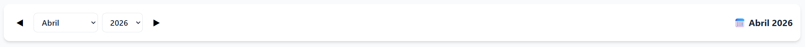

Módulo de presupuesto

Mejoras:
1. ✅ IMPLEMENTADO — Páginas con tamaño de 10 lineas cada una. Paginación con controles Anterior/Siguiente y números de página en DebtManager.jsx.
2. ✅ IMPLEMENTADO — Clonar Presupuesto al mes siguiente. Botón "Clonar Mes" con modal para seleccionar mes/año origen. Clona todos los items con fecha del mes siguiente, montos ejecutados en 0. Corregido formato de fecha a YYYY-MM-DD en backend.
3. ✅ IMPLEMENTADO — Panel Principal con selector de mes/año. Muestra resumen filtrado del mes seleccionado (ingresos, gastos, balance, presupuesto pendiente obligatorio/variable, transacciones recientes). Controles ◀ ▶ para navegar meses, botón "Hoy" para volver al mes actual. Backend actualizado con filtro por mes en /api/budget-items/summary. Corregido import de Debt en debt_service.py.
4. ✅ IMPLEMENTADO — Selector de mes/año con navegación ◀ ▶ y botón "Hoy" en página Reportes (TransactionReport.jsx). Replica la funcionalidad del punto 3 en TransactionReport.
   Revisión punto 4: No se muestra como en Panel Principal 
   
   