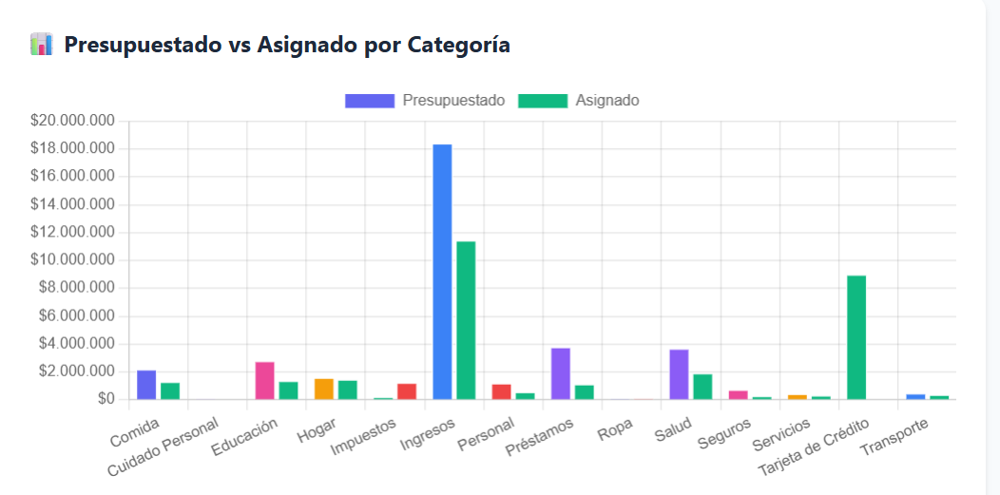

Módulo de presupuesto

Mejoras:
1. ✅ IMPLEMENTADO — Páginas con tamaño de 10 lineas cada una. Paginación con controles Anterior/Siguiente y números de página en DebtManager.jsx.
2. ✅ IMPLEMENTADO — Clonar Presupuesto al mes siguiente. Botón "Clonar Mes" con modal para seleccionar mes/año origen. Clona todos los items con fecha del mes siguiente, montos ejecutados en 0. Corregido formato de fecha a YYYY-MM-DD en backend.
3. ✅ IMPLEMENTADO — Panel Principal con selector de mes/año. Muestra resumen filtrado del mes seleccionado (ingresos, gastos, balance, presupuesto pendiente obligatorio/variable, transacciones recientes). Controles ◀ ▶ para navegar meses, botón "Hoy" para volver al mes actual. Backend actualizado con filtro por mes en /api/budget-items/summary. Corregido import de Debt en debt_service.py.
4. ✅ IMPLEMENTADO — Selector de mes/año con navegación ◀ ▶ y botón "Hoy" en página Reportes (TransactionReport.jsx). Replica la funcionalidad del punto 3 en TransactionReport.
   Revisión punto 4: No se muestra como en Panel Principal 
5. ✅ IMPLEMENTADO — Tarjeta "Ingresos Presupuestados" agregada al encabezado del módulo Presupuesto (DebtManager.jsx). Usa el campo `total_ingresos` del summary del backend (agregado en fix Bug 5). Grid expandido de 4 a 5 columnas.
6. ✅ IMPLEMENTADO — Filtro por detalle ya existía: estado `filterDetalle`, input de texto en la barra de filtros, y lógica de filtrado con `.includes()` en `displayedDebts`.
7. ✅ IMPLEMENTADO — Label "Total por Pagar" cambiado a "Total Estimado a Pagar" en DebtManager.jsx.
8. 
   
Bugs:
1. ✅ RESUELTO — Error al editar un item de presupuesto. Las categorías (ahora objetos `{id, name}`) se usaban como key/value directamente en `<option>`, generando keys `[object Object]` duplicados. Fix: `key={cat.id || cat}` y `value={cat.name || cat}` en EditDebtModal.jsx y NewDebtModal.jsx.

Ediciónd de presupuesto

App.jsx:47 ⚡ Loaded from cache
App.jsx:47 ⚡ Loaded from cache
App.jsx:57 ✅ Loaded 89 transactions from PostgreSQL
App.jsx:57 ✅ Loaded 89 transactions from PostgreSQL
installHook.js:1 Warning: Encountered two children with the same key, `[object Object]`. Keys should be unique so that components maintain their identity across updates. Non-unique keys may cause children to be duplicated and/or omitted — the behavior is unsupported and could change in a future version. Error Component Stack
    at select (<anonymous>)
    at div (<anonymous>)
    at div (<anonymous>)
    at form (<anonymous>)
    at div (<anonymous>)
    at div (<anonymous>)
    at EditDebtModal (EditDebtModal.jsx:4:26)
    at div (<anonymous>)
    at DebtManager (DebtManager.jsx:20:39)
    at div (<anonymous>)
    at Dashboard (Dashboard.jsx:13:22)
    at main (<anonymous>)
    at div (<anonymous>)
    at ToastProvider (ToastContainer.jsx:14:33)
    at App (App.jsx:9:27)
overrideMethod @ installHook.js:1
installHook.js:1 Warning: Encountered two children with the same key, `[object Object]`. Keys should be unique so that components maintain their identity across updates. Non-unique keys may cause children to be duplicated and/or omitted — the behavior is unsupported and could change in a future version. Error Component Stack
    at select (<anonymous>)
    at div (<anonymous>)
    at div (<anonymous>)
    at form (<anonymous>)
    at div (<anonymous>)
    at div (<anonymous>)
    at EditDebtModal (EditDebtModal.jsx:4:26)
    at div (<anonymous>)
    at DebtManager (DebtManager.jsx:20:39)
    at div (<anonymous>)
    at Dashboard (Dashboard.jsx:13:22)
    at main (<anonymous>)
    at div (<anonymous>)
    at ToastProvider (ToastContainer.jsx:14:33)
    at App (App.jsx:9:27)
overrideMethod @ installHook.js:1
installHook.js:1 Warning: Encountered two children with the same key, `[object Object]`. Keys should be unique so that components maintain their identity across updates. Non-unique keys may cause children to be duplicated and/or omitted — the behavior is unsupported and could change in a future version. Error Component Stack
    at select (<anonymous>)
    at div (<anonymous>)
    at div (<anonymous>)
    at form (<anonymous>)
    at div (<anonymous>)
    at div (<anonymous>)
    at EditDebtModal (EditDebtModal.jsx:4:26)
    at div (<anonymous>)
    at DebtManager (DebtManager.jsx:20:39)
    at div (<anonymous>)
    at Dashboard (Dashboard.jsx:13:22)
    at main (<anonymous>)
    at div (<anonymous>)
    at ToastProvider (ToastContainer.jsx:14:33)
    at App (App.jsx:9:27)
overrideMethod @ installHook.js:1
installHook.js:1 Warning: Encountered two children with the same key, `[object Object]`. Keys should be unique so that components maintain their identity across updates. Non-unique keys may cause children to be duplicated and/or omitted — the behavior is unsupported and could change in a future version. Error Component Stack
    at select (<anonymous>)
    at div (<anonymous>)
    at div (<anonymous>)
    at form (<anonymous>)
    at div (<anonymous>)
    at div (<anonymous>)
    at EditDebtModal (EditDebtModal.jsx:4:26)
    at div (<anonymous>)
    at DebtManager (DebtManager.jsx:20:39)
    at div (<anonymous>)
    at Dashboard (Dashboard.jsx:13:22)
    at main (<anonymous>)
    at div (<anonymous>)
    at ToastProvider (ToastContainer.jsx:14:33)
    at App (App.jsx:9:27)
overrideMethod @ installHook.js:1
installHook.js:1 Warning: Encountered two children with the same key, `[object Object]`. Keys should be unique so that components maintain their identity across updates. Non-unique keys may cause children to be duplicated and/or omitted — the behavior is unsupported and could change in a future version. Error Component Stack
    at select (<anonymous>)
    at div (<anonymous>)
    at div (<anonymous>)
    at form (<anonymous>)
    at div (<anonymous>)
    at div (<anonymous>)
    at EditDebtModal (EditDebtModal.jsx:4:26)
    at div (<anonymous>)
    at DebtManager (DebtManager.jsx:20:39)
    at div (<anonymous>)
    at Dashboard (Dashboard.jsx:13:22)
    at main (<anonymous>)
    at div (<anonymous>)
    at ToastProvider (ToastContainer.jsx:14:33)
    at App (App.jsx:9:27)
overrideMethod @ installHook.js:1
installHook.js:1 Warning: Encountered two children with the same key, `[object Object]`. Keys should be unique so that components maintain their identity across updates. Non-unique keys may cause children to be duplicated and/or omitted — the behavior is unsupported and could change in a future version. Error Component Stack
    at select (<anonymous>)
    at div (<anonymous>)
    at div (<anonymous>)
    at form (<anonymous>)
    at div (<anonymous>)
    at div (<anonymous>)
    at EditDebtModal (EditDebtModal.jsx:4:26)
    at div (<anonymous>)
    at DebtManager (DebtManager.jsx:20:39)
    at div (<anonymous>)
    at Dashboard (Dashboard.jsx:13:22)
    at main (<anonymous>)
    at div (<anonymous>)
    at ToastProvider (ToastContainer.jsx:14:33)
    at App (App.jsx:9:27)
overrideMethod @ installHook.js:1
installHook.js:1 Warning: Encountered two children with the same key, `[object Object]`. Keys should be unique so that components maintain their identity across updates. Non-unique keys may cause children to be duplicated and/or omitted — the behavior is unsupported and could change in a future version. Error Component Stack
    at select (<anonymous>)
    at div (<anonymous>)
    at div (<anonymous>)
    at form (<anonymous>)
    at div (<anonymous>)
    at div (<anonymous>)
    at EditDebtModal (EditDebtModal.jsx:4:26)
    at div (<anonymous>)
    at DebtManager (DebtManager.jsx:20:39)
    at div (<anonymous>)
    at Dashboard (Dashboard.jsx:13:22)
    at main (<anonymous>)
    at div (<anonymous>)
    at ToastProvider (ToastContainer.jsx:14:33)
    at App (App.jsx:9:27)
overrideMethod @ installHook.js:1
installHook.js:1 Warning: Encountered two children with the same key, `[object Object]`. Keys should be unique so that components maintain their identity across updates. Non-unique keys may cause children to be duplicated and/or omitted — the behavior is unsupported and could change in a future version. Error Component Stack
    at select (<anonymous>)
    at div (<anonymous>)
    at div (<anonymous>)
    at form (<anonymous>)
    at div (<anonymous>)
    at div (<anonymous>)
    at EditDebtModal (EditDebtModal.jsx:4:26)
    at div (<anonymous>)
    at DebtManager (DebtManager.jsx:20:39)
    at div (<anonymous>)
    at Dashboard (Dashboard.jsx:13:22)
    at main (<anonymous>)
    at div (<anonymous>)
    at ToastProvider (ToastContainer.jsx:14:33)
    at App (App.jsx:9:27)
overrideMethod @ installHook.js:1
installHook.js:1 Warning: Encountered two children with the same key, `[object Object]`. Keys should be unique so that components maintain their identity across updates. Non-unique keys may cause children to be duplicated and/or omitted — the behavior is unsupported and could change in a future version. Error Component Stack
    at select (<anonymous>)
    at div (<anonymous>)
    at div (<anonymous>)
    at form (<anonymous>)
    at div (<anonymous>)
    at div (<anonymous>)
    at EditDebtModal (EditDebtModal.jsx:4:26)
    at div (<anonymous>)
    at DebtManager (DebtManager.jsx:20:39)
    at div (<anonymous>)
    at Dashboard (Dashboard.jsx:13:22)
    at main (<anonymous>)
    at div (<anonymous>)
    at ToastProvider (ToastContainer.jsx:14:33)
    at App (App.jsx:9:27)
overrideMethod @ installHook.js:1
installHook.js:1 Warning: Encountered two children with the same key, `[object Object]`. Keys should be unique so that components maintain their identity across updates. Non-unique keys may cause children to be duplicated and/or omitted — the behavior is unsupported and could change in a future version. Error Component Stack
    at select (<anonymous>)
    at div (<anonymous>)
    at div (<anonymous>)
    at form (<anonymous>)
    at div (<anonymous>)
    at div (<anonymous>)
    at EditDebtModal (EditDebtModal.jsx:4:26)
    at div (<anonymous>)
    at DebtManager (DebtManager.jsx:20:39)
    at div (<anonymous>)
    at Dashboard (Dashboard.jsx:13:22)
    at main (<anonymous>)
    at div (<anonymous>)
    at ToastProvider (ToastContainer.jsx:14:33)
    at App (App.jsx:9:27)
overrideMethod @ installHook.js:1
installHook.js:1 Warning: Encountered two children with the same key, `[object Object]`. Keys should be unique so that components maintain their identity across updates. Non-unique keys may cause children to be duplicated and/or omitted — the behavior is unsupported and could change in a future version. Error Component Stack
    at select (<anonymous>)
    at div (<anonymous>)
    at div (<anonymous>)
    at form (<anonymous>)
    at div (<anonymous>)
    at div (<anonymous>)
    at EditDebtModal (EditDebtModal.jsx:4:26)
    at div (<anonymous>)
    at DebtManager (DebtManager.jsx:20:39)
    at div (<anonymous>)
    at Dashboard (Dashboard.jsx:13:22)
    at main (<anonymous>)
    at div (<anonymous>)
    at ToastProvider (ToastContainer.jsx:14:33)
    at App (App.jsx:9:27)
overrideMethod @ installHook.js:1
installHook.js:1 Warning: Encountered two children with the same key, `[object Object]`. Keys should be unique so that components maintain their identity across updates. Non-unique keys may cause children to be duplicated and/or omitted — the behavior is unsupported and could change in a future version. Error Component Stack
    at select (<anonymous>)
    at div (<anonymous>)
    at div (<anonymous>)
    at form (<anonymous>)
    at div (<anonymous>)
    at div (<anonymous>)
    at EditDebtModal (EditDebtModal.jsx:4:26)
    at div (<anonymous>)
    at DebtManager (DebtManager.jsx:20:39)
    at div (<anonymous>)
    at Dashboard (Dashboard.jsx:13:22)
    at main (<anonymous>)
    at div (<anonymous>)
    at ToastProvider (ToastContainer.jsx:14:33)
    at App (App.jsx:9:27)
overrideMethod @ installHook.js:1
installHook.js:1 Warning: Encountered two children with the same key, `[object Object]`. Keys should be unique so that components maintain their identity across updates. Non-unique keys may cause children to be duplicated and/or omitted — the behavior is unsupported and could change in a future version. Error Component Stack
    at select (<anonymous>)
    at div (<anonymous>)
    at div (<anonymous>)
    at form (<anonymous>)
    at div (<anonymous>)
    at div (<anonymous>)
    at EditDebtModal (EditDebtModal.jsx:4:26)
    at div (<anonymous>)
    at DebtManager (DebtManager.jsx:20:39)
    at div (<anonymous>)
    at Dashboard (Dashboard.jsx:13:22)
    at main (<anonymous>)
    at div (<anonymous>)
    at ToastProvider (ToastContainer.jsx:14:33)
    at App (App.jsx:9:27)
overrideMethod @ installHook.js:1
installHook.js:1 Warning: Encountered two children with the same key, `[object Object]`. Keys should be unique so that components maintain their identity across updates. Non-unique keys may cause children to be duplicated and/or omitted — the behavior is unsupported and could change in a future version. Error Component Stack
    at select (<anonymous>)
    at div (<anonymous>)
    at div (<anonymous>)
    at form (<anonymous>)
    at div (<anonymous>)
    at div (<anonymous>)
    at EditDebtModal (EditDebtModal.jsx:4:26)
    at div (<anonymous>)
    at DebtManager (DebtManager.jsx:20:39)
    at div (<anonymous>)
    at Dashboard (Dashboard.jsx:13:22)
    at main (<anonymous>)
    at div (<anonymous>)
    at ToastProvider (ToastContainer.jsx:14:33)
    at App (App.jsx:9:27)
overrideMethod @ installHook.js:1
installHook.js:1 Warning: Encountered two children with the same key, `[object Object]`. Keys should be unique so that components maintain their identity across updates. Non-unique keys may cause children to be duplicated and/or omitted — the behavior is unsupported and could change in a future version. Error Component Stack
    at select (<anonymous>)
    at div (<anonymous>)
    at div (<anonymous>)
    at form (<anonymous>)
    at div (<anonymous>)
    at div (<anonymous>)
    at EditDebtModal (EditDebtModal.jsx:4:26)
    at div (<anonymous>)
    at DebtManager (DebtManager.jsx:20:39)
    at div (<anonymous>)
    at Dashboard (Dashboard.jsx:13:22)
    at main (<anonymous>)
    at div (<anonymous>)
    at ToastProvider (ToastContainer.jsx:14:33)
    at App (App.jsx:9:27)
overrideMethod @ installHook.js:1
installHook.js:1 Warning: Encountered two children with the same key, `[object Object]`. Keys should be unique so that components maintain their identity across updates. Non-unique keys may cause children to be duplicated and/or omitted — the behavior is unsupported and could change in a future version. Error Component Stack
    at select (<anonymous>)
    at div (<anonymous>)
    at div (<anonymous>)
    at form (<anonymous>)
    at div (<anonymous>)
    at div (<anonymous>)
    at EditDebtModal (EditDebtModal.jsx:4:26)
    at div (<anonymous>)
    at DebtManager (DebtManager.jsx:20:39)
    at div (<anonymous>)
    at Dashboard (Dashboard.jsx:13:22)
    at main (<anonymous>)
    at div (<anonymous>)
    at ToastProvider (ToastContainer.jsx:14:33)
    at App (App.jsx:9:27)
overrideMethod @ installHook.js:1
chunk-NUMECXU6.js?v=00a09b6a:9934 Uncaught Error: Objects are not valid as a React child (found: object with keys {id, name}). If you meant to render a collection of children, use an array instead.
    at throwOnInvalidObjectType (chunk-NUMECXU6.js?v=00a09b6a:9934:17)
    at reconcileChildFibers2 (chunk-NUMECXU6.js?v=00a09b6a:10564:15)
    at reconcileChildren (chunk-NUMECXU6.js?v=00a09b6a:14290:37)
    at updateHostComponent (chunk-NUMECXU6.js?v=00a09b6a:14807:11)
    at beginWork (chunk-NUMECXU6.js?v=00a09b6a:15935:22)
    at HTMLUnknownElement.callCallback2 (chunk-NUMECXU6.js?v=00a09b6a:3674:22)
    at Object.invokeGuardedCallbackDev (chunk-NUMECXU6.js?v=00a09b6a:3699:24)
    at invokeGuardedCallback (chunk-NUMECXU6.js?v=00a09b6a:3733:39)
    at beginWork$1 (chunk-NUMECXU6.js?v=00a09b6a:19765:15)
    at performUnitOfWork (chunk-NUMECXU6.js?v=00a09b6a:19198:20)
chunk-NUMECXU6.js?v=00a09b6a:9934 Uncaught Error: Objects are not valid as a React child (found: object with keys {id, name}). If you meant to render a collection of children, use an array instead.
    at throwOnInvalidObjectType (chunk-NUMECXU6.js?v=00a09b6a:9934:17)
    at reconcileChildFibers2 (chunk-NUMECXU6.js?v=00a09b6a:10564:15)
    at reconcileChildren (chunk-NUMECXU6.js?v=00a09b6a:14290:37)
    at updateHostComponent (chunk-NUMECXU6.js?v=00a09b6a:14807:11)
    at beginWork (chunk-NUMECXU6.js?v=00a09b6a:15935:22)
    at HTMLUnknownElement.callCallback2 (chunk-NUMECXU6.js?v=00a09b6a:3674:22)
    at Object.invokeGuardedCallbackDev (chunk-NUMECXU6.js?v=00a09b6a:3699:24)
    at invokeGuardedCallback (chunk-NUMECXU6.js?v=00a09b6a:3733:39)
    at beginWork$1 (chunk-NUMECXU6.js?v=00a09b6a:19765:15)
    at performUnitOfWork (chunk-NUMECXU6.js?v=00a09b6a:19198:20)
chunk-NUMECXU6.js?v=00a09b6a:9934 Uncaught Error: Objects are not valid as a React child (found: object with keys {id, name}). If you meant to render a collection of children, use an array instead.
    at throwOnInvalidObjectType (chunk-NUMECXU6.js?v=00a09b6a:9934:17)
    at reconcileChildFibers2 (chunk-NUMECXU6.js?v=00a09b6a:10564:15)
    at reconcileChildren (chunk-NUMECXU6.js?v=00a09b6a:14290:37)
    at updateHostComponent (chunk-NUMECXU6.js?v=00a09b6a:14807:11)
    at beginWork (chunk-NUMECXU6.js?v=00a09b6a:15935:22)
    at HTMLUnknownElement.callCallback2 (chunk-NUMECXU6.js?v=00a09b6a:3674:22)
    at Object.invokeGuardedCallbackDev (chunk-NUMECXU6.js?v=00a09b6a:3699:24)
    at invokeGuardedCallback (chunk-NUMECXU6.js?v=00a09b6a:3733:39)
    at beginWork$1 (chunk-NUMECXU6.js?v=00a09b6a:19765:15)
    at performUnitOfWork (chunk-NUMECXU6.js?v=00a09b6a:19198:20)
chunk-NUMECXU6.js?v=00a09b6a:9934 Uncaught Error: Objects are not valid as a React child (found: object with keys {id, name}). If you meant to render a collection of children, use an array instead.
    at throwOnInvalidObjectType (chunk-NUMECXU6.js?v=00a09b6a:9934:17)
    at reconcileChildFibers2 (chunk-NUMECXU6.js?v=00a09b6a:10564:15)
    at reconcileChildren (chunk-NUMECXU6.js?v=00a09b6a:14290:37)
    at updateHostComponent (chunk-NUMECXU6.js?v=00a09b6a:14807:11)
    at beginWork (chunk-NUMECXU6.js?v=00a09b6a:15935:22)
    at HTMLUnknownElement.callCallback2 (chunk-NUMECXU6.js?v=00a09b6a:3674:22)
    at Object.invokeGuardedCallbackDev (chunk-NUMECXU6.js?v=00a09b6a:3699:24)
    at invokeGuardedCallback (chunk-NUMECXU6.js?v=00a09b6a:3733:39)
    at beginWork$1 (chunk-NUMECXU6.js?v=00a09b6a:19765:15)
    at performUnitOfWork (chunk-NUMECXU6.js?v=00a09b6a:19198:20)
chunk-NUMECXU6.js?v=00a09b6a:9934 Uncaught Error: Objects are not valid as a React child (found: object with keys {id, name}). If you meant to render a collection of children, use an array instead.
    at throwOnInvalidObjectType (chunk-NUMECXU6.js?v=00a09b6a:9934:17)
    at reconcileChildFibers2 (chunk-NUMECXU6.js?v=00a09b6a:10564:15)
    at reconcileChildren (chunk-NUMECXU6.js?v=00a09b6a:14290:37)
    at updateHostComponent (chunk-NUMECXU6.js?v=00a09b6a:14807:11)
    at beginWork (chunk-NUMECXU6.js?v=00a09b6a:15935:22)
    at HTMLUnknownElement.callCallback2 (chunk-NUMECXU6.js?v=00a09b6a:3674:22)
    at Object.invokeGuardedCallbackDev (chunk-NUMECXU6.js?v=00a09b6a:3699:24)
    at invokeGuardedCallback (chunk-NUMECXU6.js?v=00a09b6a:3733:39)
    at beginWork$1 (chunk-NUMECXU6.js?v=00a09b6a:19765:15)
    at performUnitOfWork (chunk-NUMECXU6.js?v=00a09b6a:19198:20)
chunk-NUMECXU6.js?v=00a09b6a:9934 Uncaught Error: Objects are not valid as a React child (found: object with keys {id, name}). If you meant to render a collection of children, use an array instead.
    at throwOnInvalidObjectType (chunk-NUMECXU6.js?v=00a09b6a:9934:17)
    at reconcileChildFibers2 (chunk-NUMECXU6.js?v=00a09b6a:10564:15)
    at reconcileChildren (chunk-NUMECXU6.js?v=00a09b6a:14290:37)
    at updateHostComponent (chunk-NUMECXU6.js?v=00a09b6a:14807:11)
    at beginWork (chunk-NUMECXU6.js?v=00a09b6a:15935:22)
    at HTMLUnknownElement.callCallback2 (chunk-NUMECXU6.js?v=00a09b6a:3674:22)
    at Object.invokeGuardedCallbackDev (chunk-NUMECXU6.js?v=00a09b6a:3699:24)
    at invokeGuardedCallback (chunk-NUMECXU6.js?v=00a09b6a:3733:39)
    at beginWork$1 (chunk-NUMECXU6.js?v=00a09b6a:19765:15)
    at performUnitOfWork (chunk-NUMECXU6.js?v=00a09b6a:19198:20)
chunk-NUMECXU6.js?v=00a09b6a:9934 Uncaught Error: Objects are not valid as a React child (found: object with keys {id, name}). If you meant to render a collection of children, use an array instead.
    at throwOnInvalidObjectType (chunk-NUMECXU6.js?v=00a09b6a:9934:17)
    at reconcileChildFibers2 (chunk-NUMECXU6.js?v=00a09b6a:10564:15)
    at reconcileChildren (chunk-NUMECXU6.js?v=00a09b6a:14290:37)
    at updateHostComponent (chunk-NUMECXU6.js?v=00a09b6a:14807:11)
    at beginWork (chunk-NUMECXU6.js?v=00a09b6a:15935:22)
    at HTMLUnknownElement.callCallback2 (chunk-NUMECXU6.js?v=00a09b6a:3674:22)
    at Object.invokeGuardedCallbackDev (chunk-NUMECXU6.js?v=00a09b6a:3699:24)
    at invokeGuardedCallback (chunk-NUMECXU6.js?v=00a09b6a:3733:39)
    at beginWork$1 (chunk-NUMECXU6.js?v=00a09b6a:19765:15)
    at performUnitOfWork (chunk-NUMECXU6.js?v=00a09b6a:19198:20)
chunk-NUMECXU6.js?v=00a09b6a:9934 Uncaught Error: Objects are not valid as a React child (found: object with keys {id, name}). If you meant to render a collection of children, use an array instead.
    at throwOnInvalidObjectType (chunk-NUMECXU6.js?v=00a09b6a:9934:17)
    at reconcileChildFibers2 (chunk-NUMECXU6.js?v=00a09b6a:10564:15)
    at reconcileChildren (chunk-NUMECXU6.js?v=00a09b6a:14290:37)
    at updateHostComponent (chunk-NUMECXU6.js?v=00a09b6a:14807:11)
    at beginWork (chunk-NUMECXU6.js?v=00a09b6a:15935:22)
    at HTMLUnknownElement.callCallback2 (chunk-NUMECXU6.js?v=00a09b6a:3674:22)
    at Object.invokeGuardedCallbackDev (chunk-NUMECXU6.js?v=00a09b6a:3699:24)
    at invokeGuardedCallback (chunk-NUMECXU6.js?v=00a09b6a:3733:39)
    at beginWork$1 (chunk-NUMECXU6.js?v=00a09b6a:19765:15)
    at performUnitOfWork (chunk-NUMECXU6.js?v=00a09b6a:19198:20)
chunk-NUMECXU6.js?v=00a09b6a:9934 Uncaught Error: Objects are not valid as a React child (found: object with keys {id, name}). If you meant to render a collection of children, use an array instead.
    at throwOnInvalidObjectType (chunk-NUMECXU6.js?v=00a09b6a:9934:17)
    at reconcileChildFibers2 (chunk-NUMECXU6.js?v=00a09b6a:10564:15)
    at reconcileChildren (chunk-NUMECXU6.js?v=00a09b6a:14290:37)
    at updateHostComponent (chunk-NUMECXU6.js?v=00a09b6a:14807:11)
    at beginWork (chunk-NUMECXU6.js?v=00a09b6a:15935:22)
    at HTMLUnknownElement.callCallback2 (chunk-NUMECXU6.js?v=00a09b6a:3674:22)
    at Object.invokeGuardedCallbackDev (chunk-NUMECXU6.js?v=00a09b6a:3699:24)
    at invokeGuardedCallback (chunk-NUMECXU6.js?v=00a09b6a:3733:39)
    at beginWork$1 (chunk-NUMECXU6.js?v=00a09b6a:19765:15)
    at performUnitOfWork (chunk-NUMECXU6.js?v=00a09b6a:19198:20)
chunk-NUMECXU6.js?v=00a09b6a:9934 Uncaught Error: Objects are not valid as a React child (found: object with keys {id, name}). If you meant to render a collection of children, use an array instead.
    at throwOnInvalidObjectType (chunk-NUMECXU6.js?v=00a09b6a:9934:17)
    at reconcileChildFibers2 (chunk-NUMECXU6.js?v=00a09b6a:10564:15)
    at reconcileChildren (chunk-NUMECXU6.js?v=00a09b6a:14290:37)
    at updateHostComponent (chunk-NUMECXU6.js?v=00a09b6a:14807:11)
    at beginWork (chunk-NUMECXU6.js?v=00a09b6a:15935:22)
    at HTMLUnknownElement.callCallback2 (chunk-NUMECXU6.js?v=00a09b6a:3674:22)
    at Object.invokeGuardedCallbackDev (chunk-NUMECXU6.js?v=00a09b6a:3699:24)
    at invokeGuardedCallback (chunk-NUMECXU6.js?v=00a09b6a:3733:39)
    at beginWork$1 (chunk-NUMECXU6.js?v=00a09b6a:19765:15)
    at performUnitOfWork (chunk-NUMECXU6.js?v=00a09b6a:19198:20)
chunk-NUMECXU6.js?v=00a09b6a:9934 Uncaught Error: Objects are not valid as a React child (found: object with keys {id, name}). If you meant to render a collection of children, use an array instead.
    at throwOnInvalidObjectType (chunk-NUMECXU6.js?v=00a09b6a:9934:17)
    at reconcileChildFibers2 (chunk-NUMECXU6.js?v=00a09b6a:10564:15)
    at reconcileChildren (chunk-NUMECXU6.js?v=00a09b6a:14290:37)
    at updateHostComponent (chunk-NUMECXU6.js?v=00a09b6a:14807:11)
    at beginWork (chunk-NUMECXU6.js?v=00a09b6a:15935:22)
    at HTMLUnknownElement.callCallback2 (chunk-NUMECXU6.js?v=00a09b6a:3674:22)
    at Object.invokeGuardedCallbackDev (chunk-NUMECXU6.js?v=00a09b6a:3699:24)
    at invokeGuardedCallback (chunk-NUMECXU6.js?v=00a09b6a:3733:39)
    at beginWork$1 (chunk-NUMECXU6.js?v=00a09b6a:19765:15)
    at performUnitOfWork (chunk-NUMECXU6.js?v=00a09b6a:19198:20)
chunk-NUMECXU6.js?v=00a09b6a:9934 Uncaught Error: Objects are not valid as a React child (found: object with keys {id, name}). If you meant to render a collection of children, use an array instead.
    at throwOnInvalidObjectType (chunk-NUMECXU6.js?v=00a09b6a:9934:17)
    at reconcileChildFibers2 (chunk-NUMECXU6.js?v=00a09b6a:10564:15)
    at reconcileChildren (chunk-NUMECXU6.js?v=00a09b6a:14290:37)
    at updateHostComponent (chunk-NUMECXU6.js?v=00a09b6a:14807:11)
    at beginWork (chunk-NUMECXU6.js?v=00a09b6a:15935:22)
    at HTMLUnknownElement.callCallback2 (chunk-NUMECXU6.js?v=00a09b6a:3674:22)
    at Object.invokeGuardedCallbackDev (chunk-NUMECXU6.js?v=00a09b6a:3699:24)
    at invokeGuardedCallback (chunk-NUMECXU6.js?v=00a09b6a:3733:39)
    at beginWork$1 (chunk-NUMECXU6.js?v=00a09b6a:19765:15)
    at performUnitOfWork (chunk-NUMECXU6.js?v=00a09b6a:19198:20)
chunk-NUMECXU6.js?v=00a09b6a:9934 Uncaught Error: Objects are not valid as a React child (found: object with keys {id, name}). If you meant to render a collection of children, use an array instead.
    at throwOnInvalidObjectType (chunk-NUMECXU6.js?v=00a09b6a:9934:17)
    at reconcileChildFibers2 (chunk-NUMECXU6.js?v=00a09b6a:10564:15)
    at reconcileChildren (chunk-NUMECXU6.js?v=00a09b6a:14290:37)
    at updateHostComponent (chunk-NUMECXU6.js?v=00a09b6a:14807:11)
    at beginWork (chunk-NUMECXU6.js?v=00a09b6a:15935:22)
    at HTMLUnknownElement.callCallback2 (chunk-NUMECXU6.js?v=00a09b6a:3674:22)
    at Object.invokeGuardedCallbackDev (chunk-NUMECXU6.js?v=00a09b6a:3699:24)
    at invokeGuardedCallback (chunk-NUMECXU6.js?v=00a09b6a:3733:39)
    at beginWork$1 (chunk-NUMECXU6.js?v=00a09b6a:19765:15)
    at performUnitOfWork (chunk-NUMECXU6.js?v=00a09b6a:19198:20)
chunk-NUMECXU6.js?v=00a09b6a:9934 Uncaught Error: Objects are not valid as a React child (found: object with keys {id, name}). If you meant to render a collection of children, use an array instead.
    at throwOnInvalidObjectType (chunk-NUMECXU6.js?v=00a09b6a:9934:17)
    at reconcileChildFibers2 (chunk-NUMECXU6.js?v=00a09b6a:10564:15)
    at reconcileChildren (chunk-NUMECXU6.js?v=00a09b6a:14290:37)
    at updateHostComponent (chunk-NUMECXU6.js?v=00a09b6a:14807:11)
    at beginWork (chunk-NUMECXU6.js?v=00a09b6a:15935:22)
    at HTMLUnknownElement.callCallback2 (chunk-NUMECXU6.js?v=00a09b6a:3674:22)
    at Object.invokeGuardedCallbackDev (chunk-NUMECXU6.js?v=00a09b6a:3699:24)
    at invokeGuardedCallback (chunk-NUMECXU6.js?v=00a09b6a:3733:39)
    at beginWork$1 (chunk-NUMECXU6.js?v=00a09b6a:19765:15)
    at performUnitOfWork (chunk-NUMECXU6.js?v=00a09b6a:19198:20)
chunk-NUMECXU6.js?v=00a09b6a:9934 Uncaught Error: Objects are not valid as a React child (found: object with keys {id, name}). If you meant to render a collection of children, use an array instead.
    at throwOnInvalidObjectType (chunk-NUMECXU6.js?v=00a09b6a:9934:17)
    at reconcileChildFibers2 (chunk-NUMECXU6.js?v=00a09b6a:10564:15)
    at reconcileChildren (chunk-NUMECXU6.js?v=00a09b6a:14290:37)
    at updateHostComponent (chunk-NUMECXU6.js?v=00a09b6a:14807:11)
    at beginWork (chunk-NUMECXU6.js?v=00a09b6a:15935:22)
    at HTMLUnknownElement.callCallback2 (chunk-NUMECXU6.js?v=00a09b6a:3674:22)
    at Object.invokeGuardedCallbackDev (chunk-NUMECXU6.js?v=00a09b6a:3699:24)
    at invokeGuardedCallback (chunk-NUMECXU6.js?v=00a09b6a:3733:39)
    at beginWork$1 (chunk-NUMECXU6.js?v=00a09b6a:19765:15)
    at performUnitOfWork (chunk-NUMECXU6.js?v=00a09b6a:19198:20)
chunk-NUMECXU6.js?v=00a09b6a:9934 Uncaught Error: Objects are not valid as a React child (found: object with keys {id, name}). If you meant to render a collection of children, use an array instead.
    at throwOnInvalidObjectType (chunk-NUMECXU6.js?v=00a09b6a:9934:17)
    at reconcileChildFibers2 (chunk-NUMECXU6.js?v=00a09b6a:10564:15)
    at reconcileChildren (chunk-NUMECXU6.js?v=00a09b6a:14290:37)
    at updateHostComponent (chunk-NUMECXU6.js?v=00a09b6a:14807:11)
    at beginWork (chunk-NUMECXU6.js?v=00a09b6a:15935:22)
    at HTMLUnknownElement.callCallback2 (chunk-NUMECXU6.js?v=00a09b6a:3674:22)
    at Object.invokeGuardedCallbackDev (chunk-NUMECXU6.js?v=00a09b6a:3699:24)
    at invokeGuardedCallback (chunk-NUMECXU6.js?v=00a09b6a:3733:39)
    at beginWork$1 (chunk-NUMECXU6.js?v=00a09b6a:19765:15)
    at performUnitOfWork (chunk-NUMECXU6.js?v=00a09b6a:19198:20)
chunk-NUMECXU6.js?v=00a09b6a:9934 Uncaught Error: Objects are not valid as a React child (found: object with keys {id, name}). If you meant to render a collection of children, use an array instead.
    at throwOnInvalidObjectType (chunk-NUMECXU6.js?v=00a09b6a:9934:17)
    at reconcileChildFibers2 (chunk-NUMECXU6.js?v=00a09b6a:10564:15)
    at reconcileChildren (chunk-NUMECXU6.js?v=00a09b6a:14290:37)
    at updateHostComponent (chunk-NUMECXU6.js?v=00a09b6a:14807:11)
    at beginWork (chunk-NUMECXU6.js?v=00a09b6a:15935:22)
    at HTMLUnknownElement.callCallback2 (chunk-NUMECXU6.js?v=00a09b6a:3674:22)
    at Object.invokeGuardedCallbackDev (chunk-NUMECXU6.js?v=00a09b6a:3699:24)
    at invokeGuardedCallback (chunk-NUMECXU6.js?v=00a09b6a:3733:39)
    at beginWork$1 (chunk-NUMECXU6.js?v=00a09b6a:19765:15)
    at performUnitOfWork (chunk-NUMECXU6.js?v=00a09b6a:19198:20)
installHook.js:1 Warning: Encountered two children with the same key, `[object Object]`. Keys should be unique so that components maintain their identity across updates. Non-unique keys may cause children to be duplicated and/or omitted — the behavior is unsupported and could change in a future version. Error Component Stack
    at select (<anonymous>)
    at div (<anonymous>)
    at div (<anonymous>)
    at form (<anonymous>)
    at div (<anonymous>)
    at div (<anonymous>)
    at EditDebtModal (EditDebtModal.jsx:4:26)
    at div (<anonymous>)
    at DebtManager (DebtManager.jsx:20:39)
    at div (<anonymous>)
    at Dashboard (Dashboard.jsx:13:22)
    at main (<anonymous>)
    at div (<anonymous>)
    at ToastProvider (ToastContainer.jsx:14:33)
    at App (App.jsx:9:27)
overrideMethod @ installHook.js:1
installHook.js:1 Warning: Encountered two children with the same key, `[object Object]`. Keys should be unique so that components maintain their identity across updates. Non-unique keys may cause children to be duplicated and/or omitted — the behavior is unsupported and could change in a future version. Error Component Stack
    at select (<anonymous>)
    at div (<anonymous>)
    at div (<anonymous>)
    at form (<anonymous>)
    at div (<anonymous>)
    at div (<anonymous>)
    at EditDebtModal (EditDebtModal.jsx:4:26)
    at div (<anonymous>)
    at DebtManager (DebtManager.jsx:20:39)
    at div (<anonymous>)
    at Dashboard (Dashboard.jsx:13:22)
    at main (<anonymous>)
    at div (<anonymous>)
    at ToastProvider (ToastContainer.jsx:14:33)
    at App (App.jsx:9:27)
overrideMethod @ installHook.js:1
installHook.js:1 Warning: Encountered two children with the same key, `[object Object]`. Keys should be unique so that components maintain their identity across updates. Non-unique keys may cause children to be duplicated and/or omitted — the behavior is unsupported and could change in a future version. Error Component Stack
    at select (<anonymous>)
    at div (<anonymous>)
    at div (<anonymous>)
    at form (<anonymous>)
    at div (<anonymous>)
    at div (<anonymous>)
    at EditDebtModal (EditDebtModal.jsx:4:26)
    at div (<anonymous>)
    at DebtManager (DebtManager.jsx:20:39)
    at div (<anonymous>)
    at Dashboard (Dashboard.jsx:13:22)
    at main (<anonymous>)
    at div (<anonymous>)
    at ToastProvider (ToastContainer.jsx:14:33)
    at App (App.jsx:9:27)
overrideMethod @ installHook.js:1
installHook.js:1 Warning: Encountered two children with the same key, `[object Object]`. Keys should be unique so that components maintain their identity across updates. Non-unique keys may cause children to be duplicated and/or omitted — the behavior is unsupported and could change in a future version. Error Component Stack
    at select (<anonymous>)
    at div (<anonymous>)
    at div (<anonymous>)
    at form (<anonymous>)
    at div (<anonymous>)
    at div (<anonymous>)
    at EditDebtModal (EditDebtModal.jsx:4:26)
    at div (<anonymous>)
    at DebtManager (DebtManager.jsx:20:39)
    at div (<anonymous>)
    at Dashboard (Dashboard.jsx:13:22)
    at main (<anonymous>)
    at div (<anonymous>)
    at ToastProvider (ToastContainer.jsx:14:33)
    at App (App.jsx:9:27)
overrideMethod @ installHook.js:1
installHook.js:1 Warning: Encountered two children with the same key, `[object Object]`. Keys should be unique so that components maintain their identity across updates. Non-unique keys may cause children to be duplicated and/or omitted — the behavior is unsupported and could change in a future version. Error Component Stack
    at select (<anonymous>)
    at div (<anonymous>)
    at div (<anonymous>)
    at form (<anonymous>)
    at div (<anonymous>)
    at div (<anonymous>)
    at EditDebtModal (EditDebtModal.jsx:4:26)
    at div (<anonymous>)
    at DebtManager (DebtManager.jsx:20:39)
    at div (<anonymous>)
    at Dashboard (Dashboard.jsx:13:22)
    at main (<anonymous>)
    at div (<anonymous>)
    at ToastProvider (ToastContainer.jsx:14:33)
    at App (App.jsx:9:27)
overrideMethod @ installHook.js:1
installHook.js:1 Warning: Encountered two children with the same key, `[object Object]`. Keys should be unique so that components maintain their identity across updates. Non-unique keys may cause children to be duplicated and/or omitted — the behavior is unsupported and could change in a future version. Error Component Stack
    at select (<anonymous>)
    at div (<anonymous>)
    at div (<anonymous>)
    at form (<anonymous>)
    at div (<anonymous>)
    at div (<anonymous>)
    at EditDebtModal (EditDebtModal.jsx:4:26)
    at div (<anonymous>)
    at DebtManager (DebtManager.jsx:20:39)
    at div (<anonymous>)
    at Dashboard (Dashboard.jsx:13:22)
    at main (<anonymous>)
    at div (<anonymous>)
    at ToastProvider (ToastContainer.jsx:14:33)
    at App (App.jsx:9:27)
overrideMethod @ installHook.js:1
installHook.js:1 Warning: Encountered two children with the same key, `[object Object]`. Keys should be unique so that components maintain their identity across updates. Non-unique keys may cause children to be duplicated and/or omitted — the behavior is unsupported and could change in a future version. Error Component Stack
    at select (<anonymous>)
    at div (<anonymous>)
    at div (<anonymous>)
    at form (<anonymous>)
    at div (<anonymous>)
    at div (<anonymous>)
    at EditDebtModal (EditDebtModal.jsx:4:26)
    at div (<anonymous>)
    at DebtManager (DebtManager.jsx:20:39)
    at div (<anonymous>)
    at Dashboard (Dashboard.jsx:13:22)
    at main (<anonymous>)
    at div (<anonymous>)
    at ToastProvider (ToastContainer.jsx:14:33)
    at App (App.jsx:9:27)
overrideMethod @ installHook.js:1
installHook.js:1 Warning: Encountered two children with the same key, `[object Object]`. Keys should be unique so that components maintain their identity across updates. Non-unique keys may cause children to be duplicated and/or omitted — the behavior is unsupported and could change in a future version. Error Component Stack
    at select (<anonymous>)
    at div (<anonymous>)
    at div (<anonymous>)
    at form (<anonymous>)
    at div (<anonymous>)
    at div (<anonymous>)
    at EditDebtModal (EditDebtModal.jsx:4:26)
    at div (<anonymous>)
    at DebtManager (DebtManager.jsx:20:39)
    at div (<anonymous>)
    at Dashboard (Dashboard.jsx:13:22)
    at main (<anonymous>)
    at div (<anonymous>)
    at ToastProvider (ToastContainer.jsx:14:33)
    at App (App.jsx:9:27)
overrideMethod @ installHook.js:1
installHook.js:1 Warning: Encountered two children with the same key, `[object Object]`. Keys should be unique so that components maintain their identity across updates. Non-unique keys may cause children to be duplicated and/or omitted — the behavior is unsupported and could change in a future version. Error Component Stack
    at select (<anonymous>)
    at div (<anonymous>)
    at div (<anonymous>)
    at form (<anonymous>)
    at div (<anonymous>)
    at div (<anonymous>)
    at EditDebtModal (EditDebtModal.jsx:4:26)
    at div (<anonymous>)
    at DebtManager (DebtManager.jsx:20:39)
    at div (<anonymous>)
    at Dashboard (Dashboard.jsx:13:22)
    at main (<anonymous>)
    at div (<anonymous>)
    at ToastProvider (ToastContainer.jsx:14:33)
    at App (App.jsx:9:27)
overrideMethod @ installHook.js:1
installHook.js:1 Warning: Encountered two children with the same key, `[object Object]`. Keys should be unique so that components maintain their identity across updates. Non-unique keys may cause children to be duplicated and/or omitted — the behavior is unsupported and could change in a future version. Error Component Stack
    at select (<anonymous>)
    at div (<anonymous>)
    at div (<anonymous>)
    at form (<anonymous>)
    at div (<anonymous>)
    at div (<anonymous>)
    at EditDebtModal (EditDebtModal.jsx:4:26)
    at div (<anonymous>)
    at DebtManager (DebtManager.jsx:20:39)
    at div (<anonymous>)
    at Dashboard (Dashboard.jsx:13:22)
    at main (<anonymous>)
    at div (<anonymous>)
    at ToastProvider (ToastContainer.jsx:14:33)
    at App (App.jsx:9:27)
overrideMethod @ installHook.js:1
installHook.js:1 Warning: Encountered two children with the same key, `[object Object]`. Keys should be unique so that components maintain their identity across updates. Non-unique keys may cause children to be duplicated and/or omitted — the behavior is unsupported and could change in a future version. Error Component Stack
    at select (<anonymous>)
    at div (<anonymous>)
    at div (<anonymous>)
    at form (<anonymous>)
    at div (<anonymous>)
    at div (<anonymous>)
    at EditDebtModal (EditDebtModal.jsx:4:26)
    at div (<anonymous>)
    at DebtManager (DebtManager.jsx:20:39)
    at div (<anonymous>)
    at Dashboard (Dashboard.jsx:13:22)
    at main (<anonymous>)
    at div (<anonymous>)
    at ToastProvider (ToastContainer.jsx:14:33)
    at App (App.jsx:9:27)
overrideMethod @ installHook.js:1
installHook.js:1 Warning: Encountered two children with the same key, `[object Object]`. Keys should be unique so that components maintain their identity across updates. Non-unique keys may cause children to be duplicated and/or omitted — the behavior is unsupported and could change in a future version. Error Component Stack
    at select (<anonymous>)
    at div (<anonymous>)
    at div (<anonymous>)
    at form (<anonymous>)
    at div (<anonymous>)
    at div (<anonymous>)
    at EditDebtModal (EditDebtModal.jsx:4:26)
    at div (<anonymous>)
    at DebtManager (DebtManager.jsx:20:39)
    at div (<anonymous>)
    at Dashboard (Dashboard.jsx:13:22)
    at main (<anonymous>)
    at div (<anonymous>)
    at ToastProvider (ToastContainer.jsx:14:33)
    at App (App.jsx:9:27)
overrideMethod @ installHook.js:1
installHook.js:1 Warning: Encountered two children with the same key, `[object Object]`. Keys should be unique so that components maintain their identity across updates. Non-unique keys may cause children to be duplicated and/or omitted — the behavior is unsupported and could change in a future version. Error Component Stack
    at select (<anonymous>)
    at div (<anonymous>)
    at div (<anonymous>)
    at form (<anonymous>)
    at div (<anonymous>)
    at div (<anonymous>)
    at EditDebtModal (EditDebtModal.jsx:4:26)
    at div (<anonymous>)
    at DebtManager (DebtManager.jsx:20:39)
    at div (<anonymous>)
    at Dashboard (Dashboard.jsx:13:22)
    at main (<anonymous>)
    at div (<anonymous>)
    at ToastProvider (ToastContainer.jsx:14:33)
    at App (App.jsx:9:27)
overrideMethod @ installHook.js:1
installHook.js:1 Warning: Encountered two children with the same key, `[object Object]`. Keys should be unique so that components maintain their identity across updates. Non-unique keys may cause children to be duplicated and/or omitted — the behavior is unsupported and could change in a future version. Error Component Stack
    at select (<anonymous>)
    at div (<anonymous>)
    at div (<anonymous>)
    at form (<anonymous>)
    at div (<anonymous>)
    at div (<anonymous>)
    at EditDebtModal (EditDebtModal.jsx:4:26)
    at div (<anonymous>)
    at DebtManager (DebtManager.jsx:20:39)
    at div (<anonymous>)
    at Dashboard (Dashboard.jsx:13:22)
    at main (<anonymous>)
    at div (<anonymous>)
    at ToastProvider (ToastContainer.jsx:14:33)
    at App (App.jsx:9:27)
overrideMethod @ installHook.js:1
installHook.js:1 Warning: Encountered two children with the same key, `[object Object]`. Keys should be unique so that components maintain their identity across updates. Non-unique keys may cause children to be duplicated and/or omitted — the behavior is unsupported and could change in a future version. Error Component Stack
    at select (<anonymous>)
    at div (<anonymous>)
    at div (<anonymous>)
    at form (<anonymous>)
    at div (<anonymous>)
    at div (<anonymous>)
    at EditDebtModal (EditDebtModal.jsx:4:26)
    at div (<anonymous>)
    at DebtManager (DebtManager.jsx:20:39)
    at div (<anonymous>)
    at Dashboard (Dashboard.jsx:13:22)
    at main (<anonymous>)
    at div (<anonymous>)
    at ToastProvider (ToastContainer.jsx:14:33)
    at App (App.jsx:9:27)
overrideMethod @ installHook.js:1
installHook.js:1 Warning: Encountered two children with the same key, `[object Object]`. Keys should be unique so that components maintain their identity across updates. Non-unique keys may cause children to be duplicated and/or omitted — the behavior is unsupported and could change in a future version. Error Component Stack
    at select (<anonymous>)
    at div (<anonymous>)
    at div (<anonymous>)
    at form (<anonymous>)
    at div (<anonymous>)
    at div (<anonymous>)
    at EditDebtModal (EditDebtModal.jsx:4:26)
    at div (<anonymous>)
    at DebtManager (DebtManager.jsx:20:39)
    at div (<anonymous>)
    at Dashboard (Dashboard.jsx:13:22)
    at main (<anonymous>)
    at div (<anonymous>)
    at ToastProvider (ToastContainer.jsx:14:33)
    at App (App.jsx:9:27)
overrideMethod @ installHook.js:1
chunk-NUMECXU6.js?v=00a09b6a:9934 Uncaught Error: Objects are not valid as a React child (found: object with keys {id, name}). If you meant to render a collection of children, use an array instead.
    at throwOnInvalidObjectType (chunk-NUMECXU6.js?v=00a09b6a:9934:17)
    at reconcileChildFibers2 (chunk-NUMECXU6.js?v=00a09b6a:10564:15)
    at reconcileChildren (chunk-NUMECXU6.js?v=00a09b6a:14290:37)
    at updateHostComponent (chunk-NUMECXU6.js?v=00a09b6a:14807:11)
    at beginWork (chunk-NUMECXU6.js?v=00a09b6a:15935:22)
    at HTMLUnknownElement.callCallback2 (chunk-NUMECXU6.js?v=00a09b6a:3674:22)
    at Object.invokeGuardedCallbackDev (chunk-NUMECXU6.js?v=00a09b6a:3699:24)
    at invokeGuardedCallback (chunk-NUMECXU6.js?v=00a09b6a:3733:39)
    at beginWork$1 (chunk-NUMECXU6.js?v=00a09b6a:19765:15)
    at performUnitOfWork (chunk-NUMECXU6.js?v=00a09b6a:19198:20)
chunk-NUMECXU6.js?v=00a09b6a:9934 Uncaught Error: Objects are not valid as a React child (found: object with keys {id, name}). If you meant to render a collection of children, use an array instead.
    at throwOnInvalidObjectType (chunk-NUMECXU6.js?v=00a09b6a:9934:17)
    at reconcileChildFibers2 (chunk-NUMECXU6.js?v=00a09b6a:10564:15)
    at reconcileChildren (chunk-NUMECXU6.js?v=00a09b6a:14290:37)
    at updateHostComponent (chunk-NUMECXU6.js?v=00a09b6a:14807:11)
    at beginWork (chunk-NUMECXU6.js?v=00a09b6a:15935:22)
    at HTMLUnknownElement.callCallback2 (chunk-NUMECXU6.js?v=00a09b6a:3674:22)
    at Object.invokeGuardedCallbackDev (chunk-NUMECXU6.js?v=00a09b6a:3699:24)
    at invokeGuardedCallback (chunk-NUMECXU6.js?v=00a09b6a:3733:39)
    at beginWork$1 (chunk-NUMECXU6.js?v=00a09b6a:19765:15)
    at performUnitOfWork (chunk-NUMECXU6.js?v=00a09b6a:19198:20)
chunk-NUMECXU6.js?v=00a09b6a:9934 Uncaught Error: Objects are not valid as a React child (found: object with keys {id, name}). If you meant to render a collection of children, use an array instead.
    at throwOnInvalidObjectType (chunk-NUMECXU6.js?v=00a09b6a:9934:17)
    at reconcileChildFibers2 (chunk-NUMECXU6.js?v=00a09b6a:10564:15)
    at reconcileChildren (chunk-NUMECXU6.js?v=00a09b6a:14290:37)
    at updateHostComponent (chunk-NUMECXU6.js?v=00a09b6a:14807:11)
    at beginWork (chunk-NUMECXU6.js?v=00a09b6a:15935:22)
    at HTMLUnknownElement.callCallback2 (chunk-NUMECXU6.js?v=00a09b6a:3674:22)
    at Object.invokeGuardedCallbackDev (chunk-NUMECXU6.js?v=00a09b6a:3699:24)
    at invokeGuardedCallback (chunk-NUMECXU6.js?v=00a09b6a:3733:39)
    at beginWork$1 (chunk-NUMECXU6.js?v=00a09b6a:19765:15)
    at performUnitOfWork (chunk-NUMECXU6.js?v=00a09b6a:19198:20)
chunk-NUMECXU6.js?v=00a09b6a:9934 Uncaught Error: Objects are not valid as a React child (found: object with keys {id, name}). If you meant to render a collection of children, use an array instead.
    at throwOnInvalidObjectType (chunk-NUMECXU6.js?v=00a09b6a:9934:17)
    at reconcileChildFibers2 (chunk-NUMECXU6.js?v=00a09b6a:10564:15)
    at reconcileChildren (chunk-NUMECXU6.js?v=00a09b6a:14290:37)
    at updateHostComponent (chunk-NUMECXU6.js?v=00a09b6a:14807:11)
    at beginWork (chunk-NUMECXU6.js?v=00a09b6a:15935:22)
    at HTMLUnknownElement.callCallback2 (chunk-NUMECXU6.js?v=00a09b6a:3674:22)
    at Object.invokeGuardedCallbackDev (chunk-NUMECXU6.js?v=00a09b6a:3699:24)
    at invokeGuardedCallback (chunk-NUMECXU6.js?v=00a09b6a:3733:39)
    at beginWork$1 (chunk-NUMECXU6.js?v=00a09b6a:19765:15)
    at performUnitOfWork (chunk-NUMECXU6.js?v=00a09b6a:19198:20)
chunk-NUMECXU6.js?v=00a09b6a:9934 Uncaught Error: Objects are not valid as a React child (found: object with keys {id, name}). If you meant to render a collection of children, use an array instead.
    at throwOnInvalidObjectType (chunk-NUMECXU6.js?v=00a09b6a:9934:17)
    at reconcileChildFibers2 (chunk-NUMECXU6.js?v=00a09b6a:10564:15)
    at reconcileChildren (chunk-NUMECXU6.js?v=00a09b6a:14290:37)
    at updateHostComponent (chunk-NUMECXU6.js?v=00a09b6a:14807:11)
    at beginWork (chunk-NUMECXU6.js?v=00a09b6a:15935:22)
    at HTMLUnknownElement.callCallback2 (chunk-NUMECXU6.js?v=00a09b6a:3674:22)
    at Object.invokeGuardedCallbackDev (chunk-NUMECXU6.js?v=00a09b6a:3699:24)
    at invokeGuardedCallback (chunk-NUMECXU6.js?v=00a09b6a:3733:39)
    at beginWork$1 (chunk-NUMECXU6.js?v=00a09b6a:19765:15)
    at performUnitOfWork (chunk-NUMECXU6.js?v=00a09b6a:19198:20)
chunk-NUMECXU6.js?v=00a09b6a:9934 Uncaught Error: Objects are not valid as a React child (found: object with keys {id, name}). If you meant to render a collection of children, use an array instead.
    at throwOnInvalidObjectType (chunk-NUMECXU6.js?v=00a09b6a:9934:17)
    at reconcileChildFibers2 (chunk-NUMECXU6.js?v=00a09b6a:10564:15)
    at reconcileChildren (chunk-NUMECXU6.js?v=00a09b6a:14290:37)
    at updateHostComponent (chunk-NUMECXU6.js?v=00a09b6a:14807:11)
    at beginWork (chunk-NUMECXU6.js?v=00a09b6a:15935:22)
    at HTMLUnknownElement.callCallback2 (chunk-NUMECXU6.js?v=00a09b6a:3674:22)
    at Object.invokeGuardedCallbackDev (chunk-NUMECXU6.js?v=00a09b6a:3699:24)
    at invokeGuardedCallback (chunk-NUMECXU6.js?v=00a09b6a:3733:39)
    at beginWork$1 (chunk-NUMECXU6.js?v=00a09b6a:19765:15)
    at performUnitOfWork (chunk-NUMECXU6.js?v=00a09b6a:19198:20)
chunk-NUMECXU6.js?v=00a09b6a:9934 Uncaught Error: Objects are not valid as a React child (found: object with keys {id, name}). If you meant to render a collection of children, use an array instead.
    at throwOnInvalidObjectType (chunk-NUMECXU6.js?v=00a09b6a:9934:17)
    at reconcileChildFibers2 (chunk-NUMECXU6.js?v=00a09b6a:10564:15)
    at reconcileChildren (chunk-NUMECXU6.js?v=00a09b6a:14290:37)
    at updateHostComponent (chunk-NUMECXU6.js?v=00a09b6a:14807:11)
    at beginWork (chunk-NUMECXU6.js?v=00a09b6a:15935:22)
    at HTMLUnknownElement.callCallback2 (chunk-NUMECXU6.js?v=00a09b6a:3674:22)
    at Object.invokeGuardedCallbackDev (chunk-NUMECXU6.js?v=00a09b6a:3699:24)
    at invokeGuardedCallback (chunk-NUMECXU6.js?v=00a09b6a:3733:39)
    at beginWork$1 (chunk-NUMECXU6.js?v=00a09b6a:19765:15)
    at performUnitOfWork (chunk-NUMECXU6.js?v=00a09b6a:19198:20)
chunk-NUMECXU6.js?v=00a09b6a:9934 Uncaught Error: Objects are not valid as a React child (found: object with keys {id, name}). If you meant to render a collection of children, use an array instead.
    at throwOnInvalidObjectType (chunk-NUMECXU6.js?v=00a09b6a:9934:17)
    at reconcileChildFibers2 (chunk-NUMECXU6.js?v=00a09b6a:10564:15)
    at reconcileChildren (chunk-NUMECXU6.js?v=00a09b6a:14290:37)
    at updateHostComponent (chunk-NUMECXU6.js?v=00a09b6a:14807:11)
    at beginWork (chunk-NUMECXU6.js?v=00a09b6a:15935:22)
    at HTMLUnknownElement.callCallback2 (chunk-NUMECXU6.js?v=00a09b6a:3674:22)
    at Object.invokeGuardedCallbackDev (chunk-NUMECXU6.js?v=00a09b6a:3699:24)
    at invokeGuardedCallback (chunk-NUMECXU6.js?v=00a09b6a:3733:39)
    at beginWork$1 (chunk-NUMECXU6.js?v=00a09b6a:19765:15)
    at performUnitOfWork (chunk-NUMECXU6.js?v=00a09b6a:19198:20)
chunk-NUMECXU6.js?v=00a09b6a:9934 Uncaught Error: Objects are not valid as a React child (found: object with keys {id, name}). If you meant to render a collection of children, use an array instead.
    at throwOnInvalidObjectType (chunk-NUMECXU6.js?v=00a09b6a:9934:17)
    at reconcileChildFibers2 (chunk-NUMECXU6.js?v=00a09b6a:10564:15)
    at reconcileChildren (chunk-NUMECXU6.js?v=00a09b6a:14290:37)
    at updateHostComponent (chunk-NUMECXU6.js?v=00a09b6a:14807:11)
    at beginWork (chunk-NUMECXU6.js?v=00a09b6a:15935:22)
    at HTMLUnknownElement.callCallback2 (chunk-NUMECXU6.js?v=00a09b6a:3674:22)
    at Object.invokeGuardedCallbackDev (chunk-NUMECXU6.js?v=00a09b6a:3699:24)
    at invokeGuardedCallback (chunk-NUMECXU6.js?v=00a09b6a:3733:39)
    at beginWork$1 (chunk-NUMECXU6.js?v=00a09b6a:19765:15)
    at performUnitOfWork (chunk-NUMECXU6.js?v=00a09b6a:19198:20)
chunk-NUMECXU6.js?v=00a09b6a:9934 Uncaught Error: Objects are not valid as a React child (found: object with keys {id, name}). If you meant to render a collection of children, use an array instead.
    at throwOnInvalidObjectType (chunk-NUMECXU6.js?v=00a09b6a:9934:17)
    at reconcileChildFibers2 (chunk-NUMECXU6.js?v=00a09b6a:10564:15)
    at reconcileChildren (chunk-NUMECXU6.js?v=00a09b6a:14290:37)
    at updateHostComponent (chunk-NUMECXU6.js?v=00a09b6a:14807:11)
    at beginWork (chunk-NUMECXU6.js?v=00a09b6a:15935:22)
    at HTMLUnknownElement.callCallback2 (chunk-NUMECXU6.js?v=00a09b6a:3674:22)
    at Object.invokeGuardedCallbackDev (chunk-NUMECXU6.js?v=00a09b6a:3699:24)
    at invokeGuardedCallback (chunk-NUMECXU6.js?v=00a09b6a:3733:39)
    at beginWork$1 (chunk-NUMECXU6.js?v=00a09b6a:19765:15)
    at performUnitOfWork (chunk-NUMECXU6.js?v=00a09b6a:19198:20)
chunk-NUMECXU6.js?v=00a09b6a:9934 Uncaught Error: Objects are not valid as a React child (found: object with keys {id, name}). If you meant to render a collection of children, use an array instead.
    at throwOnInvalidObjectType (chunk-NUMECXU6.js?v=00a09b6a:9934:17)
    at reconcileChildFibers2 (chunk-NUMECXU6.js?v=00a09b6a:10564:15)
    at reconcileChildren (chunk-NUMECXU6.js?v=00a09b6a:14290:37)
    at updateHostComponent (chunk-NUMECXU6.js?v=00a09b6a:14807:11)
    at beginWork (chunk-NUMECXU6.js?v=00a09b6a:15935:22)
    at HTMLUnknownElement.callCallback2 (chunk-NUMECXU6.js?v=00a09b6a:3674:22)
    at Object.invokeGuardedCallbackDev (chunk-NUMECXU6.js?v=00a09b6a:3699:24)
    at invokeGuardedCallback (chunk-NUMECXU6.js?v=00a09b6a:3733:39)
    at beginWork$1 (chunk-NUMECXU6.js?v=00a09b6a:19765:15)
    at performUnitOfWork (chunk-NUMECXU6.js?v=00a09b6a:19198:20)
chunk-NUMECXU6.js?v=00a09b6a:9934 Uncaught Error: Objects are not valid as a React child (found: object with keys {id, name}). If you meant to render a collection of children, use an array instead.
    at throwOnInvalidObjectType (chunk-NUMECXU6.js?v=00a09b6a:9934:17)
    at reconcileChildFibers2 (chunk-NUMECXU6.js?v=00a09b6a:10564:15)
    at reconcileChildren (chunk-NUMECXU6.js?v=00a09b6a:14290:37)
    at updateHostComponent (chunk-NUMECXU6.js?v=00a09b6a:14807:11)
    at beginWork (chunk-NUMECXU6.js?v=00a09b6a:15935:22)
    at HTMLUnknownElement.callCallback2 (chunk-NUMECXU6.js?v=00a09b6a:3674:22)
    at Object.invokeGuardedCallbackDev (chunk-NUMECXU6.js?v=00a09b6a:3699:24)
    at invokeGuardedCallback (chunk-NUMECXU6.js?v=00a09b6a:3733:39)
    at beginWork$1 (chunk-NUMECXU6.js?v=00a09b6a:19765:15)
    at performUnitOfWork (chunk-NUMECXU6.js?v=00a09b6a:19198:20)
chunk-NUMECXU6.js?v=00a09b6a:9934 Uncaught Error: Objects are not valid as a React child (found: object with keys {id, name}). If you meant to render a collection of children, use an array instead.
    at throwOnInvalidObjectType (chunk-NUMECXU6.js?v=00a09b6a:9934:17)
    at reconcileChildFibers2 (chunk-NUMECXU6.js?v=00a09b6a:10564:15)
    at reconcileChildren (chunk-NUMECXU6.js?v=00a09b6a:14290:37)
    at updateHostComponent (chunk-NUMECXU6.js?v=00a09b6a:14807:11)
    at beginWork (chunk-NUMECXU6.js?v=00a09b6a:15935:22)
    at HTMLUnknownElement.callCallback2 (chunk-NUMECXU6.js?v=00a09b6a:3674:22)
    at Object.invokeGuardedCallbackDev (chunk-NUMECXU6.js?v=00a09b6a:3699:24)
    at invokeGuardedCallback (chunk-NUMECXU6.js?v=00a09b6a:3733:39)
    at beginWork$1 (chunk-NUMECXU6.js?v=00a09b6a:19765:15)
    at performUnitOfWork (chunk-NUMECXU6.js?v=00a09b6a:19198:20)
chunk-NUMECXU6.js?v=00a09b6a:9934 Uncaught Error: Objects are not valid as a React child (found: object with keys {id, name}). If you meant to render a collection of children, use an array instead.
    at throwOnInvalidObjectType (chunk-NUMECXU6.js?v=00a09b6a:9934:17)
    at reconcileChildFibers2 (chunk-NUMECXU6.js?v=00a09b6a:10564:15)
    at reconcileChildren (chunk-NUMECXU6.js?v=00a09b6a:14290:37)
    at updateHostComponent (chunk-NUMECXU6.js?v=00a09b6a:14807:11)
    at beginWork (chunk-NUMECXU6.js?v=00a09b6a:15935:22)
    at HTMLUnknownElement.callCallback2 (chunk-NUMECXU6.js?v=00a09b6a:3674:22)
    at Object.invokeGuardedCallbackDev (chunk-NUMECXU6.js?v=00a09b6a:3699:24)
    at invokeGuardedCallback (chunk-NUMECXU6.js?v=00a09b6a:3733:39)
    at beginWork$1 (chunk-NUMECXU6.js?v=00a09b6a:19765:15)
    at performUnitOfWork (chunk-NUMECXU6.js?v=00a09b6a:19198:20)
chunk-NUMECXU6.js?v=00a09b6a:9934 Uncaught Error: Objects are not valid as a React child (found: object with keys {id, name}). If you meant to render a collection of children, use an array instead.
    at throwOnInvalidObjectType (chunk-NUMECXU6.js?v=00a09b6a:9934:17)
    at reconcileChildFibers2 (chunk-NUMECXU6.js?v=00a09b6a:10564:15)
    at reconcileChildren (chunk-NUMECXU6.js?v=00a09b6a:14290:37)
    at updateHostComponent (chunk-NUMECXU6.js?v=00a09b6a:14807:11)
    at beginWork (chunk-NUMECXU6.js?v=00a09b6a:15935:22)
    at HTMLUnknownElement.callCallback2 (chunk-NUMECXU6.js?v=00a09b6a:3674:22)
    at Object.invokeGuardedCallbackDev (chunk-NUMECXU6.js?v=00a09b6a:3699:24)
    at invokeGuardedCallback (chunk-NUMECXU6.js?v=00a09b6a:3733:39)
    at beginWork$1 (chunk-NUMECXU6.js?v=00a09b6a:19765:15)
    at performUnitOfWork (chunk-NUMECXU6.js?v=00a09b6a:19198:20)
chunk-NUMECXU6.js?v=00a09b6a:9934 Uncaught Error: Objects are not valid as a React child (found: object with keys {id, name}). If you meant to render a collection of children, use an array instead.
    at throwOnInvalidObjectType (chunk-NUMECXU6.js?v=00a09b6a:9934:17)
    at reconcileChildFibers2 (chunk-NUMECXU6.js?v=00a09b6a:10564:15)
    at reconcileChildren (chunk-NUMECXU6.js?v=00a09b6a:14290:37)
    at updateHostComponent (chunk-NUMECXU6.js?v=00a09b6a:14807:11)
    at beginWork (chunk-NUMECXU6.js?v=00a09b6a:15935:22)
    at HTMLUnknownElement.callCallback2 (chunk-NUMECXU6.js?v=00a09b6a:3674:22)
    at Object.invokeGuardedCallbackDev (chunk-NUMECXU6.js?v=00a09b6a:3699:24)
    at invokeGuardedCallback (chunk-NUMECXU6.js?v=00a09b6a:3733:39)
    at beginWork$1 (chunk-NUMECXU6.js?v=00a09b6a:19765:15)
    at performUnitOfWork (chunk-NUMECXU6.js?v=00a09b6a:19198:20)
chunk-NUMECXU6.js?v=00a09b6a:9934 Uncaught Error: Objects are not valid as a React child (found: object with keys {id, name}). If you meant to render a collection of children, use an array instead.
    at throwOnInvalidObjectType (chunk-NUMECXU6.js?v=00a09b6a:9934:17)
    at reconcileChildFibers2 (chunk-NUMECXU6.js?v=00a09b6a:10564:15)
    at reconcileChildren (chunk-NUMECXU6.js?v=00a09b6a:14290:37)
    at updateHostComponent (chunk-NUMECXU6.js?v=00a09b6a:14807:11)
    at beginWork (chunk-NUMECXU6.js?v=00a09b6a:15935:22)
    at HTMLUnknownElement.callCallback2 (chunk-NUMECXU6.js?v=00a09b6a:3674:22)
    at Object.invokeGuardedCallbackDev (chunk-NUMECXU6.js?v=00a09b6a:3699:24)
    at invokeGuardedCallback (chunk-NUMECXU6.js?v=00a09b6a:3733:39)
    at beginWork$1 (chunk-NUMECXU6.js?v=00a09b6a:19765:15)
    at performUnitOfWork (chunk-NUMECXU6.js?v=00a09b6a:19198:20)
installHook.js:1 The above error occurred in the <option> component:

 

2. ✅ ~~Parace que en el grafico Presupuestado vs Asignado por Categoría  no está filtrando por mes.~~ **Resuelto**: Se agregó filtro por mes/año en `presupuestoVsAsignadoData` en TransactionReport.jsx.
3. ✅ ~~Agregar columna monto_a_pagar (en ingles en la base de datos) para indicar el monto real estimado a pagar para ese item, por defeto 100% del monto_total.~~ **Implementado**: Se agregó columna `estimated_payment` (Float, nullable) con migración Alembic `454edd24e1a1`. Backfill automático desde `monto_total`. Campo visible en tabla, formularios de alta/edición y resumen (`total_estimated_payment`).
4. ✅ ~~Agregar el formulario de alta unitaria, masiva por csv y edición de item de presupuesto.~~ **Implementado**: Los tres formularios ya existían (NewDebtModal.jsx, EditDebtModal.jsx, BudgetCSVImport.jsx). Se actualizaron para incluir el campo `estimated_payment` (Monto a Pagar) con auto-sync desde monto_total y soporte en plantilla CSV.
