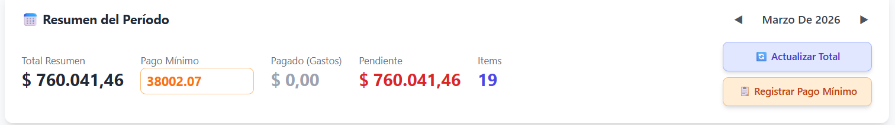
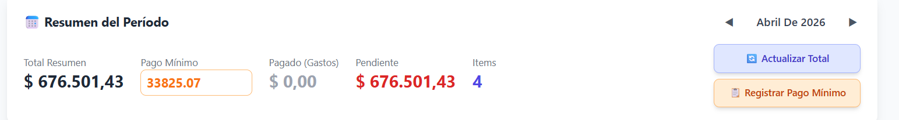

Modulo de tarjeta de crédito

Funcionalidades:
1. Registro de gastos del periodo actual
2. Registro del monto total como item de presupuesto para mes siguiente al cierre del resumen.
3. Calculo de cuotas a futuro para compras en cuotas.
4. Calculo de montos en ARS para comprar en dolares.
5. ✅ RESUELTO - Implementar funcionalidad del punto 3 de FINLY_BUDGET_MODULE.md en página Presupuesto.
6. ✅ RESUELTO — Agregar en Resumen de Tarjeta opción para registrar el pago, indicando monto e item de presupuesto donde será asignado ese pago (simil cuando se carga un gasto desde el módulo de gastos).
   → Fix: Nuevo botón "💳 Registrar Pago" en la sección Resumen del Período. Abre modal `CreditCardPaymentModal` con: fecha, monto (con shortcuts de pendiente/total), forma de pago, selector de item de presupuesto (pre-selecciona el item del período si existe), y detalle. Crea una transacción tipo Gasto/categoría "Tarjeta de Crédito" asociada al item de presupuesto seleccionado.
7. Crear opción para registrar gasto de nuevo periodo.
    Revisión fix 20: No aparece, tampoco el de Registro de Pago minimo, que desapareció..  
     

8. ✅ RESUELTO — Agregar opción para editar pago registrado.
   → Fix: Sección "Pagos Registrados" en Resumen del Período muestra cada pago con botones ✏️ editar y 🗑️ eliminar. El modal `CreditCardPaymentModal` ahora soporta modo edición (pre-llena fecha, monto, forma de pago, detalle). Al guardar actualiza la transacción existente vía `PUT /api/transactions/{id}`. Backend retorna `payment_transactions` en la respuesta de `get_card_period_installments`.

9. Paginar la vista de Compras del periodo s 5 lineas por página.

10. ✅ RESUELTO — Los periodos no son meses calendario, agregar opción de definir rango de fechas del periodo.
   → Fix: Se implementó `_get_period_date_range()` que calcula el ciclo de facturación real usando `closing_day`. También se creó tabla `credit_card_period_configs` para permitir closing_day y due_day distintos por período. Campos editables "Día Cierre" y "Día Vencimiento" en el Resumen del Período.

11. ✅ RESUELTO — Visualización y manejo de períodos de tarjeta
   → Fix: Implementación completa (11.1-11.8):
   - Backend: `get_card_period_installments()` ahora retorna `period_start`, `period_end`, `closing_date`, `due_date`
   - Backend: Nuevo endpoint `GET /api/credit-cards/{card_id}/period-for-date?purchase_date=YYYY-MM-DD` para determinar el período de una compra
   - Backend: Nuevo método `get_period_for_date()` en CreditCardService
   - Frontend: Navegación por períodos muestra "Marzo – Abril 2026" en lugar de solo el mes
   - Frontend: Bloque de info del período con fechas de inicio/fin, cierre, vencimiento + edición de días
   - Frontend: PurchaseModal muestra período asignado automáticamente al seleccionar fecha de compra
   - Se eliminaron los inputs duplicados de Día Cierre/Vencimiento del área de métricas (ahora están en el bloque de período)

Bugs Módulo Tarjeta de Crédito
1. ✅ RESUELTO — Edito un gasto de tarjeta a monto en dolares, pero cuando guardo el monto no se actuliza en la lista de pagos registrados.
   → Fix: Corrección en `update_purchase` para manejar currency y exchange_rate correctamente.
2. ✅ RESUELTO — El pago en cuota registrado es la cuoata actual, por lo tanto en cronograma de cuotas cada cuota es igual a la actual y el 
   monto_total=<cant cuotas>*monto_cuota
   → Fix: Fórmula de interés corregida a amortización francesa: `monthly_rate = annual_rate / 12 / 100`.
3. ✅ RESUELTO — Es erróneo registrar cada pago en presupuesto, sino que se debe registrar el pago total para que pueda asignar el pago correspondiente.
   3.1- ✅ Agregar un botón para registrar todo el periodo en el presupuesto del mes siguiente al vencimiento.
   3.2- ✅ Permitir actualizar ese presupuesto de tarjeta con edicion de pagos registrados al periodo en cuestión.
   → Fix: Botones "Registrar Total" y "Registrar Pago Mínimo". Incluye compras standalone de 1 cuota + cuotas de planes.
4. ✅ RESUELTO — El pago minimo varia según el resumen, no es un porcentaje fijo, permitir configurar el valor de cada periodo a mano. 
   → Fix: Campo editable de pago mínimo en frontend. El backend acepta `minimum_payment` personalizado (default: 5% del total).
5. ✅ RESUELTO — Al registrar los gastos en el Presupuestos agregar monto minimo en descripción del item correspondiente al periodo en cuestión. 
   → Fix: El `detalle` del BudgetItem incluye el monto mínimo: "(Mín: $X)" para pago total, "- Pago Mínimo: $X" para pago mínimo.
6. ✅ RESUELTO — Si quiero eliminar un item generardo desde Registar en Presupupesto da error
   → Fix: `debt_service.py` referenciaba clase `Debt` inexistente. Corregido a `BudgetItem` en 4 métodos.

  
Detalles del error

   App.jsx:47 ⚡ Loaded from cache
App.jsx:47 ⚡ Loaded from cache
App.jsx:57 ✅ Loaded 183 transactions from PostgreSQL
App.jsx:57 ✅ Loaded 183 transactions from PostgreSQL
App.jsx:175 ✅ Transaction 597 deleted from PostgreSQL
App.jsx:47 ⚡ Loaded from cache
App.jsx:57 ✅ Loaded 182 transactions from PostgreSQL
App.jsx:79 🔄 Syncing from Google Sheets to PostgreSQL...
App.jsx:81 ✅ Sync completed: Object
App.jsx:95 ✅ Loaded 176 transactions from PostgreSQL
usage-monitoring.js:71 Uncaught (in promise) InvalidStateError: Failed to execute 'transaction' on 'IDBDatabase': The database connection is closing.
    at Proxy.<anonymous> (chrome-extension://elfaihghhjjoknimpccccmkioofjjfkf/background.js:66:26082)
    at Proxy.s (chrome-extension://elfaihghhjjoknimpccccmkioofjjfkf/background.js:66:27201)
    at ps.getActiveSessions (chrome-extension://elfaihghhjjoknimpccccmkioofjjfkf/background.js:68:10277)
    at async Ec.getComputeDependencies (chrome-extension://elfaihghhjjoknimpccccmkioofjjfkf/background.js:68:40408)
    at async chrome-extension://elfaihghhjjoknimpccccmkioofjjfkf/background.js:68:16371
usage-monitoring.js:71 Uncaught (in promise) InvalidStateError: Failed to execute 'transaction' on 'IDBDatabase': The database connection is closing.
    at Proxy.<anonymous> (chrome-extension://elfaihghhjjoknimpccccmkioofjjfkf/background.js:66:26082)
    at Proxy.s (chrome-extension://elfaihghhjjoknimpccccmkioofjjfkf/background.js:66:27201)
    at ps.getActiveSessions (chrome-extension://elfaihghhjjoknimpccccmkioofjjfkf/background.js:68:10277)
    at async Ec.getComputeDependencies (chrome-extension://elfaihghhjjoknimpccccmkioofjjfkf/background.js:68:40408)
    at async chrome-extension://elfaihghhjjoknimpccccmkioofjjfkf/background.js:68:16371
usage-monitoring.js:71 Uncaught (in promise) InvalidStateError: Failed to execute 'transaction' on 'IDBDatabase': The database connection is closing.
    at Proxy.<anonymous> (chrome-extension://elfaihghhjjoknimpccccmkioofjjfkf/background.js:66:26082)
    at Proxy.s (chrome-extension://elfaihghhjjoknimpccccmkioofjjfkf/background.js:66:27201)
    at ps.getActiveSessions (chrome-extension://elfaihghhjjoknimpccccmkioofjjfkf/background.js:68:10277)
    at async Ec.getComputeDependencies (chrome-extension://elfaihghhjjoknimpccccmkioofjjfkf/background.js:68:40408)
    at async chrome-extension://elfaihghhjjoknimpccccmkioofjjfkf/background.js:68:16371
usage-monitoring.js:71 Uncaught (in promise) InvalidStateError: Failed to execute 'transaction' on 'IDBDatabase': The database connection is closing.
    at Proxy.<anonymous> (chrome-extension://elfaihghhjjoknimpccccmkioofjjfkf/background.js:66:26082)
    at Proxy.s (chrome-extension://elfaihghhjjoknimpccccmkioofjjfkf/background.js:66:27201)
    at ps.getActiveSessions (chrome-extension://elfaihghhjjoknimpccccmkioofjjfkf/background.js:68:10277)
    at async Ec.getComputeDependencies (chrome-extension://elfaihghhjjoknimpccccmkioofjjfkf/background.js:68:40408)
    at async chrome-extension://elfaihghhjjoknimpccccmkioofjjfkf/background.js:68:16371
usage-monitoring.js:71 Uncaught (in promise) InvalidStateError: Failed to execute 'transaction' on 'IDBDatabase': The database connection is closing.
    at Proxy.<anonymous> (chrome-extension://elfaihghhjjoknimpccccmkioofjjfkf/background.js:66:26082)
    at Proxy.s (chrome-extension://elfaihghhjjoknimpccccmkioofjjfkf/background.js:66:27201)
    at ps.getActiveSessions (chrome-extension://elfaihghhjjoknimpccccmkioofjjfkf/background.js:68:10277)
    at async Ec.getComputeDependencies (chrome-extension://elfaihghhjjoknimpccccmkioofjjfkf/background.js:68:40408)
    at async chrome-extension://elfaihghhjjoknimpccccmkioofjjfkf/background.js:68:16371
usage-monitoring.js:71 Uncaught (in promise) InvalidStateError: Failed to execute 'transaction' on 'IDBDatabase': The database connection is closing.
    at Proxy.<anonymous> (chrome-extension://elfaihghhjjoknimpccccmkioofjjfkf/background.js:66:26082)
    at Proxy.s (chrome-extension://elfaihghhjjoknimpccccmkioofjjfkf/background.js:66:27201)
    at ps.getActiveSessions (chrome-extension://elfaihghhjjoknimpccccmkioofjjfkf/background.js:68:10277)
    at async Ec.getComputeDependencies (chrome-extension://elfaihghhjjoknimpccccmkioofjjfkf/background.js:68:40408)
    at async chrome-extension://elfaihghhjjoknimpccccmkioofjjfkf/background.js:68:16371
:8000/api/budget-items/139:1  Failed to load resource: the server responded with a status of 404 (Not Found)
installHook.js:1 Error deleting debt: AxiosError: Request failed with status code 404
    at settle (axios.js?v=00a09b6a:1319:7)
    at XMLHttpRequest.onloadend (axios.js?v=00a09b6a:1682:7)
    at Axios.request (axios.js?v=00a09b6a:2328:41)
    at async handleDeleteConfirm (DebtManager.jsx:131:7)
overrideMethod @ installHook.js:1

1. ✅ RESUELTO — Prioridad: Alta - El Resumen del pedido debe ser la suma de todas los gastos del periodo.
   → Fix: Compras standalone (1 cuota) ahora aparecen en el mes de compra (no desplazadas al mes siguiente).
   El periodo del mes actual suma todos los gastos + cuotas. Abril y subsiguientes solo muestran cuotas de planes.
   El período default al seleccionar tarjeta es el mes actual (no el siguiente).

1. ✅ RESUELTO — Prioridad: Alta 
   → Fix: `pool_pre_ping=True` en engine para manejar conexiones stale. IntegrityError (nombre duplicado) retorna 409 en vez de 500.

   
Bug al crear nueva tarjeta de crédito
 
    App.jsx:47 ⚡ Loaded from cache
        App.jsx:47 ⚡ Loaded from cache
        App.jsx:57 ✅ Loaded 85 transactions from PostgreSQL
        App.jsx:57 ✅ Loaded 85 transactions from PostgreSQL
        App.jsx:175 ✅ Transaction 198 deleted from PostgreSQL
        App.jsx:47 ⚡ Loaded from cache
        App.jsx:57 ✅ Loaded 84 transactions from PostgreSQL
        App.jsx:175 ✅ Transaction 295 deleted from PostgreSQL
        App.jsx:47 ⚡ Loaded from cache
        App.jsx:57 ✅ Loaded 83 transactions from PostgreSQL
        (index):1 Uncaught (in promise) Error: A listener indicated an asynchronous response by returning true, but the message channel closed before a response was received
        (index):1 Uncaught (in promise) Error: A listener indicated an asynchronous response by returning true, but the message channel closed before a response was received
        (index):1 Uncaught (in promise) Error: A listener indicated an asynchronous response by returning true, but the message channel closed before a response was received
        (index):1 Uncaught (in promise) Error: A listener indicated an asynchronous response by returning true, but the message channel closed before a response was received
        usage-monitoring.js:71 Uncaught (in promise) InvalidStateError: Failed to execute 'transaction' on 'IDBDatabase': The database connection is closing.
            at Proxy.<anonymous> (chrome-extension://elfaihghhjjoknimpccccmkioofjjfkf/background.js:66:26082)
            at Proxy.s (chrome-extension://elfaihghhjjoknimpccccmkioofjjfkf/background.js:66:27201)
            at ps.getActiveSessions (chrome-extension://elfaihghhjjoknimpccccmkioofjjfkf/background.js:68:10277)
            at async Ec.getComputeDependencies (chrome-extension://elfaihghhjjoknimpccccmkioofjjfkf/background.js:68:40408)
            at async chrome-extension://elfaihghhjjoknimpccccmkioofjjfkf/background.js:68:16371
        :8000/api/credit-cards:1  Failed to load resource: the server responded with a status of 500 (Internal Server Error)
        installHook.js:1 Error creating credit card: AxiosError: Request failed with status code 500
            at settle (axios.js?v=00a09b6a:1319:7)
            at XMLHttpRequest.onloadend (axios.js?v=00a09b6a:1682:7)
            at Axios.request (axios.js?v=00a09b6a:2328:41)
            at async handleSubmit (NewCreditCardModal.jsx:62:7)
        overrideMethod @ installHook.js:1
    

 - 8_1 ✅ RESUELTO — Prioridad Alta: Los errores en consola eran de una extensión de Chrome, no de la app.
   → Fix: Datos huérfanos de InstallmentPlan/Schedule para compras 1-cuota limpiados de la DB. Resumen de tarjeta corregido.

9. ✅ RESUELTO — Prioridad: Alta - Si cargo un pago en cuota el sistema propaga hasta el mes de la ultima cuota desde la fecha de compra copiando todos los gastos del periodo actual, debe copiar solo el gasto en cuotas hacia el futuro.
   → Fix 1: Solo se crean InstallmentPlan para compras multi-cuota (>1). Las queries de periodo filtran `number_of_installments > 1`.
   Compras 1-cuota aparecen solo en su mes de compra. Meses futuros solo muestran cuotas de planes multi-cuota.
   → Fix 2 adicional: Limpieza de 18 registros huérfanos de InstallmentPlan/InstallmentScheduleItem para compras 1-cuota existentes en DB.
   `get_card_summary` corregido para contar solo compras standalone del mes actual (no todas las históricas) en `current_debt`.
   → Fix 3 regresión: Revertido el cambio de bug 16 Fix 2 que sumaba TODAS las standalone. `current_debt` vuelve a usar solo mes actual + fallback a meses anteriores para `next_due_amount`.

   Revisión Fix 3:  sigue apareciendo gastos de 1 cuota en otros meses que no corresponde.

   Revisión fix 3:  sigue apareciendo gastos de 1 cuotas, revisar.
   → Fix 4: La lista "Compras con Cuotas" mostraba TODAS las compras de la tarjeta sin filtrar por período. Ahora se filtra por `purchase_id` devuelto por la API de período. La sección se renombró a "Compras del Período" y solo muestra compras relevantes al mes seleccionado.

10. Prioridad: Baja -  Si muevo el control  de fecha   hacia adelante o hacia atras muestra cronograma de pagos (incorrecto hasta que se resuelva bug 9) hasta el mes del pago en cupta mas alejando (hacia atras) o hasta la ultima cuota mas lejana en el futuro y luego desaparace el control obligando el usuario a presionar volver y el toast de Tarjeta para ver el cronograma actual. Se pide que al llegar al final registrado de periodo  (pasadoo futuro) dejar el ultimo para permitir al usurio navegar los periodos sin necesidad de precionar Volver.

11. Prioridad: Baja - En Compra en cuotas paginar a 10 registros por pagina.
12. Prioridad: Baja - En Cronograma de Cuotas paginar a 5 registros por pagina.
13. ✅ RESUELTO — Prioridad: Alta: Cambiar label de botón Resumen a Resumen Total.
   → Fix: Label cambiado de "📊 Resumen" a "📊 Resumen Total" en CreditCardManager.jsx.
14. Prioridad Alta - Crear un botón Resumen Periodo Actual donde
    1.  En Distribución por Descripción mostrar los montos que se adeudan en ese periodo, donde en el caso de pago en cuotas descontar las cuotas previas el periodo en curso.
    2.  En Detalle por Descripción Mosntrar los montos de ese periodo, no los acumulado de gastos en cuotas.
15. ✅ RESUELTO — Prioridad Alta - Fecha inválida al importar CSV con formato "dd.MM.yy"
    → Fix: `parseDate()` en CreditCardCSVImport.jsx ahora soporta separadores `/`, `.` y `-`, con años de 2 o 4 dígitos.
    Formatos soportados: DD/MM/YYYY, DD.MM.YY, DD.MM.YYYY, DD-MM-YYYY, YYYY-MM-DD.
16. ✅ RESUELTO — Prioridad Alta - Nueva tarjeta con funcionalidad limitada (sin Resumen del Periodo ni botones)
    → Fix 1: Condición `installment_count > 0` removida — "Resumen del Período" ahora se muestra siempre, permitiendo navegar a meses con datos.
    → Fix 2: `get_card_summary()` usa solo standalone del mes actual en `current_debt` (compatible con bug 9). Fallback en `next_due_amount` busca hasta 3 meses atrás para tarjetas sin datos en el mes actual.

    → Fix 3: Botones "Registrar Total" y "Registrar Pago Mínimo" ahora siempre visibles. Se deshabilitan (disabled + gris) cuando `total_due === 0` en el período actual.

17. ✅ RESUELTO — Prioridad Alta - Registré un pago en la Tarjeta Ciudad y figura en ambas
   → Fix: `_get_gastos_paid_for_period()` ahora filtra por `debt_id` del BudgetItem específico de cada tarjeta/período en lugar de sumar todas las transacciones "Tarjeta de Crédito" del mes. Los pagos ya no se cruzan entre tarjetas.

18. ✅ RESUELTO — Prioridad Alta - Al presionar "Registrar Pago Minimo" registra el 5% del monto sin tener en cuenta el valor cargado en campo "Pago mínimo".
   → Fix: `get_card_period_installments` ahora retorna el monto mínimo almacenado en el BudgetItem (extraído del detalle) en vez de recalcular siempre el 5%. Así el campo "Pago mínimo" conserva el valor personalizado tras registrar. Toast ahora muestra el monto registrado para feedback claro.
    
19. ✅ RESUELTO — Prioridad Alta - Tarjeta ICBC no registra suma de montos en toast y al cambiar de mes mantiene los mismos gastos en marzo y abril.
   → Fix: La lista "Compras del Período" hacía fallback a TODAS las compras cuando el período no tenía items (`periodPurchaseIds.size === 0`). Ahora filtra siempre por los `purchase_id` del período, mostrando vacío si el mes no tiene compras. Toast con montos ya corregido en bug 18.
   Revisión bug 19: Ahora no muestra los gastos registrados para marzo.

20. ✅ RESUELTO — Prioridad Alta - Próximo Pago debe ser Total Resumen (mes anterior) - Pago Registrado (en Registrar Pago) + Suma de gasto del periodo.
   → Fix: Fórmula en `get_card_summary()` cambiada a: `next_due_amount = max(0, Total(mes anterior) - Pagado(mes anterior)) + Total(mes actual)`. Ahora refleja el saldo impago del período anterior más los cargos del período actual.

21. ✅ RESUELTO — Prioridad Alta - Luego de hacer un registro de pago no aparece el item del nuevo item de presupuesto y tampoco se ve el registro en Gastos.
   → Fix: Tres cambios: (1) Al registrar pago con "💳 Registrar Pago", si no existe budget item para el período, se auto-crea vía `registerCardPeriodBudget` antes de guardar la transacción. (2) La transacción siempre se crea con `debt_id` apuntando al budget item del período, asegurando que aparezca en Presupuesto. (3) Se pasa `refreshTransactions` a `CreditCardManager` para refrescar la lista principal de gastos tras registrar un pago.

22. ✅ RESUELTO — Verificar seteo de periodo, no veo donde registrar fecha de cierre (inicio) y de vencimiento (fin).
   → Fix: Los campos "Día Cierre" y "Día Vencimiento" ahora aparecen editables en el Resumen del Período de cada tarjeta. Cada período puede tener valores distintos (tabla `credit_card_period_configs`). Si no se configura un período específico, se usan los valores por defecto de la tarjeta. El ciclo de facturación usa el `closing_day` para determinar el rango real de compras del período (ej: cierre día 20 → período Mar 21 a Abr 20). Endpoint: `PUT /api/credit-cards/{id}/period-config`.

23. ✅ RESUELTO — No se pueden borrar tarjetas inactivas.
   → Fix (revisado): Las tarjetas inactivas NO se pueden borrar. El botón de eliminar solo aparece en tarjetas activas y realiza un soft delete (desactivar). Las tarjetas inactivas permanecen visibles sin opción de borrado.