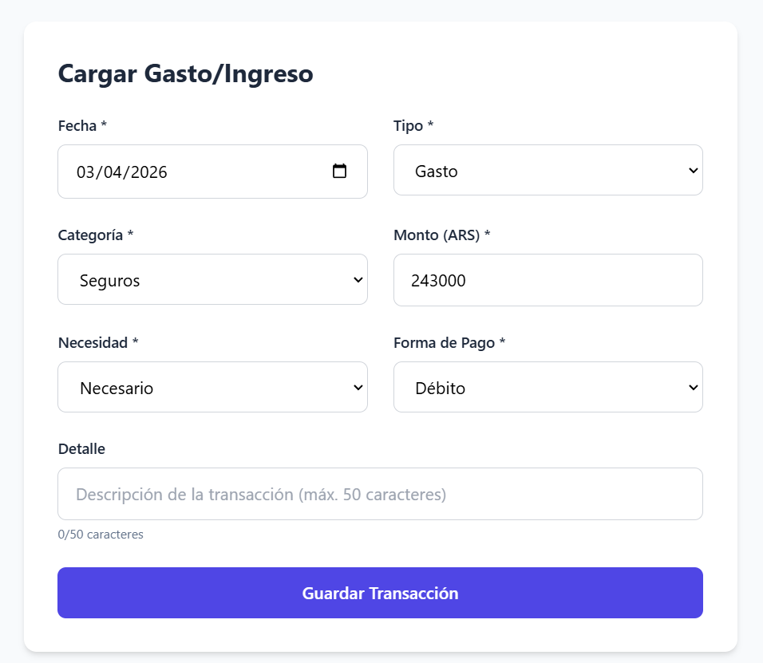

Módulo de gastos

Mejoras:
1. ✅ IMPLEMENTADO — Páginas con tamaño de 25 lineas cada una. Paginación con controles Anterior/Siguiente y números de página en TransactionReport.jsx.
2. ✅ IMPLEMENTADO — Tanto en carga individual como masiva desde csv, la categoria debe ser un campo requerido. Backend (Pydantic) y CSVImport ahora exigen categoría.
3. ✅ IMPLEMENTADO — Filtro para mostrar por mes. Por defecto mostrar los gastos del mes actual. Selector de mes/año en la barra de filtros de TransactionReport.jsx.
4. ✅ IMPLEMENTADO — En asignación de presupuesto, mostrar solo los items de presupuesto del mes del gasto. TransactionForm.jsx y EditTransactionModal.jsx filtran por YYYY-MM de la fecha.
5. ✅ IMPLEMENTADO — Selector de mes/año con navegación ◀ ▶ y botón "Hoy" en página Reportes (TransactionReport.jsx). Misma funcionalidad que el Panel Principal: barra visual prominente, dropdown de mes y año, navegación con wrapping mes/año.
6. ✅ IMPLEMENTADO — Normalización de categorías: tabla categories poblada con datos existentes + hardcoded, campo category_id (FK) en transactions, API /api/categories retorna [{id, name}], frontend usa objetos categoría. Migración Alembic b5e8f2a1c3d7.
7. ✅ IMPLEMENTADO — Campos de transactions renombrados a inglés: marca_temporal→timestamp, fecha→date, tipo→type, categoria→category_id, monto→amount, necesidad→necessity, forma_pago→payment_method, detalle→detail, estado_asignacion→assignment_status. Backend (main.py, database_service.py, google_sheets.py) y frontend (6 componentes) actualizados.
8. Agregar filtro por Detalles simil pantalla de Presupuesto.

Bugs:
1. ~~Prioridad: Alta~~ ✅ RESUELTO — El frontend usaba `id: Date.now()` como id de transacción en lugar del id real de la DB. Al editar, enviaba PUT con un timestamp (ej: 1775000505766) que no existía en PostgreSQL → 500. Fix: se eliminó `Date.now()` de TransactionForm.jsx y CSVImport.jsx, y `addTransaction` en App.jsx ahora usa el `id` real devuelto por la API.

 

    
Error al editar asignación de item de presupuesto
    api.js:58  PUT http://localhost:8000/api/transactions/1775000505766 500 (Internal Server Error)
    dispatchXhrRequest @ axios.js?v=00a09b6a:1784
    xhr @ axios.js?v=00a09b6a:1649
    dispatchRequest @ axios.js?v=00a09b6a:2210
    Promise.then
    _request @ axios.js?v=00a09b6a:2428
    request @ axios.js?v=00a09b6a:2324
    httpMethod @ axios.js?v=00a09b6a:2476
    wrap @ axios.js?v=00a09b6a:8
    updateTransaction @ api.js:58
    updateTransaction @ App.jsx:156
    handleSaveEdit @ Dashboard.jsx:46
    handleSubmit @ EditTransactionModal.jsx:40
    callCallback2 @ chunk-NUMECXU6.js?v=00a09b6a:3674
    invokeGuardedCallbackDev @ chunk-NUMECXU6.js?v=00a09b6a:3699
    invokeGuardedCallback @ chunk-NUMECXU6.js?v=00a09b6a:3733
    invokeGuardedCallbackAndCatchFirstError @ chunk-NUMECXU6.js?v=00a09b6a:3736
    executeDispatch @ chunk-NUMECXU6.js?v=00a09b6a:7014
    processDispatchQueueItemsInOrder @ chunk-NUMECXU6.js?v=00a09b6a:7034
    processDispatchQueue @ chunk-NUMECXU6.js?v=00a09b6a:7043
    dispatchEventsForPlugins @ chunk-NUMECXU6.js?v=00a09b6a:7051
    (anonymous) @ chunk-NUMECXU6.js?v=00a09b6a:7174
    batchedUpdates$1 @ chunk-NUMECXU6.js?v=00a09b6a:18913
    batchedUpdates @ chunk-NUMECXU6.js?v=00a09b6a:3579
    dispatchEventForPluginEventSystem @ chunk-NUMECXU6.js?v=00a09b6a:7173
    dispatchEventWithEnableCapturePhaseSelectiveHydrationWithoutDiscreteEventReplay @ chunk-NUMECXU6.js?v=00a09b6a:5478
    dispatchEvent @ chunk-NUMECXU6.js?v=00a09b6a:5472
    dispatchDiscreteEvent @ chunk-NUMECXU6.js?v=00a09b6a:5449
    installHook.js:1 ❌ Error updating transaction: AxiosError: Request failed with status code 500
        at settle (axios.js?v=00a09b6a:1319:7)
        at XMLHttpRequest.onloadend (axios.js?v=00a09b6a:1682:7)
        at Axios.request (axios.js?v=00a09b6a:2328:41)
        at async updateTransaction (App.jsx:156:7)
        at async handleSaveEdit (Dashboard.jsx:46:7)
    overrideMethod @ installHook.js:1
    updateTransaction @ App.jsx:166
    await in updateTransaction
    handleSaveEdit @ Dashboard.jsx:46
    handleSubmit @ EditTransactionModal.jsx:40
    callCallback2 @ chunk-NUMECXU6.js?v=00a09b6a:3674
    invokeGuardedCallbackDev @ chunk-NUMECXU6.js?v=00a09b6a:3699
    invokeGuardedCallback @ chunk-NUMECXU6.js?v=00a09b6a:3733
    invokeGuardedCallbackAndCatchFirstError @ chunk-NUMECXU6.js?v=00a09b6a:3736
    executeDispatch @ chunk-NUMECXU6.js?v=00a09b6a:7014
    processDispatchQueueItemsInOrder @ chunk-NUMECXU6.js?v=00a09b6a:7034
    processDispatchQueue @ chunk-NUMECXU6.js?v=00a09b6a:7043
    dispatchEventsForPlugins @ chunk-NUMECXU6.js?v=00a09b6a:7051
    (anonymous) @ chunk-NUMECXU6.js?v=00a09b6a:7174
    batchedUpdates$1 @ chunk-NUMECXU6.js?v=00a09b6a:18913
    batchedUpdates @ chunk-NUMECXU6.js?v=00a09b6a:3579
    dispatchEventForPluginEventSystem @ chunk-NUMECXU6.js?v=00a09b6a:7173
    dispatchEventWithEnableCapturePhaseSelectiveHydrationWithoutDiscreteEventReplay @ chunk-NUMECXU6.js?v=00a09b6a:5478
    dispatchEvent @ chunk-NUMECXU6.js?v=00a09b6a:5472
    dispatchDiscreteEvent @ chunk-NUMECXU6.js?v=00a09b6a:5449
    installHook.js:1 AxiosError: Request failed with status code 500
        at settle (axios.js?v=00a09b6a:1319:7)
        at XMLHttpRequest.onloadend (axios.js?v=00a09b6a:1682:7)
        at Axios.request (axios.js?v=00a09b6a:2328:41)
        at async updateTransaction (App.jsx:156:7)
        at async handleSaveEdit (Dashboard.jsx:46:7)
    overrideMethod @ installHook.js:1
    handleSaveEdit @ Dashboard.jsx:53
    await in handleSaveEdit
    handleSubmit @ EditTransactionModal.jsx:40
    callCallback2 @ chunk-NUMECXU6.js?v=00a09b6a:3674
    invokeGuardedCallbackDev @ chunk-NUMECXU6.js?v=00a09b6a:3699
    invokeGuardedCallback @ chunk-NUMECXU6.js?v=00a09b6a:3733
    invokeGuardedCallbackAndCatchFirstError @ chunk-NUMECXU6.js?v=00a09b6a:3736
    executeDispatch @ chunk-NUMECXU6.js?v=00a09b6a:7014
    processDispatchQueueItemsInOrder @ chunk-NUMECXU6.js?v=00a09b6a:7034
    processDispatchQueue @ chunk-NUMECXU6.js?v=00a09b6a:7043
    dispatchEventsForPlugins @ chunk-NUMECXU6.js?v=00a09b6a:7051
    (anonymous) @ chunk-NUMECXU6.js?v=00a09b6a:7174
    batchedUpdates$1 @ chunk-NUMECXU6.js?v=00a09b6a:18913
    batchedUpdates @ chunk-NUMECXU6.js?v=00a09b6a:3579
    dispatchEventForPluginEventSystem @ chunk-NUMECXU6.js?v=00a09b6a:7173
    dispatchEventWithEnableCapturePhaseSelectiveHydrationWithoutDiscreteEventReplay @ chunk-NUMECXU6.js?v=00a09b6a:5478
    dispatchEvent @ chunk-NUMECXU6.js?v=00a09b6a:5472
    dispatchDiscreteEvent @ chunk-NUMECXU6.js?v=00a09b6a:5449
   

2. ~~Error al import gastos desde csv~~ ✅ RESUELTO — El modelo Pydantic `Transaction` en main.py seguía usando nombres en español (`fecha`, `tipo`, `categoria`, `monto`, etc.) pero el frontend (CSVImport.jsx, TransactionForm.jsx, EditTransactionModal.jsx) enviaba campos en inglés (`date`, `type`, `category`, `amount`, etc.) tras Mejora 7 → 422 Unprocessable Entity. Fix: se actualizó el modelo Pydantic a campos inglés (`date`, `type`, `category`, `amount`, `necessity`, `payment_method`, `detail`, `assignment_status`).

App.jsx:47 ⚡ Loaded from cache
App.jsx:57 ✅ Loaded 89 transactions from PostgreSQL
usage-monitoring.js:71 Uncaught (in promise) InvalidStateError: Failed to execute 'transaction' on 'IDBDatabase': The database connection is closing.
    at Proxy.<anonymous> (chrome-extension://elfaihghhjjoknimpccccmkioofjjfkf/background.js:66:26082)
    at Proxy.s (chrome-extension://elfaihghhjjoknimpccccmkioofjjfkf/background.js:66:27201)
    at ps.getActiveSessions (chrome-extension://elfaihghhjjoknimpccccmkioofjjfkf/background.js:68:10277)
    at async Ec.getComputeDependencies (chrome-extension://elfaihghhjjoknimpccccmkioofjjfkf/background.js:68:40408)
    at async chrome-extension://elfaihghhjjoknimpccccmkioofjjfkf/background.js:68:16371
:8000/api/transactions/820:1  Failed to load resource: the server responded with a status of 422 (Unprocessable Entity)
installHook.js:1 ❌ Error updating transaction: AxiosError: Request failed with status code 422
    at settle (axios.js?v=00a09b6a:1319:7)
    at XMLHttpRequest.onloadend (axios.js?v=00a09b6a:1682:7)
    at Axios.request (axios.js?v=00a09b6a:2328:41)
    at async updateTransaction (App.jsx:158:7)
    at async handleSaveEdit (Dashboard.jsx:46:7)
overrideMethod @ installHook.js:1
installHook.js:1 AxiosError: Request failed with status code 422
    at settle (axios.js?v=00a09b6a:1319:7)
    at XMLHttpRequest.onloadend (axios.js?v=00a09b6a:1682:7)
    at Axios.request (axios.js?v=00a09b6a:2328:41)
    at async updateTransaction (App.jsx:158:7)
    at async handleSaveEdit (Dashboard.jsx:46:7)
overrideMethod @ installHook.js:1
(index):1 Uncaught (in promise) Error: A listener indicated an asynchronous response by returning true, but the message channel closed before a response was received
(index):1 Uncaught (in promise) Error: A listener indicated an asynchronous response by returning true, but the message channel closed before a response was received
(index):1 Uncaught (in promise) Error: A listener indicated an asynchronous response by returning true, but the message channel closed before a response was received
(index):1 Uncaught (in promise) Error: A listener indicated an asynchronous response by returning true, but the message channel closed before a response was received
usage-monitoring.js:71 Uncaught (in promise) InvalidStateError: Failed to execute 'transaction' on 'IDBDatabase': The database connection is closing.
    at Proxy.<anonymous> (chrome-extension://elfaihghhjjoknimpccccmkioofjjfkf/background.js:66:26082)
    at Proxy.s (chrome-extension://elfaihghhjjoknimpccccmkioofjjfkf/background.js:66:27201)
    at ps.getActiveSessions (chrome-extension://elfaihghhjjoknimpccccmkioofjjfkf/background.js:68:10277)
    at async Ec.getComputeDependencies (chrome-extension://elfaihghhjjoknimpccccmkioofjjfkf/background.js:68:40408)
    at async chrome-extension://elfaihghhjjoknimpccccmkioofjjfkf/background.js:68:16371
usage-monitoring.js:71 Uncaught (in promise) InvalidStateError: Failed to execute 'transaction' on 'IDBDatabase': The database connection is closing.
    at Proxy.<anonymous> (chrome-extension://elfaihghhjjoknimpccccmkioofjjfkf/background.js:66:26082)
    at Proxy.s (chrome-extension://elfaihghhjjoknimpccccmkioofjjfkf/background.js:66:27201)
    at ps.getActiveSessions (chrome-extension://elfaihghhjjoknimpccccmkioofjjfkf/background.js:68:10277)
    at async Ec.getComputeDependencies (chrome-extension://elfaihghhjjoknimpccccmkioofjjfkf/background.js:68:40408)
    at async chrome-extension://elfaihghhjjoknimpccccmkioofjjfkf/background.js:68:16371
:8000/api/transactions/import:1  Failed to load resource: the server responded with a status of 422 (Unprocessable Entity)
installHook.js:1 ❌ Error importing transactions: AxiosError: Request failed with status code 422
    at settle (axios.js?v=00a09b6a:1319:7)
    at XMLHttpRequest.onloadend (axios.js?v=00a09b6a:1682:7)
    at Axios.request (axios.js?v=00a09b6a:2328:41)
    at async addMultipleTransactions (App.jsx:144:24)
    at async confirmImport (CSVImport.jsx:155:9)
overrideMethod @ installHook.js:1

3. ~~Desapareció la funcionalidad de asignar un nuevo gasto a un item de presupuesto~~ ✅ RESUELTO — El filtro de items de presupuesto por mes usaba `d.fecha` (fecha de creación del item) en lugar de `d.fecha_vencimiento` (mes al que pertenece). Al no haber items creados en el mes actual, el selector no aparecía. Fix: se cambió el filtro a `d.fecha_vencimiento` en TransactionForm.jsx y EditTransactionModal.jsx.
   
   Revisión bug 3: Sigue si aparecer combo → Verificado: el filtro por `fecha_vencimiento` es correcto, el backend estaba caído cuando se testeó.
4. ~~No puedo asignar item de presupuesto al editar un gasto del mes actual~~ ✅ RESUELTO — Dashboard.jsx cargaba los items de presupuesto solo una vez al montar el componente. Si se agregaban items nuevos (ej: al clonar mes), el modal de edición no los veía. Fix: se agregó `useEffect` en Dashboard.jsx que recarga los items de presupuesto cada vez que se abre el modal de edición.
5. ~~Prioridad Alta - Error en el calculo de  Total a Pagar en presupuesto Marzo , y se propaga a abril , el csv qeu geerar muestra Total por Pagar = 8628000 (sum de todas la categorias menos Ingresos) e Ingresos  =  8824024, parece que el codigo suma todo como montos a pagar, sin filtrar ingresos~~ ✅ RESUELTO — `get_debt_summary()` en debt_service.py no filtraba por `tipo_flujo`, sumando items de tipo INGRESO como si fueran gastos a pagar. Fix: se agregó filtro `Debt.tipo_flujo == FlowType.GASTO` a todas las queries de montos (`total_amount`, `pending_amount`, `partial_amount`, `overdue_amount`) y conteos por estado. Se agregó campo `total_ingresos` separado.

6. ~~Error al editar transaccion de gastos~~ ✅ RESUELTO — La columna `detail` en la tabla `transactions` era `VARCHAR(50)`, demasiado corta para detalles reales. Al editar una transacción con más de 50 caracteres, el backend fallaba silenciosamente con error 500. Fix: migración Alembic `feb52f2c5e5c` cambia columna `detail` de `VARCHAR(50)` a `TEXT`. Además se mejoró el manejo de errores en `update_transaction` para capturar `ValueError` (categoría vacía → 400) y propagar errores con mensajes claros en lugar de 404 genérico.

App.jsx:47 ⚡ Loaded from cache
App.jsx:47 ⚡ Loaded from cache
App.jsx:57 ✅ Loaded 121 transactions from PostgreSQL
App.jsx:57 ✅ Loaded 121 transactions from PostgreSQL
(index):1 Uncaught (in promise) Error: A listener indicated an asynchronous response by returning true, but the message channel closed before a response was received
(index):1 Uncaught (in promise) Error: A listener indicated an asynchronous response by returning true, but the message channel closed before a response was received
(index):1 Uncaught (in promise) Error: A listener indicated an asynchronous response by returning true, but the message channel closed before a response was received
(index):1 Uncaught (in promise) Error: A listener indicated an asynchronous response by returning true, but the message channel closed before a response was received
usage-monitoring.js:71 Uncaught (in promise) InvalidStateError: Failed to execute 'transaction' on 'IDBDatabase': The database connection is closing.
    at Proxy.<anonymous> (chrome-extension://elfaihghhjjoknimpccccmkioofjjfkf/background.js:66:26082)
    at Proxy.s (chrome-extension://elfaihghhjjoknimpccccmkioofjjfkf/background.js:66:27201)
    at ps.getActiveSessions (chrome-extension://elfaihghhjjoknimpccccmkioofjjfkf/background.js:68:10277)
    at async Ec.getComputeDependencies (chrome-extension://elfaihghhjjoknimpccccmkioofjjfkf/background.js:68:40408)
    at async chrome-extension://elfaihghhjjoknimpccccmkioofjjfkf/background.js:68:16371

7. Prioridad Alta - Error al borrar gasto.
 
 

    App.jsx:47 ⚡ Loaded from cache
    App.jsx:57 ✅ Loaded 122 transactions from PostgreSQL
    App.jsx:177 ✅ Transaction 853 deleted from PostgreSQL
    App.jsx:47 ⚡ Loaded from cache
    :8000/api/transactions/853:1  Failed to load resource: the server responded with a status of 500 (Internal Server Error)
    installHook.js:1 ❌ Error deleting transaction: AxiosError: Request failed with status code 500
        at settle (axios.js?v=00a09b6a:1319:7)
        at XMLHttpRequest.onloadend (axios.js?v=00a09b6a:1682:7)
        at Axios.request (axios.js?v=00a09b6a:2328:41)
        at async deleteTransaction (App.jsx:176:7)
        at async handleDelete (Dashboard.jsx:68:7)
    overrideMethod @ installHook.js:1
    installHook.js:1 AxiosError: Request failed with status code 500
        at settle (axios.js?v=00a09b6a:1319:7)
        at XMLHttpRequest.onloadend (axios.js?v=00a09b6a:1682:7)
        at Axios.request (axios.js?v=00a09b6a:2328:41)
        at async deleteTransaction (App.jsx:176:7)
        at async handleDelete (Dashboard.jsx:68:7)
    overrideMethod @ installHook.js:1
    App.jsx:57 ✅ Loaded 121 transactions from PostgreSQL

8. Prioridad Alta - Error al importar desde csv

App.jsx:47 ⚡ Loaded from cache
App.jsx:57 ✅ Loaded 94 transactions from PostgreSQL
(index):1 Uncaught (in promise) Error: A listener indicated an asynchronous response by returning true, but the message channel closed before a response was received
(index):1 Uncaught (in promise) Error: A listener indicated an asynchronous response by returning true, but the message channel closed before a response was received
(index):1 Uncaught (in promise) Error: A listener indicated an asynchronous response by returning true, but the message channel closed before a response was received

