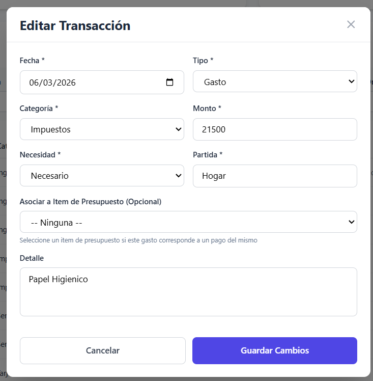
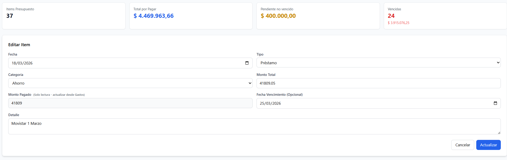
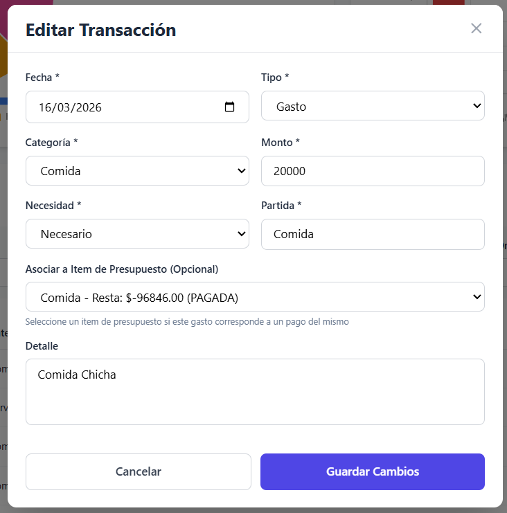
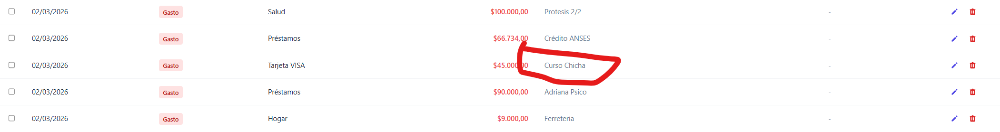
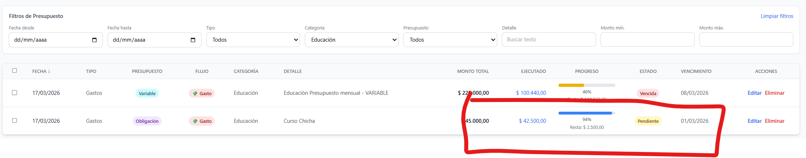
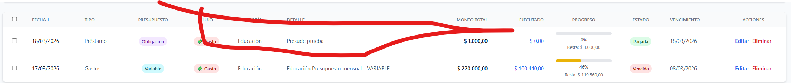

1. ~~¿De donde surge Partida?~~ ✅ FIXED
   
   **Problema**: Partida era un campo redundante que duplicaba el valor de Categoría. Vestigio de migración desde Google Sheets sin utilidad funcional.
   
   **Solución implementada**: 
   - Creada migración SQL `002_remove_partida_field.sql` para eliminar columna de la tabla `transactions`
   - Actualizado modelo SQLAlchemy en `backend/database/database.py`
   - Eliminado del schema Pydantic en `backend/main.py`
   - Actualizado backend: `database_service.py` y `google_sheets.py`
   - Actualizado frontend: `EditTransactionModal.jsx`, `TransactionForm.jsx`, `TransactionReport.jsx`, `CSVImport.jsx`
   
   **Resultado**: Sistema simplificado, eliminando complejidad innecesaria para uso personal.

~~~~

~~Parece ser copia de Categoria, si es asi eliminar ese campo.~~

2. ~~Editar en Presupuesto implementr como popup como en editar Gastos~~ ✅ FIXED

   **Solución implementada**: Creado componente EditDebtModal.jsx que implementa el modal popup para editar items de presupuesto, igual que EditTransactionModal.jsx para gastos.

~~Editar presupuesto~~
~~~~

~~Editar Gastos~~
~~~~

3. Generar script de backup para genenerar sql para migrar a otra base de datos.

4. ~~Bug: Desvinculo un item desde módulo Gastos pero en Presupuesto se sigue visualizando como vinculado~~ ✅ FIXED

   **Solución implementada**: Agregado `debtRefreshKey` en Dashboard.jsx que se incrementa cuando:
   - Se actualiza una transacción (vinculación/desvinculación)
   - Se elimina una transacción vinculada
   - Se crea una transacción vinculada a un item de presupuesto
   
   Esto fuerza al componente DebtManager a remontarse y recargar los datos actualizados del presupuesto.

~~Item en gastos:~~
~~~~

~~Item que estaba asociado en presupuesto:~~
~~~~

5. ~~Se probó asignar un gasto e un item de presupuesto, era de 1000, se cargó 900 y aparece como pagada en vez de parcial además no aparece el avance en barra de progreso~~ ✅ FIXED

   **Problema**: El sistema estaba usando el campo legacy `monto_pagado` en lugar de `monto_ejecutado` para calcular el estado de los presupuestos y la barra de progreso.

   **Solución implementada**: 
   - Modificado `backend/services/database_service.py` para actualizar `monto_ejecutado` en lugar de `monto_pagado` en las funciones `add_transaction`, `update_transaction`, y `delete_transaction`
   - Modificado `backend/services/debt_service.py` para calcular el estado basándose en `monto_ejecutado` en lugar de `monto_pagado`
   - Corregida la función de exportación CSV en `frontend/src/components/DebtManager.jsx` para usar `monto_ejecutado`
   
   Ahora el sistema calcula correctamente:
   - Estado PAGO_PARCIAL cuando `monto_ejecutado < monto_total`
   - Estado PAGADA cuando `monto_ejecutado >= monto_total`
   - Barra de progreso refleja correctamente el porcentaje ejecutado

~~~~

