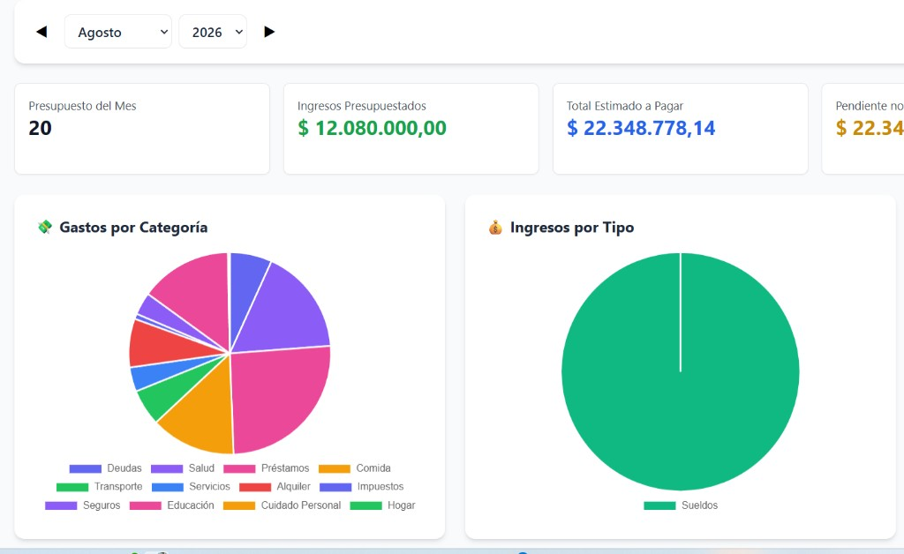

Módulo de presupuesto

## Tabla de Features y Bugs (IDs)

| ID           | Tipo    | Estado         | Resumen                                                                                              |
| ------------ | ------- | -------------- | ---------------------------------------------------------------------------------------------------- |
| BUD-FEAT-001 | FEAT | ✅ Done| Paginación de 10 líneas en listado de presupuesto                                                    |
| BUD-FEAT-002 | FEAT | ✅ Done| Clonado de presupuesto al mes siguiente                                                              |
| BUD-FEAT-003 | FEAT | ✅ Done| Selector de mes/año en Panel Principal + summary por mes                                             |
| BUD-FEAT-004 | FEAT | ✅ Done| Selector de mes/año en Reportes                                                                      |
| BUD-FEAT-005 | FEAT | ✅ Done| Tarjeta Ingresos Presupuestados en encabezado                                                        |
| BUD-FEAT-006 | FEAT | ✅ Done| Filtro por detalle en DebtManager                                                                    |
| BUD-FEAT-007 | FEAT | ✅ Done| Label Total Estimado a Pagar                                                                         |
| BUD-FEAT-008 | FEAT | 📋 Backlog     | Link desde item de presupuesto hacia gastos asociados                                                |
| BUD-BUG-001  | Bug     | ✅ Done     | Fix de keys duplicadas en categorías de edición/alta                                                 |
| BUD-FEAT-009 | FEAT | ✅ Done| Spinner de carga en tabla de presupuesto (`DebtManager` modo budget)                                 |
| BUD-BUG-010  | Bug     | ⏳ Todo     | Total Estimado a Pagar sumaba ingresos; ahora solo considera ítems con flujo Gasto  |

### Historial de Mejoras:

BUD-FEAT-001. ✅ Done— Páginas con tamaño de 10 lineas cada una. Paginación con controles Anterior/Siguiente y números de página en DebtManager.jsx.
BUD-FEAT-002. ✅ Done— Clonar Presupuesto al mes siguiente. Botón "Clonar Mes" con modal para seleccionar mes/año origen. Clona todos los items con fecha del mes siguiente, montos ejecutados en 0. Corregido formato de fecha a YYYY-MM-DD en backend.
BUD-FEAT-003. ✅ Done— Panel Principal con selector de mes/año. Muestra resumen filtrado del mes seleccionado (ingresos, gastos, balance, presupuesto pendiente obligatorio/variable, transacciones recientes). Controles ◀ ▶ para navegar meses, botón "Hoy" para volver al mes actual. Backend actualizado con filtro por mes en /api/budget-items/summary. Corregido import de Debt en debt_service.py.
BUD-FEAT-004. ✅ Done— Selector de mes/año con navegación ◀ ▶ y botón "Hoy" en página Reportes (TransactionReport.jsx). Replica la funcionalidad del punto 3 en TransactionReport.
   Revisión punto 4: No se muestra como en Panel Principal alt text
BUD-FEAT-005. ✅ Done— Tarjeta "Ingresos Presupuestados" agregada al encabezado del módulo Presupuesto (DebtManager.jsx). Usa el campo `total_ingresos` del summary del backend (agregado en fix Bug 5). Grid expandido de 4 a 5 columnas.
BUD-FEAT-006. ✅ Done— Filtro por detalle ya existía: estado `filterDetalle`, input de texto en la barra de filtros, y lógica de filtrado con `.includes()` en `displayedDebts`.
BUD-FEAT-007. ✅ Done— Label "Total por Pagar" cambiado a "Total Estimado a Pagar" en DebtManager.jsx.
BUD-FEAT-008. 📋 Backlog — Agregar link en cada item del presupuesto para que muestre en otra pantalla (no en popup) los items de gastos asociados.

Bugs:
BUD-BUG-001. ✅ Done — Error al editar un item de presupuesto. Las categorías (ahora objetos `{id, name}`) se usaban como key/value directamente en `<option>`, generando keys `[object Object]` duplicados. Fix: `key={cat.id || cat}` y `value={cat.name || cat}` en EditDebtModal.jsx y NewDebtModal.jsx.

BUD-BUG-010. ✅ Done — El encabezado **Total Estimado a Pagar** sumaba `estimated_payment` de todos los ítems del mes, incluyendo flujo **Ingreso**. El backend (`debt_service.py`) ya filtraba solo Gastos; el frontend no. Fix en `DebtManager.jsx`: `total_estimated_payment`, pendiente y vencidas solo acumulan ítems con `tipo_flujo === 'Gasto'`.

Evidencia (antes del fix — ingresos inflaban el total):

Ediciónd de presupuesto App.jsx:47 ⚡ Loaded from cache App.jsx:47 ⚡ Loaded from cache App.jsx:57 ✅ Loaded 89 transactions from PostgreSQL App.jsx:57 ✅ Loaded 89 transactions from PostgreSQL installHook.js:1 Warning: Encountered two children with the same key, `[object Object]`. Keys should be unique so that components maintain their identity across updates. Non-unique keys may cause children to be duplicated and/or omitted — the behavior is unsupported and could change in a future version. Error Component Stack at select () at div () at div () at form () at div () at div () at EditDebtModal (EditDebtModal.jsx:4:26) at div () at DebtManager (DebtManager.jsx:20:39) at div () at Dashboard (Dashboard.jsx:13:22) at main () at div () at ToastProvider (ToastContainer.jsx:14:33) at App (App.jsx:9:27) overrideMethod @ installHook.js:1 installHook.js:1 Warning: Encountered two children with the same key, `[object Object]`. Keys should be unique so that components maintain their identity across updates. Non-unique keys may cause children to be duplicated and/or omitted — the behavior is unsupported and could change in a future version. Error Component Stack at select () at div () at div () at form () at div () at div () at EditDebtModal (EditDebtModal.jsx:4:26) at div () at DebtManager (DebtManager.jsx:20:39) at div () at Dashboard (Dashboard.jsx:13:22) at main () at div () at ToastProvider (ToastContainer.jsx:14:33) at App (App.jsx:9:27) overrideMethod @ installHook.js:1 installHook.js:1 Warning: Encountered two children with the same key, `[object Object]`. Keys should be unique so that components maintain their identity across updates. Non-unique keys may cause children to be duplicated and/or omitted — the behavior is unsupported and could change in a future version. Error Component Stack at select () at div () at div () at form () at div () at div () at EditDebtModal (EditDebtModal.jsx:4:26) at div () at DebtManager (DebtManager.jsx:20:39) at div () at Dashboard (Dashboard.jsx:13:22) at main () at div () at ToastProvider (ToastContainer.jsx:14:33) at App (App.jsx:9:27) overrideMethod @ installHook.js:1 installHook.js:1 Warning: Encountered two children with the same key, `[object Object]`. Keys should be unique so that components maintain their identity across updates. Non-unique keys may cause children to be duplicated and/or omitted — the behavior is unsupported and could change in a future version. Error Component Stack at select () at div () at div () at form () at div () at div () at EditDebtModal (EditDebtModal.jsx:4:26) at div () at DebtManager (DebtManager.jsx:20:39) at div () at Dashboard (Dashboard.jsx:13:22) at main () at div () at ToastProvider (ToastContainer.jsx:14:33) at App (App.jsx:9:27) overrideMethod @ installHook.js:1 installHook.js:1 Warning: Encountered two children with the same key, `[object Object]`. Keys should be unique so that components maintain their identity across updates. Non-unique keys may cause children to be duplicated and/or omitted — the behavior is unsupported and could change in a future version. Error Component Stack at select () at div () at div () at form () at div () at div () at EditDebtModal (EditDebtModal.jsx:4:26) at div () at DebtManager (DebtManager.jsx:20:39) at div () at Dashboard (Dashboard.jsx:13:22) at main () at div () at ToastProvider (ToastContainer.jsx:14:33) at App (App.jsx:9:27) overrideMethod @ installHook.js:1 installHook.js:1 Warning: Encountered two children with the same key, `[object Object]`. Keys should be unique so that components maintain their identity across updates. Non-unique keys may cause children to be duplicated and/or omitted — the behavior is unsupported and could change in a future version. Error Component Stack at select () at div () at div () at form () at div () at div () at EditDebtModal (EditDebtModal.jsx:4:26) at div () at DebtManager (DebtManager.jsx:20:39) at div () at Dashboard (Dashboard.jsx:13:22) at main () at div () at ToastProvider (ToastContainer.jsx:14:33) at App (App.jsx:9:27) overrideMethod @ installHook.js:1 installHook.js:1 Warning: Encountered two children with the same key, `[object Object]`. Keys should be unique so that components maintain their identity across updates. Non-unique keys may cause children to be duplicated and/or omitted — the behavior is unsupported and could change in a future version. Error Component Stack at select () at div () at div () at form () at div () at div () at EditDebtModal (EditDebtModal.jsx:4:26) at div () at DebtManager (DebtManager.jsx:20:39) at div () at Dashboard (Dashboard.jsx:13:22) at main () at div () at ToastProvider (ToastContainer.jsx:14:33) at App (App.jsx:9:27) overrideMethod @ installHook.js:1 installHook.js:1 Warning: Encountered two children with the same key, `[object Object]`. Keys should be unique so that components maintain their identity across updates. Non-unique keys may cause children to be duplicated and/or omitted — the behavior is unsupported and could change in a future version. Error Component Stack at select () at div () at div () at form () at div () at div () at EditDebtModal (EditDebtModal.jsx:4:26) at div () at DebtManager (DebtManager.jsx:20:39) at div () at Dashboard (Dashboard.jsx:13:22) at main () at div () at ToastProvider (ToastContainer.jsx:14:33) at App (App.jsx:9:27) overrideMethod @ installHook.js:1 installHook.js:1 Warning: Encountered two children with the same key, `[object Object]`. Keys should be unique so that components maintain their identity across updates. Non-unique keys may cause children to be duplicated and/or omitted — the behavior is unsupported and could change in a future version. Error Component Stack at select () at div () at div () at form () at div () at div () at EditDebtModal (EditDebtModal.jsx:4:26) at div () at DebtManager (DebtManager.jsx:20:39) at div () at Dashboard (Dashboard.jsx:13:22) at main () at div () at ToastProvider (ToastContainer.jsx:14:33) at App (App.jsx:9:27) overrideMethod @ installHook.js:1 installHook.js:1 Warning: Encountered two children with the same key, `[object Object]`. Keys should be unique so that components maintain their identity across updates. Non-unique keys may cause children to be duplicated and/or omitted — the behavior is unsupported and could change in a future version. Error Component Stack at select () at div () at div () at form () at div () at div () at EditDebtModal (EditDebtModal.jsx:4:26) at div () at DebtManager (DebtManager.jsx:20:39) at div () at Dashboard (Dashboard.jsx:13:22) at main () at div () at ToastProvider (ToastContainer.jsx:14:33) at App (App.jsx:9:27) overrideMethod @ installHook.js:1 installHook.js:1 Warning: Encountered two children with the same key, `[object Object]`. Keys should be unique so that components maintain their identity across updates. Non-unique keys may cause children to be duplicated and/or omitted — the behavior is unsupported and could change in a future version. Error Component Stack at select () at div () at div () at form () at div () at div () at EditDebtModal (EditDebtModal.jsx:4:26) at div () at DebtManager (DebtManager.jsx:20:39) at div () at Dashboard (Dashboard.jsx:13:22) at main () at div () at ToastProvider (ToastContainer.jsx:14:33) at App (App.jsx:9:27) overrideMethod @ installHook.js:1 installHook.js:1 Warning: Encountered two children with the same key, `[object Object]`. Keys should be unique so that components maintain their identity across updates. Non-unique keys may cause children to be duplicated and/or omitted — the behavior is unsupported and could change in a future version. Error Component Stack at select () at div () at div () at form () at div () at div () at EditDebtModal (EditDebtModal.jsx:4:26) at div () at DebtManager (DebtManager.jsx:20:39) at div () at Dashboard (Dashboard.jsx:13:22) at main () at div () at ToastProvider (ToastContainer.jsx:14:33) at App (App.jsx:9:27) overrideMethod @ installHook.js:1 installHook.js:1 Warning: Encountered two children with the same key, `[object Object]`. Keys should be unique so that components maintain their identity across updates. Non-unique keys may cause children to be duplicated and/or omitted — the behavior is unsupported and could change in a future version. Error Component Stack at select () at div () at div () at form () at div () at div () at EditDebtModal (EditDebtModal.jsx:4:26) at div () at DebtManager (DebtManager.jsx:20:39) at div () at Dashboard (Dashboard.jsx:13:22) at main () at div () at ToastProvider (ToastContainer.jsx:14:33) at App (App.jsx:9:27) overrideMethod @ installHook.js:1 installHook.js:1 Warning: Encountered two children with the same key, `[object Object]`. Keys should be unique so that components maintain their identity across updates. Non-unique keys may cause children to be duplicated and/or omitted — the behavior is unsupported and could change in a future version. Error Component Stack at select () at div () at div () at form () at div () at div () at EditDebtModal (EditDebtModal.jsx:4:26) at div () at DebtManager (DebtManager.jsx:20:39) at div () at Dashboard (Dashboard.jsx:13:22) at main () at div () at ToastProvider (ToastContainer.jsx:14:33) at App (App.jsx:9:27) overrideMethod @ installHook.js:1 installHook.js:1 Warning: Encountered two children with the same key, `[object Object]`. Keys should be unique so that components maintain their identity across updates. Non-unique keys may cause children to be duplicated and/or omitted — the behavior is unsupported and could change in a future version. Error Component Stack at select () at div () at div () at form () at div () at div () at EditDebtModal (EditDebtModal.jsx:4:26) at div () at DebtManager (DebtManager.jsx:20:39) at div () at Dashboard (Dashboard.jsx:13:22) at main () at div () at ToastProvider (ToastContainer.jsx:14:33) at App (App.jsx:9:27) overrideMethod @ installHook.js:1 installHook.js:1 Warning: Encountered two children with the same key, `[object Object]`. Keys should be unique so that components maintain their identity across updates. Non-unique keys may cause children to be duplicated and/or omitted — the behavior is unsupported and could change in a future version. Error Component Stack at select () at div () at div () at form () at div () at div () at EditDebtModal (EditDebtModal.jsx:4:26) at div () at DebtManager (DebtManager.jsx:20:39) at div () at Dashboard (Dashboard.jsx:13:22) at main () at div () at ToastProvider (ToastContainer.jsx:14:33) at App (App.jsx:9:27) overrideMethod @ installHook.js:1 chunk-NUMECXU6.js?v=00a09b6a:9934 Uncaught Error: Objects are not valid as a React child (found: object with keys {id, name}). If you meant to render a collection of children, use an array instead. at throwOnInvalidObjectType (chunk-NUMECXU6.js?v=00a09b6a:9934:17) at reconcileChildFibers2 (chunk-NUMECXU6.js?v=00a09b6a:10564:15) at reconcileChildren (chunk-NUMECXU6.js?v=00a09b6a:14290:37) at updateHostComponent (chunk-NUMECXU6.js?v=00a09b6a:14807:11) at beginWork (chunk-NUMECXU6.js?v=00a09b6a:15935:22) at HTMLUnknownElement.callCallback2 (chunk-NUMECXU6.js?v=00a09b6a:3674:22) at Object.invokeGuardedCallbackDev (chunk-NUMECXU6.js?v=00a09b6a:3699:24) at invokeGuardedCallback (chunk-NUMECXU6.js?v=00a09b6a:3733:39) at beginWork$1 (chunk-NUMECXU6.js?v=00a09b6a:19765:15) at performUnitOfWork (chunk-NUMECXU6.js?v=00a09b6a:19198:20) chunk-NUMECXU6.js?v=00a09b6a:9934 Uncaught Error: Objects are not valid as a React child (found: object with keys {id, name}). If you meant to render a collection of children, use an array instead. at throwOnInvalidObjectType (chunk-NUMECXU6.js?v=00a09b6a:9934:17) at reconcileChildFibers2 (chunk-NUMECXU6.js?v=00a09b6a:10564:15) at reconcileChildren (chunk-NUMECXU6.js?v=00a09b6a:14290:37) at updateHostComponent (chunk-NUMECXU6.js?v=00a09b6a:14807:11) at beginWork (chunk-NUMECXU6.js?v=00a09b6a:15935:22) at HTMLUnknownElement.callCallback2 (chunk-NUMECXU6.js?v=00a09b6a:3674:22) at Object.invokeGuardedCallbackDev (chunk-NUMECXU6.js?v=00a09b6a:3699:24) at invokeGuardedCallback (chunk-NUMECXU6.js?v=00a09b6a:3733:39) at beginWork$1 (chunk-NUMECXU6.js?v=00a09b6a:19765:15) at performUnitOfWork (chunk-NUMECXU6.js?v=00a09b6a:19198:20) chunk-NUMECXU6.js?v=00a09b6a:9934 Uncaught Error: Objects are not valid as a React child (found: object with keys {id, name}). If you meant to render a collection of children, use an array instead. at throwOnInvalidObjectType (chunk-NUMECXU6.js?v=00a09b6a:9934:17) at reconcileChildFibers2 (chunk-NUMECXU6.js?v=00a09b6a:10564:15) at reconcileChildren (chunk-NUMECXU6.js?v=00a09b6a:14290:37) at updateHostComponent (chunk-NUMECXU6.js?v=00a09b6a:14807:11) at beginWork (chunk-NUMECXU6.js?v=00a09b6a:15935:22) at HTMLUnknownElement.callCallback2 (chunk-NUMECXU6.js?v=00a09b6a:3674:22) at Object.invokeGuardedCallbackDev (chunk-NUMECXU6.js?v=00a09b6a:3699:24) at invokeGuardedCallback (chunk-NUMECXU6.js?v=00a09b6a:3733:39) at beginWork$1 (chunk-NUMECXU6.js?v=00a09b6a:19765:15) at performUnitOfWork (chunk-NUMECXU6.js?v=00a09b6a:19198:20) chunk-NUMECXU6.js?v=00a09b6a:9934 Uncaught Error: Objects are not valid as a React child (found: object with keys {id, name}). If you meant to render a collection of children, use an array instead. at throwOnInvalidObjectType (chunk-NUMECXU6.js?v=00a09b6a:9934:17) at reconcileChildFibers2 (chunk-NUMECXU6.js?v=00a09b6a:10564:15) at reconcileChildren (chunk-NUMECXU6.js?v=00a09b6a:14290:37) at updateHostComponent (chunk-NUMECXU6.js?v=00a09b6a:14807:11) at beginWork (chunk-NUMECXU6.js?v=00a09b6a:15935:22) at HTMLUnknownElement.callCallback2 (chunk-NUMECXU6.js?v=00a09b6a:3674:22) at Object.invokeGuardedCallbackDev (chunk-NUMECXU6.js?v=00a09b6a:3699:24) at invokeGuardedCallback (chunk-NUMECXU6.js?v=00a09b6a:3733:39) at beginWork$1 (chunk-NUMECXU6.js?v=00a09b6a:19765:15) at performUnitOfWork (chunk-NUMECXU6.js?v=00a09b6a:19198:20) chunk-NUMECXU6.js?v=00a09b6a:9934 Uncaught Error: Objects are not valid as a React child (found: object with keys {id, name}). If you meant to render a collection of children, use an array instead. at throwOnInvalidObjectType (chunk-NUMECXU6.js?v=00a09b6a:9934:17) at reconcileChildFibers2 (chunk-NUMECXU6.js?v=00a09b6a:10564:15) at reconcileChildren (chunk-NUMECXU6.js?v=00a09b6a:14290:37) at updateHostComponent (chunk-NUMECXU6.js?v=00a09b6a:14807:11) at beginWork (chunk-NUMECXU6.js?v=00a09b6a:15935:22) at HTMLUnknownElement.callCallback2 (chunk-NUMECXU6.js?v=00a09b6a:3674:22) at Object.invokeGuardedCallbackDev (chunk-NUMECXU6.js?v=00a09b6a:3699:24) at invokeGuardedCallback (chunk-NUMECXU6.js?v=00a09b6a:3733:39) at beginWork$1 (chunk-NUMECXU6.js?v=00a09b6a:19765:15) at performUnitOfWork (chunk-NUMECXU6.js?v=00a09b6a:19198:20) chunk-NUMECXU6.js?v=00a09b6a:9934 Uncaught Error: Objects are not valid as a React child (found: object with keys {id, name}). If you meant to render a collection of children, use an array instead. at throwOnInvalidObjectType (chunk-NUMECXU6.js?v=00a09b6a:9934:17) at reconcileChildFibers2 (chunk-NUMECXU6.js?v=00a09b6a:10564:15) at reconcileChildren (chunk-NUMECXU6.js?v=00a09b6a:14290:37) at updateHostComponent (chunk-NUMECXU6.js?v=00a09b6a:14807:11) at beginWork (chunk-NUMECXU6.js?v=00a09b6a:15935:22) at HTMLUnknownElement.callCallback2 (chunk-NUMECXU6.js?v=00a09b6a:3674:22) at Object.invokeGuardedCallbackDev (chunk-NUMECXU6.js?v=00a09b6a:3699:24) at invokeGuardedCallback (chunk-NUMECXU6.js?v=00a09b6a:3733:39) at beginWork$1 (chunk-NUMECXU6.js?v=00a09b6a:19765:15) at performUnitOfWork (chunk-NUMECXU6.js?v=00a09b6a:19198:20) chunk-NUMECXU6.js?v=00a09b6a:9934 Uncaught Error: Objects are not valid as a React child (found: object with keys {id, name}). If you meant to render a collection of children, use an array instead. at throwOnInvalidObjectType (chunk-NUMECXU6.js?v=00a09b6a:9934:17) at reconcileChildFibers2 (chunk-NUMECXU6.js?v=00a09b6a:10564:15) at reconcileChildren (chunk-NUMECXU6.js?v=00a09b6a:14290:37) at updateHostComponent (chunk-NUMECXU6.js?v=00a09b6a:14807:11) at beginWork (chunk-NUMECXU6.js?v=00a09b6a:15935:22) at HTMLUnknownElement.callCallback2 (chunk-NUMECXU6.js?v=00a09b6a:3674:22) at Object.invokeGuardedCallbackDev (chunk-NUMECXU6.js?v=00a09b6a:3699:24) at invokeGuardedCallback (chunk-NUMECXU6.js?v=00a09b6a:3733:39) at beginWork$1 (chunk-NUMECXU6.js?v=00a09b6a:19765:15) at performUnitOfWork (chunk-NUMECXU6.js?v=00a09b6a:19198:20) chunk-NUMECXU6.js?v=00a09b6a:9934 Uncaught Error: Objects are not valid as a React child (found: object with keys {id, name}). If you meant to render a collection of children, use an array instead. at throwOnInvalidObjectType (chunk-NUMECXU6.js?v=00a09b6a:9934:17) at reconcileChildFibers2 (chunk-NUMECXU6.js?v=00a09b6a:10564:15) at reconcileChildren (chunk-NUMECXU6.js?v=00a09b6a:14290:37) at updateHostComponent (chunk-NUMECXU6.js?v=00a09b6a:14807:11) at beginWork (chunk-NUMECXU6.js?v=00a09b6a:15935:22) at HTMLUnknownElement.callCallback2 (chunk-NUMECXU6.js?v=00a09b6a:3674:22) at Object.invokeGuardedCallbackDev (chunk-NUMECXU6.js?v=00a09b6a:3699:24) at invokeGuardedCallback (chunk-NUMECXU6.js?v=00a09b6a:3733:39) at beginWork$1 (chunk-NUMECXU6.js?v=00a09b6a:19765:15) at performUnitOfWork (chunk-NUMECXU6.js?v=00a09b6a:19198:20) chunk-NUMECXU6.js?v=00a09b6a:9934 Uncaught Error: Objects are not valid as a React child (found: object with keys {id, name}). If you meant to render a collection of children, use an array instead. at throwOnInvalidObjectType (chunk-NUMECXU6.js?v=00a09b6a:9934:17) at reconcileChildFibers2 (chunk-NUMECXU6.js?v=00a09b6a:10564:15) at reconcileChildren (chunk-NUMECXU6.js?v=00a09b6a:14290:37) at updateHostComponent (chunk-NUMECXU6.js?v=00a09b6a:14807:11) at beginWork (chunk-NUMECXU6.js?v=00a09b6a:15935:22) at HTMLUnknownElement.callCallback2 (chunk-NUMECXU6.js?v=00a09b6a:3674:22) at Object.invokeGuardedCallbackDev (chunk-NUMECXU6.js?v=00a09b6a:3699:24) at invokeGuardedCallback (chunk-NUMECXU6.js?v=00a09b6a:3733:39) at beginWork$1 (chunk-NUMECXU6.js?v=00a09b6a:19765:15) at performUnitOfWork (chunk-NUMECXU6.js?v=00a09b6a:19198:20) chunk-NUMECXU6.js?v=00a09b6a:9934 Uncaught Error: Objects are not valid as a React child (found: object with keys {id, name}). If you meant to render a collection of children, use an array instead. at throwOnInvalidObjectType (chunk-NUMECXU6.js?v=00a09b6a:9934:17) at reconcileChildFibers2 (chunk-NUMECXU6.js?v=00a09b6a:10564:15) at reconcileChildren (chunk-NUMECXU6.js?v=00a09b6a:14290:37) at updateHostComponent (chunk-NUMECXU6.js?v=00a09b6a:14807:11) at beginWork (chunk-NUMECXU6.js?v=00a09b6a:15935:22) at HTMLUnknownElement.callCallback2 (chunk-NUMECXU6.js?v=00a09b6a:3674:22) at Object.invokeGuardedCallbackDev (chunk-NUMECXU6.js?v=00a09b6a:3699:24) at invokeGuardedCallback (chunk-NUMECXU6.js?v=00a09b6a:3733:39) at beginWork$1 (chunk-NUMECXU6.js?v=00a09b6a:19765:15) at performUnitOfWork (chunk-NUMECXU6.js?v=00a09b6a:19198:20) chunk-NUMECXU6.js?v=00a09b6a:9934 Uncaught Error: Objects are not valid as a React child (found: object with keys {id, name}). If you meant to render a collection of children, use an array instead. at throwOnInvalidObjectType (chunk-NUMECXU6.js?v=00a09b6a:9934:17) at reconcileChildFibers2 (chunk-NUMECXU6.js?v=00a09b6a:10564:15) at reconcileChildren (chunk-NUMECXU6.js?v=00a09b6a:14290:37) at updateHostComponent (chunk-NUMECXU6.js?v=00a09b6a:14807:11) at beginWork (chunk-NUMECXU6.js?v=00a09b6a:15935:22) at HTMLUnknownElement.callCallback2 (chunk-NUMECXU6.js?v=00a09b6a:3674:22) at Object.invokeGuardedCallbackDev (chunk-NUMECXU6.js?v=00a09b6a:3699:24) at invokeGuardedCallback (chunk-NUMECXU6.js?v=00a09b6a:3733:39) at beginWork$1 (chunk-NUMECXU6.js?v=00a09b6a:19765:15) at performUnitOfWork (chunk-NUMECXU6.js?v=00a09b6a:19198:20) chunk-NUMECXU6.js?v=00a09b6a:9934 Uncaught Error: Objects are not valid as a React child (found: object with keys {id, name}). If you meant to render a collection of children, use an array instead. at throwOnInvalidObjectType (chunk-NUMECXU6.js?v=00a09b6a:9934:17) at reconcileChildFibers2 (chunk-NUMECXU6.js?v=00a09b6a:10564:15) at reconcileChildren (chunk-NUMECXU6.js?v=00a09b6a:14290:37) at updateHostComponent (chunk-NUMECXU6.js?v=00a09b6a:14807:11) at beginWork (chunk-NUMECXU6.js?v=00a09b6a:15935:22) at HTMLUnknownElement.callCallback2 (chunk-NUMECXU6.js?v=00a09b6a:3674:22) at Object.invokeGuardedCallbackDev (chunk-NUMECXU6.js?v=00a09b6a:3699:24) at invokeGuardedCallback (chunk-NUMECXU6.js?v=00a09b6a:3733:39) at beginWork$1 (chunk-NUMECXU6.js?v=00a09b6a:19765:15) at performUnitOfWork (chunk-NUMECXU6.js?v=00a09b6a:19198:20) chunk-NUMECXU6.js?v=00a09b6a:9934 Uncaught Error: Objects are not valid as a React child (found: object with keys {id, name}). If you meant to render a collection of children, use an array instead. at throwOnInvalidObjectType (chunk-NUMECXU6.js?v=00a09b6a:9934:17) at reconcileChildFibers2 (chunk-NUMECXU6.js?v=00a09b6a:10564:15) at reconcileChildren (chunk-NUMECXU6.js?v=00a09b6a:14290:37) at updateHostComponent (chunk-NUMECXU6.js?v=00a09b6a:14807:11) at beginWork (chunk-NUMECXU6.js?v=00a09b6a:15935:22) at HTMLUnknownElement.callCallback2 (chunk-NUMECXU6.js?v=00a09b6a:3674:22) at Object.invokeGuardedCallbackDev (chunk-NUMECXU6.js?v=00a09b6a:3699:24) at invokeGuardedCallback (chunk-NUMECXU6.js?v=00a09b6a:3733:39) at beginWork$1 (chunk-NUMECXU6.js?v=00a09b6a:19765:15) at performUnitOfWork (chunk-NUMECXU6.js?v=00a09b6a:19198:20) chunk-NUMECXU6.js?v=00a09b6a:9934 Uncaught Error: Objects are not valid as a React child (found: object with keys {id, name}). If you meant to render a collection of children, use an array instead. at throwOnInvalidObjectType (chunk-NUMECXU6.js?v=00a09b6a:9934:17) at reconcileChildFibers2 (chunk-NUMECXU6.js?v=00a09b6a:10564:15) at reconcileChildren (chunk-NUMECXU6.js?v=00a09b6a:14290:37) at updateHostComponent (chunk-NUMECXU6.js?v=00a09b6a:14807:11) at beginWork (chunk-NUMECXU6.js?v=00a09b6a:15935:22) at HTMLUnknownElement.callCallback2 (chunk-NUMECXU6.js?v=00a09b6a:3674:22) at Object.invokeGuardedCallbackDev (chunk-NUMECXU6.js?v=00a09b6a:3699:24) at invokeGuardedCallback (chunk-NUMECXU6.js?v=00a09b6a:3733:39) at beginWork$1 (chunk-NUMECXU6.js?v=00a09b6a:19765:15) at performUnitOfWork (chunk-NUMECXU6.js?v=00a09b6a:19198:20) chunk-NUMECXU6.js?v=00a09b6a:9934 Uncaught Error: Objects are not valid as a React child (found: object with keys {id, name}). If you meant to render a collection of children, use an array instead. at throwOnInvalidObjectType (chunk-NUMECXU6.js?v=00a09b6a:9934:17) at reconcileChildFibers2 (chunk-NUMECXU6.js?v=00a09b6a:10564:15) at reconcileChildren (chunk-NUMECXU6.js?v=00a09b6a:14290:37) at updateHostComponent (chunk-NUMECXU6.js?v=00a09b6a:14807:11) at beginWork (chunk-NUMECXU6.js?v=00a09b6a:15935:22) at HTMLUnknownElement.callCallback2 (chunk-NUMECXU6.js?v=00a09b6a:3674:22) at Object.invokeGuardedCallbackDev (chunk-NUMECXU6.js?v=00a09b6a:3699:24) at invokeGuardedCallback (chunk-NUMECXU6.js?v=00a09b6a:3733:39) at beginWork$1 (chunk-NUMECXU6.js?v=00a09b6a:19765:15) at performUnitOfWork (chunk-NUMECXU6.js?v=00a09b6a:19198:20) chunk-NUMECXU6.js?v=00a09b6a:9934 Uncaught Error: Objects are not valid as a React child (found: object with keys {id, name}). If you meant to render a collection of children, use an array instead. at throwOnInvalidObjectType (chunk-NUMECXU6.js?v=00a09b6a:9934:17) at reconcileChildFibers2 (chunk-NUMECXU6.js?v=00a09b6a:10564:15) at reconcileChildren (chunk-NUMECXU6.js?v=00a09b6a:14290:37) at updateHostComponent (chunk-NUMECXU6.js?v=00a09b6a:14807:11) at beginWork (chunk-NUMECXU6.js?v=00a09b6a:15935:22) at HTMLUnknownElement.callCallback2 (chunk-NUMECXU6.js?v=00a09b6a:3674:22) at Object.invokeGuardedCallbackDev (chunk-NUMECXU6.js?v=00a09b6a:3699:24) at invokeGuardedCallback (chunk-NUMECXU6.js?v=00a09b6a:3733:39) at beginWork$1 (chunk-NUMECXU6.js?v=00a09b6a:19765:15) at performUnitOfWork (chunk-NUMECXU6.js?v=00a09b6a:19198:20) chunk-NUMECXU6.js?v=00a09b6a:9934 Uncaught Error: Objects are not valid as a React child (found: object with keys {id, name}). If you meant to render a collection of children, use an array instead. at throwOnInvalidObjectType (chunk-NUMECXU6.js?v=00a09b6a:9934:17) at reconcileChildFibers2 (chunk-NUMECXU6.js?v=00a09b6a:10564:15) at reconcileChildren (chunk-NUMECXU6.js?v=00a09b6a:14290:37) at updateHostComponent (chunk-NUMECXU6.js?v=00a09b6a:14807:11) at beginWork (chunk-NUMECXU6.js?v=00a09b6a:15935:22) at HTMLUnknownElement.callCallback2 (chunk-NUMECXU6.js?v=00a09b6a:3674:22) at Object.invokeGuardedCallbackDev (chunk-NUMECXU6.js?v=00a09b6a:3699:24) at invokeGuardedCallback (chunk-NUMECXU6.js?v=00a09b6a:3733:39) at beginWork$1 (chunk-NUMECXU6.js?v=00a09b6a:19765:15) at performUnitOfWork (chunk-NUMECXU6.js?v=00a09b6a:19198:20) installHook.js:1 Warning: Encountered two children with the same key, `[object Object]`. Keys should be unique so that components maintain their identity across updates. Non-unique keys may cause children to be duplicated and/or omitted — the behavior is unsupported and could change in a future version. Error Component Stack at select () at div () at div () at form () at div () at div () at EditDebtModal (EditDebtModal.jsx:4:26) at div () at DebtManager (DebtManager.jsx:20:39) at div () at Dashboard (Dashboard.jsx:13:22) at main () at div () at ToastProvider (ToastContainer.jsx:14:33) at App (App.jsx:9:27) overrideMethod @ installHook.js:1 installHook.js:1 Warning: Encountered two children with the same key, `[object Object]`. Keys should be unique so that components maintain their identity across updates. Non-unique keys may cause children to be duplicated and/or omitted — the behavior is unsupported and could change in a future version. Error Component Stack at select () at div () at div () at form () at div () at div () at EditDebtModal (EditDebtModal.jsx:4:26) at div () at DebtManager (DebtManager.jsx:20:39) at div () at Dashboard (Dashboard.jsx:13:22) at main () at div () at ToastProvider (ToastContainer.jsx:14:33) at App (App.jsx:9:27) overrideMethod @ installHook.js:1 installHook.js:1 Warning: Encountered two children with the same key, `[object Object]`. Keys should be unique so that components maintain their identity across updates. Non-unique keys may cause children to be duplicated and/or omitted — the behavior is unsupported and could change in a future version. Error Component Stack at select () at div () at div () at form () at div () at div () at EditDebtModal (EditDebtModal.jsx:4:26) at div () at DebtManager (DebtManager.jsx:20:39) at div () at Dashboard (Dashboard.jsx:13:22) at main () at div () at ToastProvider (ToastContainer.jsx:14:33) at App (App.jsx:9:27) overrideMethod @ installHook.js:1 installHook.js:1 Warning: Encountered two children with the same key, `[object Object]`. Keys should be unique so that components maintain their identity across updates. Non-unique keys may cause children to be duplicated and/or omitted — the behavior is unsupported and could change in a future version. Error Component Stack at select () at div () at div () at form () at div () at div () at EditDebtModal (EditDebtModal.jsx:4:26) at div () at DebtManager (DebtManager.jsx:20:39) at div () at Dashboard (Dashboard.jsx:13:22) at main () at div () at ToastProvider (ToastContainer.jsx:14:33) at App (App.jsx:9:27) overrideMethod @ installHook.js:1 installHook.js:1 Warning: Encountered two children with the same key, `[object Object]`. Keys should be unique so that components maintain their identity across updates. Non-unique keys may cause children to be duplicated and/or omitted — the behavior is unsupported and could change in a future version. Error Component Stack at select () at div () at div () at form () at div () at div () at EditDebtModal (EditDebtModal.jsx:4:26) at div () at DebtManager (DebtManager.jsx:20:39) at div () at Dashboard (Dashboard.jsx:13:22) at main () at div () at ToastProvider (ToastContainer.jsx:14:33) at App (App.jsx:9:27) overrideMethod @ installHook.js:1 installHook.js:1 Warning: Encountered two children with the same key, `[object Object]`. Keys should be unique so that components maintain their identity across updates. Non-unique keys may cause children to be duplicated and/or omitted — the behavior is unsupported and could change in a future version. Error Component Stack at select () at div () at div () at form () at div () at div () at EditDebtModal (EditDebtModal.jsx:4:26) at div () at DebtManager (DebtManager.jsx:20:39) at div () at Dashboard (Dashboard.jsx:13:22) at main () at div () at ToastProvider (ToastContainer.jsx:14:33) at App (App.jsx:9:27) overrideMethod @ installHook.js:1 installHook.js:1 Warning: Encountered two children with the same key, `[object Object]`. Keys should be unique so that components maintain their identity across updates. Non-unique keys may cause children to be duplicated and/or omitted — the behavior is unsupported and could change in a future version. Error Component Stack at select () at div () at div () at form () at div () at div () at EditDebtModal (EditDebtModal.jsx:4:26) at div () at DebtManager (DebtManager.jsx:20:39) at div () at Dashboard (Dashboard.jsx:13:22) at main () at div () at ToastProvider (ToastContainer.jsx:14:33) at App (App.jsx:9:27) overrideMethod @ installHook.js:1 installHook.js:1 Warning: Encountered two children with the same key, `[object Object]`. Keys should be unique so that components maintain their identity across updates. Non-unique keys may cause children to be duplicated and/or omitted — the behavior is unsupported and could change in a future version. Error Component Stack at select () at div () at div () at form () at div () at div () at EditDebtModal (EditDebtModal.jsx:4:26) at div () at DebtManager (DebtManager.jsx:20:39) at div () at Dashboard (Dashboard.jsx:13:22) at main () at div () at ToastProvider (ToastContainer.jsx:14:33) at App (App.jsx:9:27) overrideMethod @ installHook.js:1 installHook.js:1 Warning: Encountered two children with the same key, `[object Object]`. Keys should be unique so that components maintain their identity across updates. Non-unique keys may cause children to be duplicated and/or omitted — the behavior is unsupported and could change in a future version. Error Component Stack at select () at div () at div () at form () at div () at div () at EditDebtModal (EditDebtModal.jsx:4:26) at div () at DebtManager (DebtManager.jsx:20:39) at div () at Dashboard (Dashboard.jsx:13:22) at main () at div () at ToastProvider (ToastContainer.jsx:14:33) at App (App.jsx:9:27) overrideMethod @ installHook.js:1 installHook.js:1 Warning: Encountered two children with the same key, `[object Object]`. Keys should be unique so that components maintain their identity across updates. Non-unique keys may cause children to be duplicated and/or omitted — the behavior is unsupported and could change in a future version. Error Component Stack at select () at div () at div () at form () at div () at div () at EditDebtModal (EditDebtModal.jsx:4:26) at div () at DebtManager (DebtManager.jsx:20:39) at div () at Dashboard (Dashboard.jsx:13:22) at main () at div () at ToastProvider (ToastContainer.jsx:14:33) at App (App.jsx:9:27) overrideMethod @ installHook.js:1 installHook.js:1 Warning: Encountered two children with the same key, `[object Object]`. Keys should be unique so that components maintain their identity across updates. Non-unique keys may cause children to be duplicated and/or omitted — the behavior is unsupported and could change in a future version. Error Component Stack at select () at div () at div () at form () at div () at div () at EditDebtModal (EditDebtModal.jsx:4:26) at div () at DebtManager (DebtManager.jsx:20:39) at div () at Dashboard (Dashboard.jsx:13:22) at main () at div () at ToastProvider (ToastContainer.jsx:14:33) at App (App.jsx:9:27) overrideMethod @ installHook.js:1 installHook.js:1 Warning: Encountered two children with the same key, `[object Object]`. Keys should be unique so that components maintain their identity across updates. Non-unique keys may cause children to be duplicated and/or omitted — the behavior is unsupported and could change in a future version. Error Component Stack at select () at div () at div () at form () at div () at div () at EditDebtModal (EditDebtModal.jsx:4:26) at div () at DebtManager (DebtManager.jsx:20:39) at div () at Dashboard (Dashboard.jsx:13:22) at main () at div () at ToastProvider (ToastContainer.jsx:14:33) at App (App.jsx:9:27) overrideMethod @ installHook.js:1 installHook.js:1 Warning: Encountered two children with the same key, `[object Object]`. Keys should be unique so that components maintain their identity across updates. Non-unique keys may cause children to be duplicated and/or omitted — the behavior is unsupported and could change in a future version. Error Component Stack at select () at div () at div () at form () at div () at div () at EditDebtModal (EditDebtModal.jsx:4:26) at div () at DebtManager (DebtManager.jsx:20:39) at div () at Dashboard (Dashboard.jsx:13:22) at main () at div () at ToastProvider (ToastContainer.jsx:14:33) at App (App.jsx:9:27) overrideMethod @ installHook.js:1 installHook.js:1 Warning: Encountered two children with the same key, `[object Object]`. Keys should be unique so that components maintain their identity across updates. Non-unique keys may cause children to be duplicated and/or omitted — the behavior is unsupported and could change in a future version. Error Component Stack at select () at div () at div () at form () at div () at div () at EditDebtModal (EditDebtModal.jsx:4:26) at div () at DebtManager (DebtManager.jsx:20:39) at div () at Dashboard (Dashboard.jsx:13:22) at main () at div () at ToastProvider (ToastContainer.jsx:14:33) at App (App.jsx:9:27) overrideMethod @ installHook.js:1 installHook.js:1 Warning: Encountered two children with the same key, `[object Object]`. Keys should be unique so that components maintain their identity across updates. Non-unique keys may cause children to be duplicated and/or omitted — the behavior is unsupported and could change in a future version. Error Component Stack at select () at div () at div () at form () at div () at div () at EditDebtModal (EditDebtModal.jsx:4:26) at div () at DebtManager (DebtManager.jsx:20:39) at div () at Dashboard (Dashboard.jsx:13:22) at main () at div () at ToastProvider (ToastContainer.jsx:14:33) at App (App.jsx:9:27) overrideMethod @ installHook.js:1 installHook.js:1 Warning: Encountered two children with the same key, `[object Object]`. Keys should be unique so that components maintain their identity across updates. Non-unique keys may cause children to be duplicated and/or omitted — the behavior is unsupported and could change in a future version. Error Component Stack at select () at div () at div () at form () at div () at div () at EditDebtModal (EditDebtModal.jsx:4:26) at div () at DebtManager (DebtManager.jsx:20:39) at div () at Dashboard (Dashboard.jsx:13:22) at main () at div () at ToastProvider (ToastContainer.jsx:14:33) at App (App.jsx:9:27) overrideMethod @ installHook.js:1 chunk-NUMECXU6.js?v=00a09b6a:9934 Uncaught Error: Objects are not valid as a React child (found: object with keys {id, name}). If you meant to render a collection of children, use an array instead. at throwOnInvalidObjectType (chunk-NUMECXU6.js?v=00a09b6a:9934:17) at reconcileChildFibers2 (chunk-NUMECXU6.js?v=00a09b6a:10564:15) at reconcileChildren (chunk-NUMECXU6.js?v=00a09b6a:14290:37) at updateHostComponent (chunk-NUMECXU6.js?v=00a09b6a:14807:11) at beginWork (chunk-NUMECXU6.js?v=00a09b6a:15935:22) at HTMLUnknownElement.callCallback2 (chunk-NUMECXU6.js?v=00a09b6a:3674:22) at Object.invokeGuardedCallbackDev (chunk-NUMECXU6.js?v=00a09b6a:3699:24) at invokeGuardedCallback (chunk-NUMECXU6.js?v=00a09b6a:3733:39) at beginWork$1 (chunk-NUMECXU6.js?v=00a09b6a:19765:15) at performUnitOfWork (chunk-NUMECXU6.js?v=00a09b6a:19198:20) chunk-NUMECXU6.js?v=00a09b6a:9934 Uncaught Error: Objects are not valid as a React child (found: object with keys {id, name}). If you meant to render a collection of children, use an array instead. at throwOnInvalidObjectType (chunk-NUMECXU6.js?v=00a09b6a:9934:17) at reconcileChildFibers2 (chunk-NUMECXU6.js?v=00a09b6a:10564:15) at reconcileChildren (chunk-NUMECXU6.js?v=00a09b6a:14290:37) at updateHostComponent (chunk-NUMECXU6.js?v=00a09b6a:14807:11) at beginWork (chunk-NUMECXU6.js?v=00a09b6a:15935:22) at HTMLUnknownElement.callCallback2 (chunk-NUMECXU6.js?v=00a09b6a:3674:22) at Object.invokeGuardedCallbackDev (chunk-NUMECXU6.js?v=00a09b6a:3699:24) at invokeGuardedCallback (chunk-NUMECXU6.js?v=00a09b6a:3733:39) at beginWork$1 (chunk-NUMECXU6.js?v=00a09b6a:19765:15) at performUnitOfWork (chunk-NUMECXU6.js?v=00a09b6a:19198:20) chunk-NUMECXU6.js?v=00a09b6a:9934 Uncaught Error: Objects are not valid as a React child (found: object with keys {id, name}). If you meant to render a collection of children, use an array instead. at throwOnInvalidObjectType (chunk-NUMECXU6.js?v=00a09b6a:9934:17) at reconcileChildFibers2 (chunk-NUMECXU6.js?v=00a09b6a:10564:15) at reconcileChildren (chunk-NUMECXU6.js?v=00a09b6a:14290:37) at updateHostComponent (chunk-NUMECXU6.js?v=00a09b6a:14807:11) at beginWork (chunk-NUMECXU6.js?v=00a09b6a:15935:22) at HTMLUnknownElement.callCallback2 (chunk-NUMECXU6.js?v=00a09b6a:3674:22) at Object.invokeGuardedCallbackDev (chunk-NUMECXU6.js?v=00a09b6a:3699:24) at invokeGuardedCallback (chunk-NUMECXU6.js?v=00a09b6a:3733:39) at beginWork$1 (chunk-NUMECXU6.js?v=00a09b6a:19765:15) at performUnitOfWork (chunk-NUMECXU6.js?v=00a09b6a:19198:20) chunk-NUMECXU6.js?v=00a09b6a:9934 Uncaught Error: Objects are not valid as a React child (found: object with keys {id, name}). If you meant to render a collection of children, use an array instead. at throwOnInvalidObjectType (chunk-NUMECXU6.js?v=00a09b6a:9934:17) at reconcileChildFibers2 (chunk-NUMECXU6.js?v=00a09b6a:10564:15) at reconcileChildren (chunk-NUMECXU6.js?v=00a09b6a:14290:37) at updateHostComponent (chunk-NUMECXU6.js?v=00a09b6a:14807:11) at beginWork (chunk-NUMECXU6.js?v=00a09b6a:15935:22) at HTMLUnknownElement.callCallback2 (chunk-NUMECXU6.js?v=00a09b6a:3674:22) at Object.invokeGuardedCallbackDev (chunk-NUMECXU6.js?v=00a09b6a:3699:24) at invokeGuardedCallback (chunk-NUMECXU6.js?v=00a09b6a:3733:39) at beginWork$1 (chunk-NUMECXU6.js?v=00a09b6a:19765:15) at performUnitOfWork (chunk-NUMECXU6.js?v=00a09b6a:19198:20) chunk-NUMECXU6.js?v=00a09b6a:9934 Uncaught Error: Objects are not valid as a React child (found: object with keys {id, name}). If you meant to render a collection of children, use an array instead. at throwOnInvalidObjectType (chunk-NUMECXU6.js?v=00a09b6a:9934:17) at reconcileChildFibers2 (chunk-NUMECXU6.js?v=00a09b6a:10564:15) at reconcileChildren (chunk-NUMECXU6.js?v=00a09b6a:14290:37) at updateHostComponent (chunk-NUMECXU6.js?v=00a09b6a:14807:11) at beginWork (chunk-NUMECXU6.js?v=00a09b6a:15935:22) at HTMLUnknownElement.callCallback2 (chunk-NUMECXU6.js?v=00a09b6a:3674:22) at Object.invokeGuardedCallbackDev (chunk-NUMECXU6.js?v=00a09b6a:3699:24) at invokeGuardedCallback (chunk-NUMECXU6.js?v=00a09b6a:3733:39) at beginWork$1 (chunk-NUMECXU6.js?v=00a09b6a:19765:15) at performUnitOfWork (chunk-NUMECXU6.js?v=00a09b6a:19198:20) chunk-NUMECXU6.js?v=00a09b6a:9934 Uncaught Error: Objects are not valid as a React child (found: object with keys {id, name}). If you meant to render a collection of children, use an array instead. at throwOnInvalidObjectType (chunk-NUMECXU6.js?v=00a09b6a:9934:17) at reconcileChildFibers2 (chunk-NUMECXU6.js?v=00a09b6a:10564:15) at reconcileChildren (chunk-NUMECXU6.js?v=00a09b6a:14290:37) at updateHostComponent (chunk-NUMECXU6.js?v=00a09b6a:14807:11) at beginWork (chunk-NUMECXU6.js?v=00a09b6a:15935:22) at HTMLUnknownElement.callCallback2 (chunk-NUMECXU6.js?v=00a09b6a:3674:22) at Object.invokeGuardedCallbackDev (chunk-NUMECXU6.js?v=00a09b6a:3699:24) at invokeGuardedCallback (chunk-NUMECXU6.js?v=00a09b6a:3733:39) at beginWork$1 (chunk-NUMECXU6.js?v=00a09b6a:19765:15) at performUnitOfWork (chunk-NUMECXU6.js?v=00a09b6a:19198:20) chunk-NUMECXU6.js?v=00a09b6a:9934 Uncaught Error: Objects are not valid as a React child (found: object with keys {id, name}). If you meant to render a collection of children, use an array instead. at throwOnInvalidObjectType (chunk-NUMECXU6.js?v=00a09b6a:9934:17) at reconcileChildFibers2 (chunk-NUMECXU6.js?v=00a09b6a:10564:15) at reconcileChildren (chunk-NUMECXU6.js?v=00a09b6a:14290:37) at updateHostComponent (chunk-NUMECXU6.js?v=00a09b6a:14807:11) at beginWork (chunk-NUMECXU6.js?v=00a09b6a:15935:22) at HTMLUnknownElement.callCallback2 (chunk-NUMECXU6.js?v=00a09b6a:3674:22) at Object.invokeGuardedCallbackDev (chunk-NUMECXU6.js?v=00a09b6a:3699:24) at invokeGuardedCallback (chunk-NUMECXU6.js?v=00a09b6a:3733:39) at beginWork$1 (chunk-NUMECXU6.js?v=00a09b6a:19765:15) at performUnitOfWork (chunk-NUMECXU6.js?v=00a09b6a:19198:20) chunk-NUMECXU6.js?v=00a09b6a:9934 Uncaught Error: Objects are not valid as a React child (found: object with keys {id, name}). If you meant to render a collection of children, use an array instead. at throwOnInvalidObjectType (chunk-NUMECXU6.js?v=00a09b6a:9934:17) at reconcileChildFibers2 (chunk-NUMECXU6.js?v=00a09b6a:10564:15) at reconcileChildren (chunk-NUMECXU6.js?v=00a09b6a:14290:37) at updateHostComponent (chunk-NUMECXU6.js?v=00a09b6a:14807:11) at beginWork (chunk-NUMECXU6.js?v=00a09b6a:15935:22) at HTMLUnknownElement.callCallback2 (chunk-NUMECXU6.js?v=00a09b6a:3674:22) at Object.invokeGuardedCallbackDev (chunk-NUMECXU6.js?v=00a09b6a:3699:24) at invokeGuardedCallback (chunk-NUMECXU6.js?v=00a09b6a:3733:39) at beginWork$1 (chunk-NUMECXU6.js?v=00a09b6a:19765:15) at performUnitOfWork (chunk-NUMECXU6.js?v=00a09b6a:19198:20) chunk-NUMECXU6.js?v=00a09b6a:9934 Uncaught Error: Objects are not valid as a React child (found: object with keys {id, name}). If you meant to render a collection of children, use an array instead. at throwOnInvalidObjectType (chunk-NUMECXU6.js?v=00a09b6a:9934:17) at reconcileChildFibers2 (chunk-NUMECXU6.js?v=00a09b6a:10564:15) at reconcileChildren (chunk-NUMECXU6.js?v=00a09b6a:14290:37) at updateHostComponent (chunk-NUMECXU6.js?v=00a09b6a:14807:11) at beginWork (chunk-NUMECXU6.js?v=00a09b6a:15935:22) at HTMLUnknownElement.callCallback2 (chunk-NUMECXU6.js?v=00a09b6a:3674:22) at Object.invokeGuardedCallbackDev (chunk-NUMECXU6.js?v=00a09b6a:3699:24) at invokeGuardedCallback (chunk-NUMECXU6.js?v=00a09b6a:3733:39) at beginWork$1 (chunk-NUMECXU6.js?v=00a09b6a:19765:15) at performUnitOfWork (chunk-NUMECXU6.js?v=00a09b6a:19198:20) chunk-NUMECXU6.js?v=00a09b6a:9934 Uncaught Error: Objects are not valid as a React child (found: object with keys {id, name}). If you meant to render a collection of children, use an array instead. at throwOnInvalidObjectType (chunk-NUMECXU6.js?v=00a09b6a:9934:17) at reconcileChildFibers2 (chunk-NUMECXU6.js?v=00a09b6a:10564:15) at reconcileChildren (chunk-NUMECXU6.js?v=00a09b6a:14290:37) at updateHostComponent (chunk-NUMECXU6.js?v=00a09b6a:14807:11) at beginWork (chunk-NUMECXU6.js?v=00a09b6a:15935:22) at HTMLUnknownElement.callCallback2 (chunk-NUMECXU6.js?v=00a09b6a:3674:22) at Object.invokeGuardedCallbackDev (chunk-NUMECXU6.js?v=00a09b6a:3699:24) at invokeGuardedCallback (chunk-NUMECXU6.js?v=00a09b6a:3733:39) at beginWork$1 (chunk-NUMECXU6.js?v=00a09b6a:19765:15) at performUnitOfWork (chunk-NUMECXU6.js?v=00a09b6a:19198:20) chunk-NUMECXU6.js?v=00a09b6a:9934 Uncaught Error: Objects are not valid as a React child (found: object with keys {id, name}). If you meant to render a collection of children, use an array instead. at throwOnInvalidObjectType (chunk-NUMECXU6.js?v=00a09b6a:9934:17) at reconcileChildFibers2 (chunk-NUMECXU6.js?v=00a09b6a:10564:15) at reconcileChildren (chunk-NUMECXU6.js?v=00a09b6a:14290:37) at updateHostComponent (chunk-NUMECXU6.js?v=00a09b6a:14807:11) at beginWork (chunk-NUMECXU6.js?v=00a09b6a:15935:22) at HTMLUnknownElement.callCallback2 (chunk-NUMECXU6.js?v=00a09b6a:3674:22) at Object.invokeGuardedCallbackDev (chunk-NUMECXU6.js?v=00a09b6a:3699:24) at invokeGuardedCallback (chunk-NUMECXU6.js?v=00a09b6a:3733:39) at beginWork$1 (chunk-NUMECXU6.js?v=00a09b6a:19765:15) at performUnitOfWork (chunk-NUMECXU6.js?v=00a09b6a:19198:20) chunk-NUMECXU6.js?v=00a09b6a:9934 Uncaught Error: Objects are not valid as a React child (found: object with keys {id, name}). If you meant to render a collection of children, use an array instead. at throwOnInvalidObjectType (chunk-NUMECXU6.js?v=00a09b6a:9934:17) at reconcileChildFibers2 (chunk-NUMECXU6.js?v=00a09b6a:10564:15) at reconcileChildren (chunk-NUMECXU6.js?v=00a09b6a:14290:37) at updateHostComponent (chunk-NUMECXU6.js?v=00a09b6a:14807:11) at beginWork (chunk-NUMECXU6.js?v=00a09b6a:15935:22) at HTMLUnknownElement.callCallback2 (chunk-NUMECXU6.js?v=00a09b6a:3674:22) at Object.invokeGuardedCallbackDev (chunk-NUMECXU6.js?v=00a09b6a:3699:24) at invokeGuardedCallback (chunk-NUMECXU6.js?v=00a09b6a:3733:39) at beginWork$1 (chunk-NUMECXU6.js?v=00a09b6a:19765:15) at performUnitOfWork (chunk-NUMECXU6.js?v=00a09b6a:19198:20) chunk-NUMECXU6.js?v=00a09b6a:9934 Uncaught Error: Objects are not valid as a React child (found: object with keys {id, name}). If you meant to render a collection of children, use an array instead. at throwOnInvalidObjectType (chunk-NUMECXU6.js?v=00a09b6a:9934:17) at reconcileChildFibers2 (chunk-NUMECXU6.js?v=00a09b6a:10564:15) at reconcileChildren (chunk-NUMECXU6.js?v=00a09b6a:14290:37) at updateHostComponent (chunk-NUMECXU6.js?v=00a09b6a:14807:11) at beginWork (chunk-NUMECXU6.js?v=00a09b6a:15935:22) at HTMLUnknownElement.callCallback2 (chunk-NUMECXU6.js?v=00a09b6a:3674:22) at Object.invokeGuardedCallbackDev (chunk-NUMECXU6.js?v=00a09b6a:3699:24) at invokeGuardedCallback (chunk-NUMECXU6.js?v=00a09b6a:3733:39) at beginWork$1 (chunk-NUMECXU6.js?v=00a09b6a:19765:15) at performUnitOfWork (chunk-NUMECXU6.js?v=00a09b6a:19198:20) chunk-NUMECXU6.js?v=00a09b6a:9934 Uncaught Error: Objects are not valid as a React child (found: object with keys {id, name}). If you meant to render a collection of children, use an array instead. at throwOnInvalidObjectType (chunk-NUMECXU6.js?v=00a09b6a:9934:17) at reconcileChildFibers2 (chunk-NUMECXU6.js?v=00a09b6a:10564:15) at reconcileChildren (chunk-NUMECXU6.js?v=00a09b6a:14290:37) at updateHostComponent (chunk-NUMECXU6.js?v=00a09b6a:14807:11) at beginWork (chunk-NUMECXU6.js?v=00a09b6a:15935:22) at HTMLUnknownElement.callCallback2 (chunk-NUMECXU6.js?v=00a09b6a:3674:22) at Object.invokeGuardedCallbackDev (chunk-NUMECXU6.js?v=00a09b6a:3699:24) at invokeGuardedCallback (chunk-NUMECXU6.js?v=00a09b6a:3733:39) at beginWork$1 (chunk-NUMECXU6.js?v=00a09b6a:19765:15) at performUnitOfWork (chunk-NUMECXU6.js?v=00a09b6a:19198:20) chunk-NUMECXU6.js?v=00a09b6a:9934 Uncaught Error: Objects are not valid as a React child (found: object with keys {id, name}). If you meant to render a collection of children, use an array instead. at throwOnInvalidObjectType (chunk-NUMECXU6.js?v=00a09b6a:9934:17) at reconcileChildFibers2 (chunk-NUMECXU6.js?v=00a09b6a:10564:15) at reconcileChildren (chunk-NUMECXU6.js?v=00a09b6a:14290:37) at updateHostComponent (chunk-NUMECXU6.js?v=00a09b6a:14807:11) at beginWork (chunk-NUMECXU6.js?v=00a09b6a:15935:22) at HTMLUnknownElement.callCallback2 (chunk-NUMECXU6.js?v=00a09b6a:3674:22) at Object.invokeGuardedCallbackDev (chunk-NUMECXU6.js?v=00a09b6a:3699:24) at invokeGuardedCallback (chunk-NUMECXU6.js?v=00a09b6a:3733:39) at beginWork$1 (chunk-NUMECXU6.js?v=00a09b6a:19765:15) at performUnitOfWork (chunk-NUMECXU6.js?v=00a09b6a:19198:20) chunk-NUMECXU6.js?v=00a09b6a:9934 Uncaught Error: Objects are not valid as a React child (found: object with keys {id, name}). If you meant to render a collection of children, use an array instead. at throwOnInvalidObjectType (chunk-NUMECXU6.js?v=00a09b6a:9934:17) at reconcileChildFibers2 (chunk-NUMECXU6.js?v=00a09b6a:10564:15) at reconcileChildren (chunk-NUMECXU6.js?v=00a09b6a:14290:37) at updateHostComponent (chunk-NUMECXU6.js?v=00a09b6a:14807:11) at beginWork (chunk-NUMECXU6.js?v=00a09b6a:15935:22) at HTMLUnknownElement.callCallback2 (chunk-NUMECXU6.js?v=00a09b6a:3674:22) at Object.invokeGuardedCallbackDev (chunk-NUMECXU6.js?v=00a09b6a:3699:24) at invokeGuardedCallback (chunk-NUMECXU6.js?v=00a09b6a:3733:39) at beginWork$1 (chunk-NUMECXU6.js?v=00a09b6a:19765:15) at performUnitOfWork (chunk-NUMECXU6.js?v=00a09b6a:19198:20) chunk-NUMECXU6.js?v=00a09b6a:9934 Uncaught Error: Objects are not valid as a React child (found: object with keys {id, name}). If you meant to render a collection of children, use an array instead. at throwOnInvalidObjectType (chunk-NUMECXU6.js?v=00a09b6a:9934:17) at reconcileChildFibers2 (chunk-NUMECXU6.js?v=00a09b6a:10564:15) at reconcileChildren (chunk-NUMECXU6.js?v=00a09b6a:14290:37) at updateHostComponent (chunk-NUMECXU6.js?v=00a09b6a:14807:11) at beginWork (chunk-NUMECXU6.js?v=00a09b6a:15935:22) at HTMLUnknownElement.callCallback2 (chunk-NUMECXU6.js?v=00a09b6a:3674:22) at Object.invokeGuardedCallbackDev (chunk-NUMECXU6.js?v=00a09b6a:3699:24) at invokeGuardedCallback (chunk-NUMECXU6.js?v=00a09b6a:3733:39) at beginWork$1 (chunk-NUMECXU6.js?v=00a09b6a:19765:15) at performUnitOfWork (chunk-NUMECXU6.js?v=00a09b6a:19198:20) installHook.js:1 The above error occurred in the component:

1. ✅ ~~Parace que en el grafico Presupuestado vs Asignado por Categoría alt text no está filtrando por mes.~~ **Resuelto**: Se agregó filtro por mes/año en `presupuestoVsAsignadoData` en TransactionReport.jsx.
2. ✅ ~~Agregar columna monto_a_pagar (en ingles en la base de datos) para indicar el monto real estimado a pagar para ese item, por defeto 100% del monto_total.~~ **Implementado**: Se agregó columna `estimated_payment` (Float, nullable) con migración Alembic `454edd24e1a1`. Backfill automático desde `monto_total`. Campo visible en tabla, formularios de alta/edición y resumen (`total_estimated_payment`).
3. ✅ ~~Agregar el formulario de alta unitaria, masiva por csv y edición de item de presupuesto.~~ **Implementado**: Los tres formularios ya existían (NewDebtModal.jsx, EditDebtModal.jsx, BudgetCSVImport.jsx). Se actualizaron para incluir el campo `estimated_payment` (Monto a Pagar) con auto-sync desde monto_total y soporte en plantilla CSV.
4. ✅ Done — Prioridad Alta - desalineación de montos entre Gastos vinculados y montos en Presupuesto.
  → Fix: se unificó la fuente de verdad en backend recalculando `monto_ejecutado` de cada item de presupuesto desde la suma real de transacciones vinculadas (`transactions.debt_id`) en altas, edición, bajas e importación masiva. Además se sincroniza `monto_pagado` para compatibilidad. Se actualizó `debt_service` para calcular `monto_restante` y summary usando `monto_ejecutado`, y en frontend (`DebtManager.jsx`) el "Resta" ahora usa `monto_ejecutado`.
    Revisión: Sigue desalineado Item Alimentos, verificar en los otros casos. alt text ✅ Done

