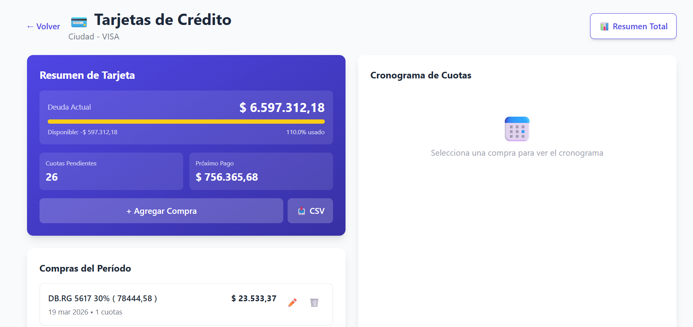
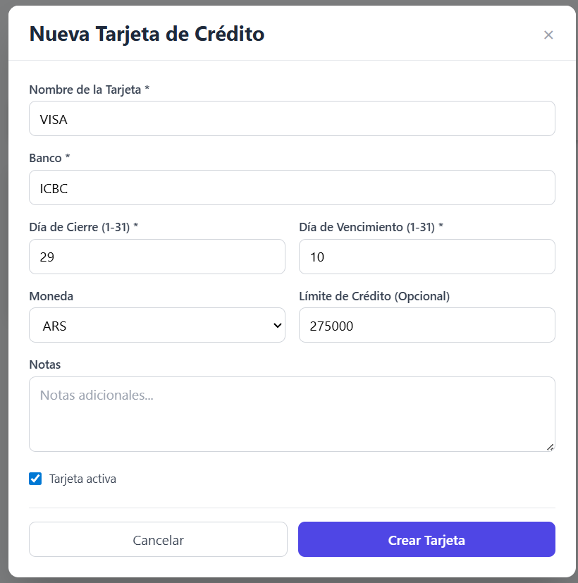
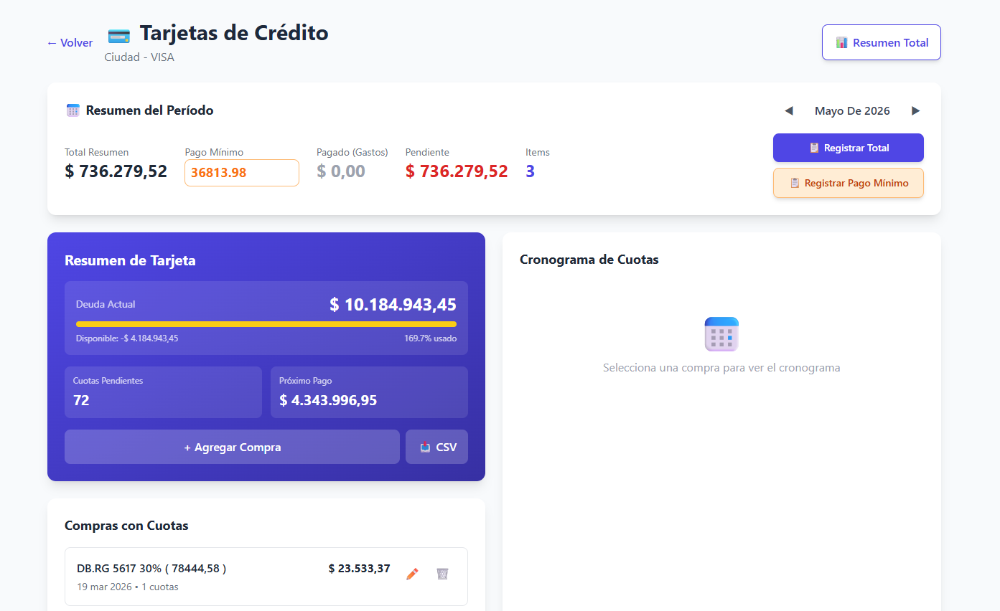
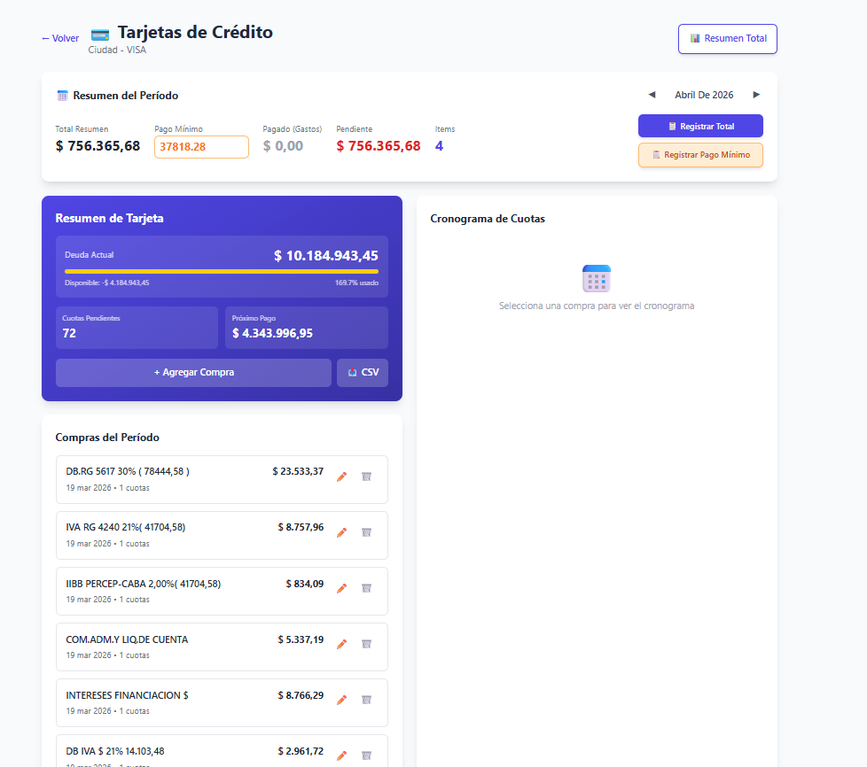
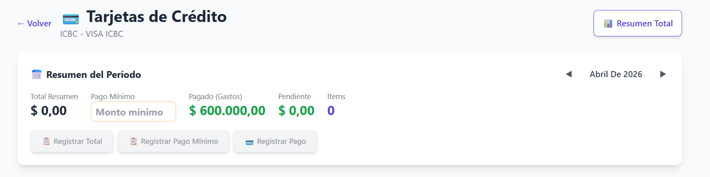
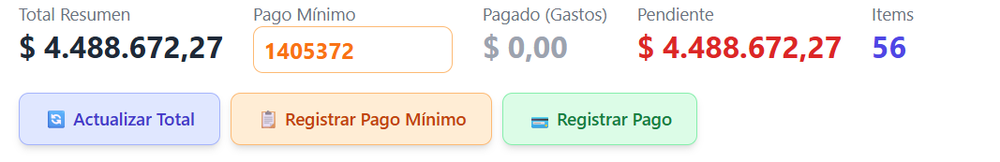
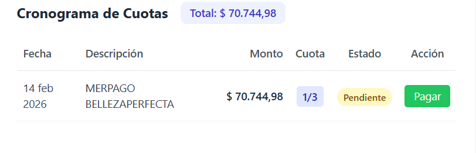

Modulo de tarjeta de crédito

Backlog Estructurado (OpenPEC-ready)

Modelo de ticket
- id: prefijo + numero (`CC-FEAT-###` o `CC-BUG-###`)
- tipo: `feature` | `bug`
- prioridad: `alta` | `media` | `baja`
- estado: `todo` | `in_progress` | `blocked` | `done`
- resumen: una linea con impacto de negocio
- alcance: backend | frontend | data
- criterio_aceptacion: resultado verificable
- evidencia: fix aplicado, endpoint, PR, query o captura

## Features Pendientes

| ID | Tipo | Prioridad | Estado | Resumen |
|---|---|---|---|---|
| CC-FEAT-001 | Feature | Alta | ✅ Done | Registrar gastos del periodo actual de forma consistente con periodo de tarjeta (no mes calendario) |
| CC-FEAT-002 | Feature | Alta | ⏳ Todo | Registrar monto total como item de presupuesto del mes siguiente al cierre |
| CC-FEAT-003 | Feature | Alta | ✅ Done | Calculo de cuotas futuras para compras en cuotas |
| CC-FEAT-004 | Feature | Media | ⏳ Todo | Calculo de montos ARS para compras en USD segun tipo de cambio |
| CC-FEAT-005 | Feature | Media | ✅ Done | Implementar funcionalidad del punto 3 de FINLY_BUDGET_MODULE.md en pagina Presupuesto |
| CC-FEAT-006 | Feature | Alta | ✅ Done | Registrar pago en Resumen de Tarjeta indicando monto e item de presupuesto |
| CC-FEAT-007 | Feature | Media | ⏳ Todo | Opcion para registrar gasto de nuevo periodo y revisar regresion de visibilidad de botones |
| CC-FEAT-008 | Feature | Alta | ✅ Done | Agregar opcion para editar pago registrado desde Resumen del Periodo |
| CC-FEAT-009 | Feature | Baja | ⏳ Todo | Paginacion de compras del periodo (5 lineas) |
| CC-FEAT-010 | Feature | Alta | ✅ Done | Los periodos no son meses calendario; agregar opcion de definir rango de fechas del periodo |
| CC-FEAT-011 | Feature | Alta | ✅ Done | Visualizacion y manejo de periodos de tarjeta (period_start, period_end, closing_date, due_date) |
| CC-FEAT-012 | Feature | Alta | ⏳ Todo | Validar pagos fuera de periodo, sugerir periodo correcto y confirmar movimiento |
| CC-FEAT-013 | Feature | Alta | ⏳ Todo | En importacion CSV, fecha de cierre debe imputar al periodo cuyo cierre coincide |
| CC-FEAT-014 | Feature | Media | ⏳ Todo | Ordenar y filtrar compras del periodo por monto |
| CC-FEAT-015 | Feature | Media | ⏳ Todo | Agrupar lista por compras en cuotas y luego compras 1 cuota |
| CC-FEAT-016 | Feature | Baja | ⏳ Todo | Icono tooltip para detalle de item |
| CC-FEAT-017 | Feature | Alta | ⏳ Todo | Bloquear cargas manual/csv fuera de ventana cierre-vencimiento, con override por rol |
| CC-FEAT-018 | Feature | Alta | ⏳ Todo | Si CSV contiene items fuera de politica del periodo, rechazar lote completo |
| CC-FEAT-020 | Feature | Baja | ⏳ Todo | Ocultar combo tipo de plan en Nueva Compra |
| CC-FEAT-021 | Feature | Baja | ⏳ Todo | Agregar textbox detalle (20 caracteres) en Nueva Compra |
| CC-FEAT-022 | Feature | Alta | ✅ Done | USD al periodo siguiente con campo `billing_date` (propuesta Opcion A) |
| CC-FEAT-023 | Feature | Alta | ⏳ Todo | Al registrar pagos del resumen actual, proyectarlos automaticamente en el periodo siguiente como movimientos negativos tipo "SU PAGO EN PESOS" para estimar el proximo resumen |

**Resumen:** 23 features, 11 completadas (48%), 12 pendientes (52%)

## Bugs Pendientes

| ID | Prioridad | Estado | Resumen |
|---|---|---|---|
| CC-BUG-001 | Alta | ✅ Done | Editar gasto a monto USD no actualiza la lista de pagos registrados |
| CC-BUG-002 | Alta | ✅ Done | Cuotas calculadas con formula incorrecta; debe usar amortizacion francesa |
| CC-BUG-003 | Alta | ✅ Done | Registrar pago en presupuesto debia ser el total del periodo, no item por item |
| CC-BUG-004 | Alta | ✅ Done | Pago minimo no es porcentaje fijo; debe ser configurable por periodo |
| CC-BUG-005 | Media | ✅ Done | Descripcion de item de presupuesto no incluia monto minimo del periodo |
| CC-BUG-006 | Alta | ✅ Done | Error al eliminar item generado desde Registrar en Presupuesto (clase Debt inexistente) |
| CC-BUG-007 | Alta | ✅ Done | Resumen del periodo no sumaba todas las compras; standalone aparecia en mes siguiente |
| CC-BUG-008 | Alta | ✅ Done | Error 500 al crear tarjeta por conexiones stale (faltaba pool_pre_ping) |
| CC-BUG-008-R1 | Alta | ✅ Done | Datos huerfanos de InstallmentPlan/Schedule para compras 1-cuota causaban errores en Resumen |
| CC-BUG-009 | Alta | ✅ Done | Gasto en cuotas propagaba todos los gastos del periodo a meses futuros en lugar de solo la cuota |
| CC-BUG-010 | Baja | ✅ Done | Navegacion de periodos desaparece al llegar a extremos; debe mantenerse en ultimo valido |
| CC-BUG-011 | Baja | ⏳ Todo | Paginacion de compras del periodo a 10 por pagina |
| CC-BUG-012 | Baja | ⏳ Todo | Paginacion de cronograma de cuotas a 5 por pagina |
| CC-BUG-013 | Alta | ✅ Done | Cambiar label del boton Resumen a Resumen Total |
| CC-BUG-015 | Alta | ✅ Done | Fecha invalida al importar CSV con formato dd.MM.yy |
| CC-BUG-016 | Alta | ✅ Done | Nueva tarjeta sin funcionalidad: sin Resumen del Periodo ni botones de registro |
| CC-BUG-017 | Alta | ✅ Done | Pago registrado en una tarjeta figuraba en ambas tarjetas del mismo mes |
| CC-BUG-018 | Alta | ✅ Done | Registrar Pago Minimo usaba porcentaje fijo en lugar del valor personalizado del campo |
| CC-BUG-019 | Alta | ✅ Done | Tarjeta ICBC no registraba suma de montos en toast y mantenia mismos gastos en marzo y abril |
| CC-BUG-019-R1 | Alta | ✅ Done | Revision bug 19, marzo sin gastos visibles tras fix |
| CC-BUG-020 | Alta | ✅ Done | Proximo Pago con formula incorrecta; debe ser saldo impago periodo anterior + total periodo actual |
| CC-BUG-021 | Alta | ✅ Done | Luego de registrar pago no aparecia el item de presupuesto ni el registro en Gastos |
| CC-BUG-022 | Alta | ✅ Done | No habia forma visible de registrar fecha de cierre y vencimiento del periodo |
| CC-BUG-023 | Media | ✅ Done | No se podian borrar tarjetas inactivas (ahora soft delete en activas, inactivas sin boton) |
| CC-BUG-024 | Alta | ✅ Done | Pago registrado no se restaba de Pendiente de Gastos en modulo de tarjetas |
| CC-BUG-025 | Baja | ⏳ Todo | Editar moneda ARS->USD no refresca cabecera Total Pendiente sin reload |
| CC-BUG-026 | Alta | ⏳ Todo | Editar fecha de gasto no mueve de periodo; debe validar y mover con confirmacion |
| CC-BUG-027 | Alta | ✅ Done | Gasto en cuotas propagaba hasta diciembre copiando todos los gastos del periodo |
| CC-BUG-028 | Baja | ⏳ Todo | UX: Al cambiar fecha de item en cuotas no se actualiza el panel de Cronograma de Cuotas |
| CC-BUG-029 | Alta | ✅ Done | Nueva Compra muestra opción visible de extracción en efectivo, con comisión obligatoria y 1 cuota (Issue Gitea #133) |

**Resumen:** 29 bugs, 26 resueltos (90%), 3 pendientes (10%)

## OpenSpec Changes

| Change | Descripción | IDs Relacionados | Estado |
|--------|-------------|-----------------|--------|
| `formalize-credit-card-module` | Formalización del módulo en spec-driven | — | 📋 Backlog |
| `cc-bugs-critical` | Bugs críticos de UX, paginación y cronograma | CC-BUG-010, CC-BUG-011, CC-BUG-012 | 📋 Backlog |
| `cc-period-policy` | Validación de ventanas temporales de períodos | CC-FEAT-012, CC-FEAT-013, CC-FEAT-017, CC-FEAT-018 | 📋 Backlog |
| `cc-ux-improvements` | Mejoras de usabilidad (paginación, orden, agrupado, tooltip) | CC-FEAT-009, CC-FEAT-014, CC-FEAT-015, CC-FEAT-016, CC-FEAT-020, CC-FEAT-021 | 📋 Backlog |
| `cc-period-budget-registration` | Registro automático del total del período en presupuesto | CC-FEAT-002, CC-FEAT-007 | 📋 Backlog |
| `credit-card-usd-billing-date` | Compras USD con `billing_date` correcto al período siguiente | CC-FEAT-004, CC-FEAT-022 | ✅ Done |
| `cc-bug-029-cash-advance-visibility` | Corrección UX para visibilidad de extracción en Nueva Compra | CC-BUG-029 | ✅ Done |
| `cc-next-statement-estimation` | Proyección automática de pagos al período siguiente | CC-FEAT-023 | 📋 Backlog |
| `cc-period-close` | Cierre de período con lifecycle OPEN/CLOSED/REOPENED y snapshot | — | 📋 Backlog |
| `cc-period-open-rollover` | Apertura de período con carryover de saldo pendiente | — | 📋 Backlog |

OpenPEC CLI (plantilla de carga)
- Nota: `openpec` no esta instalado actualmente en el entorno local. Se deja plantilla para ejecutar cuando este disponible.
- Ejemplo de alta de bug:
   `openpec issue create --id CC-BUG-026 --type bug --priority alta --status todo --title "Editar fecha de gasto no mueve de periodo" --scope "backend,frontend"`
- Ejemplo de alta de feature:
   `openpec issue create --id CC-FEAT-022 --type feature --priority alta --status todo --title "USD al periodo siguiente con billing_date" --scope "backend,data"`
- Ejemplo de transicion de estado:
   `openpec issue update --id CC-BUG-026 --status in_progress`
   `openpec issue update --id CC-BUG-026 --status done`

Mejoras:
1. Registro de gastos del periodo actual
2. Registro del monto total como item de presupuesto para mes siguiente al cierre del resumen.
3. ✅ RESUELTO Calculo de cuotas a futuro para compras en cuotas.
4. Calculo de montos en ARS para comprar en dolares.
5. ✅ RESUELTO - Implementar funcionalidad del punto 3 de FINLY_BUDGET_MODULE.md en página Presupuesto.
6. ✅ RESUELTO — Agregar en Resumen de Tarjeta opción para registrar el pago, indicando monto e item de presupuesto donde será asignado ese pago (simil cuando se carga un gasto desde el módulo de gastos).
   → Fix: Nuevo botón "💳 Registrar Pago" en la sección Resumen del Período. Abre modal `CreditCardPaymentModal` con: fecha, monto (con shortcuts de pendiente/total), forma de pago, selector de item de presupuesto (pre-selecciona el item del período si existe), y detalle. Crea una transacción tipo Gasto/categoría "Tarjeta de Crédito" asociada al item de presupuesto seleccionado.
7. Crear opción para registrar gasto de nuevo periodo.
    Revisión fix 20: No aparece, tampoco el de Registro de Pago minimo, que desapareció..  
     

8. ✅ RESUELTO — Agregar opción para editar pago registrado.
   → Fix: Sección "Pagos Registrados" en Resumen del Período muestra cada pago con botones ✏️ editar y 🗑️ eliminar. El modal `CreditCardPaymentModal` ahora soporta modo edición (pre-llena fecha, monto, forma de pago, detalle). Al guardar actualiza la transacción existente vía `PUT /api/transactions/{id}`. Backend retorna `payment_transactions` en la respuesta de `get_card_period_installments`.

9. Paginar la vista de Compras del periodo a 5 lineas por página.

10. ✅ RESUELTO — Los periodos no son meses calendario, agregar opción de definir rango de fechas del periodo.
   → Fix: Se implementó `_get_period_date_range()` que calcula el ciclo de facturación real usando `closing_day`. También se creó tabla `credit_card_period_configs` para permitir closing_day y due_day distintos por período. Campos editables "Día Cierre" y "Día Vencimiento" en el Resumen del Período.

11. ✅ RESUELTO — Visualización y manejo de períodos de tarjeta
   → Fix: Implementación completa (11.1-11.8):
   - Backend: `get_card_period_installments()` ahora retorna `period_start`, `period_end`, `closing_date`, `due_date`
   - Backend: Nuevo endpoint `GET /api/credit-cards/{card_id}/period-for-date?purchase_date=YYYY-MM-DD` para determinar el período de una compra
   - Backend: Nuevo método `get_period_for_date()` en CreditCardService
   - Frontend: Navegación por períodos muestra "Marzo – Abril 2026" en lugar de solo el mes
   - Frontend: Bloque de info del período con fechas de inicio/fin, cierre, vencimiento + edición de días
   - Frontend: PurchaseModal muestra período asignado automáticamente al seleccionar fecha de compra
   - Se eliminaron los inputs duplicados de Día Cierre/Vencimiento del área de métricas (ahora están en el bloque de período)
   
12. Que el sistema no deje cargar pagos con fechas fuera del periodo. En caso de que ocurra indicar al usuario que corresponde al periodo X (indicarlo) y ofrecer la opción de moverlo al periodo correspondiente, si no acepta volver al a ventana de edición para que cargue la fecha correcta.
Nota: la fecha de cierre es compartida entre ambos periodos, fin de un periodo, e inicio del siguiente. Eso es porque el corte exacto puede ocurrir dentro del dia de cierre, y pasada esa hora los gastos computan al periodo posterior. En ese caso siempre consultar al usuario si quiere dejar el gasto en 
ese periodo o en el posterior.

1.   En caso de importación masiva por csv, gastos en fecha de cierre cargarlo en periodo que tenga esa fecha como cierre. 

2.  En listado de Compras del Periodo agregar opción de ordenar por monto, con filtro en la columna.

3.  En lista de Comprar por Periodos agregar ocpciónd e agrupar primero los gastos en cuotas y luego el resto de pagos en un1 cuota.
    
4.  Si el item tiene detalle habilitar un icono de ver y si el usuario lo presiona mostrar el detalles como tooltip.  

5.  Por defecto no habilitar cargas manuales o masivas con csv a periodos pasado la fecha de vencimiento
    Rango de fechas para carga: Desde cierre hasta vencimiento.
    En caso de que la fecha supere a la del vecimiento, dentro de la cabecera agregar botón para habiltar opción de carga, solo admin y writer de esa tarjeta.

6.  Cargas masiva: Si algun item esta en un perdiodo cuya fecha de venc en anterior a la actual y el periodo no esta habiitado segun 18 no aceptar la carga de ningun item del csv. Medidas de seguridad para evitar incosistencias por carga parciales.

7.  ✅ RESUELTO — Meses sin gastos visibles (ej: marzo mostraba lista vacía a pesar de tener compras registradas).
   → Fix (CC-BUG-019-R1): Corrección en la lógica de consulta de compras del periodo. Las compras standalone de 1 cuota
   ahora se filtran por `billing_date` (o `purchase_date` como fallback) dentro del rango del periodo real de la tarjeta.

8.  En Nueva Compra (carga de item manual) ocultar combo Tipo de Plan (es innecesario)

9.  En Nueva Compra (carga de item manual) agregar textbox para cargar detalles (hasta 20 caracteres)

10. Los gastos en dolares se reflejan como Transferencia de Deuda pesificados en el siguiente periodo.
    O sea no son gastos para pagar en el periodo actual, sino del siguiente.
    → Solución propuesta (Opción A — billing_date separado):
      - Agregar campo `billing_date` a `CreditCardPurchase` (migración Alembic).
      - Al registrar una compra en USD → `billing_date = purchase_date + 1 mes`; ARS → `billing_date = purchase_date`.
      - `_get_standalone_purchases_for_period()` filtra por `billing_date` en lugar de `purchase_date`.
      - Se conserva `purchase_date` con la fecha real de compra (historial/auditoría).
      - `_calculate_period_total()` no requiere cambios adicionales.

Bugs Módulo Tarjeta de Crédito
1. ✅ RESUELTO — Edito un gasto de tarjeta a monto en dolares, pero cuando guardo el monto no se actuliza en la lista de pagos registrados.
   → Fix: Corrección en `update_purchase` para manejar currency y exchange_rate correctamente.
2. ✅ RESUELTO — El pago en cuota registrado es la cuoata actual, por lo tanto en cronograma de cuotas cada cuota es igual a la actual y el 
   monto_total=<cant cuotas>*monto_cuota
   → Fix: Fórmula de interés corregida a amortización francesa: `monthly_rate = annual_rate / 12 / 100`.
3. ✅ RESUELTO — Es erróneo registrar cada pago en presupuesto, sino que se debe registrar el pago total para que pueda asignar el pago correspondiente.
   3.1- ✅ Agregar un botón para registrar todo el periodo en el presupuesto del mes siguiente al vencimiento.
   3.2- ✅ Permitir actualizar ese presupuesto de tarjeta con edicion de pagos registrados al periodo en cuestión.
   → Fix: Botones "Registrar Total" y "Registrar Pago Mínimo". Incluye compras standalone de 1 cuota + cuotas de planes.
4. ✅ RESUELTO — El pago minimo varia según el resumen, no es un porcentaje fijo, permitir configurar el valor de cada periodo a mano. 
   → Fix: Campo editable de pago mínimo en frontend. El backend acepta `minimum_payment` personalizado (default: 5% del total).
5. ✅ RESUELTO — Al registrar los gastos en el Presupuestos agregar monto minimo en descripción del item correspondiente al periodo en cuestión. 
   → Fix: El `detalle` del BudgetItem incluye el monto mínimo: "(Mín: $X)" para pago total, "- Pago Mínimo: $X" para pago mínimo.
6. ✅ RESUELTO — Si quiero eliminar un item generardo desde Registar en Presupupesto da error
   → Fix: `debt_service.py` referenciaba clase `Debt` inexistente. Corregido a `BudgetItem` en 4 métodos.

  
Detalles del error

   App.jsx:47 ⚡ Loaded from cache
App.jsx:47 ⚡ Loaded from cache
App.jsx:57 ✅ Loaded 183 transactions from PostgreSQL
App.jsx:57 ✅ Loaded 183 transactions from PostgreSQL
App.jsx:175 ✅ Transaction 597 deleted from PostgreSQL
App.jsx:47 ⚡ Loaded from cache
App.jsx:57 ✅ Loaded 182 transactions from PostgreSQL
App.jsx:79 🔄 Syncing from Google Sheets to PostgreSQL...
App.jsx:81 ✅ Sync completed: Object
App.jsx:95 ✅ Loaded 176 transactions from PostgreSQL
usage-monitoring.js:71 Uncaught (in promise) InvalidStateError: Failed to execute 'transaction' on 'IDBDatabase': The database connection is closing.
    at Proxy.<anonymous> (chrome-extension://elfaihghhjjoknimpccccmkioofjjfkf/background.js:66:26082)
    at Proxy.s (chrome-extension://elfaihghhjjoknimpccccmkioofjjfkf/background.js:66:27201)
    at ps.getActiveSessions (chrome-extension://elfaihghhjjoknimpccccmkioofjjfkf/background.js:68:10277)
    at async Ec.getComputeDependencies (chrome-extension://elfaihghhjjoknimpccccmkioofjjfkf/background.js:68:40408)
    at async chrome-extension://elfaihghhjjoknimpccccmkioofjjfkf/background.js:68:16371
usage-monitoring.js:71 Uncaught (in promise) InvalidStateError: Failed to execute 'transaction' on 'IDBDatabase': The database connection is closing.
    at Proxy.<anonymous> (chrome-extension://elfaihghhjjoknimpccccmkioofjjfkf/background.js:66:26082)
    at Proxy.s (chrome-extension://elfaihghhjjoknimpccccmkioofjjfkf/background.js:66:27201)
    at ps.getActiveSessions (chrome-extension://elfaihghhjjoknimpccccmkioofjjfkf/background.js:68:10277)
    at async Ec.getComputeDependencies (chrome-extension://elfaihghhjjoknimpccccmkioofjjfkf/background.js:68:40408)
    at async chrome-extension://elfaihghhjjoknimpccccmkioofjjfkf/background.js:68:16371
usage-monitoring.js:71 Uncaught (in promise) InvalidStateError: Failed to execute 'transaction' on 'IDBDatabase': The database connection is closing.
    at Proxy.<anonymous> (chrome-extension://elfaihghhjjoknimpccccmkioofjjfkf/background.js:66:26082)
    at Proxy.s (chrome-extension://elfaihghhjjoknimpccccmkioofjjfkf/background.js:66:27201)
    at ps.getActiveSessions (chrome-extension://elfaihghhjjoknimpccccmkioofjjfkf/background.js:68:10277)
    at async Ec.getComputeDependencies (chrome-extension://elfaihghhjjoknimpccccmkioofjjfkf/background.js:68:40408)
    at async chrome-extension://elfaihghhjjoknimpccccmkioofjjfkf/background.js:68:16371
usage-monitoring.js:71 Uncaught (in promise) InvalidStateError: Failed to execute 'transaction' on 'IDBDatabase': The database connection is closing.
    at Proxy.<anonymous> (chrome-extension://elfaihghhjjoknimpccccmkioofjjfkf/background.js:66:26082)
    at Proxy.s (chrome-extension://elfaihghhjjoknimpccccmkioofjjfkf/background.js:66:27201)
    at ps.getActiveSessions (chrome-extension://elfaihghhjjoknimpccccmkioofjjfkf/background.js:68:10277)
    at async Ec.getComputeDependencies (chrome-extension://elfaihghhjjoknimpccccmkioofjjfkf/background.js:68:40408)
    at async chrome-extension://elfaihghhjjoknimpccccmkioofjjfkf/background.js:68:16371
usage-monitoring.js:71 Uncaught (in promise) InvalidStateError: Failed to execute 'transaction' on 'IDBDatabase': The database connection is closing.
    at Proxy.<anonymous> (chrome-extension://elfaihghhjjoknimpccccmkioofjjfkf/background.js:66:26082)
    at Proxy.s (chrome-extension://elfaihghhjjoknimpccccmkioofjjfkf/background.js:66:27201)
    at ps.getActiveSessions (chrome-extension://elfaihghhjjoknimpccccmkioofjjfkf/background.js:68:10277)
    at async Ec.getComputeDependencies (chrome-extension://elfaihghhjjoknimpccccmkioofjjfkf/background.js:68:40408)
    at async chrome-extension://elfaihghhjjoknimpccccmkioofjjfkf/background.js:68:16371
usage-monitoring.js:71 Uncaught (in promise) InvalidStateError: Failed to execute 'transaction' on 'IDBDatabase': The database connection is closing.
    at Proxy.<anonymous> (chrome-extension://elfaihghhjjoknimpccccmkioofjjfkf/background.js:66:26082)
    at Proxy.s (chrome-extension://elfaihghhjjoknimpccccmkioofjjfkf/background.js:66:27201)
    at ps.getActiveSessions (chrome-extension://elfaihghhjjoknimpccccmkioofjjfkf/background.js:68:10277)
    at async Ec.getComputeDependencies (chrome-extension://elfaihghhjjoknimpccccmkioofjjfkf/background.js:68:40408)
    at async chrome-extension://elfaihghhjjoknimpccccmkioofjjfkf/background.js:68:16371
:8000/api/budget-items/139:1  Failed to load resource: the server responded with a status of 404 (Not Found)
installHook.js:1 Error deleting debt: AxiosError: Request failed with status code 404
    at settle (axios.js?v=00a09b6a:1319:7)
    at XMLHttpRequest.onloadend (axios.js?v=00a09b6a:1682:7)
    at Axios.request (axios.js?v=00a09b6a:2328:41)
    at async handleDeleteConfirm (DebtManager.jsx:131:7)
overrideMethod @ installHook.js:1

1. ✅ RESUELTO — Prioridad: Alta - El Resumen del pedido debe ser la suma de todas los gastos del periodo.
   → Fix: Compras standalone (1 cuota) ahora aparecen en el mes de compra (no desplazadas al mes siguiente).
   El periodo del mes actual suma todos los gastos + cuotas. Abril y subsiguientes solo muestran cuotas de planes.
   El período default al seleccionar tarjeta es el mes actual (no el siguiente).

1. ✅ RESUELTO — Prioridad: Alta 
   → Fix: `pool_pre_ping=True` en engine para manejar conexiones stale. IntegrityError (nombre duplicado) retorna 409 en vez de 500.

   
Bug al crear nueva tarjeta de crédito
 
    App.jsx:47 ⚡ Loaded from cache
        App.jsx:47 ⚡ Loaded from cache
        App.jsx:57 ✅ Loaded 85 transactions from PostgreSQL
        App.jsx:57 ✅ Loaded 85 transactions from PostgreSQL
        App.jsx:175 ✅ Transaction 198 deleted from PostgreSQL
        App.jsx:47 ⚡ Loaded from cache
        App.jsx:57 ✅ Loaded 84 transactions from PostgreSQL
        App.jsx:175 ✅ Transaction 295 deleted from PostgreSQL
        App.jsx:47 ⚡ Loaded from cache
        App.jsx:57 ✅ Loaded 83 transactions from PostgreSQL
        (index):1 Uncaught (in promise) Error: A listener indicated an asynchronous response by returning true, but the message channel closed before a response was received
        (index):1 Uncaught (in promise) Error: A listener indicated an asynchronous response by returning true, but the message channel closed before a response was received
        (index):1 Uncaught (in promise) Error: A listener indicated an asynchronous response by returning true, but the message channel closed before a response was received
        (index):1 Uncaught (in promise) Error: A listener indicated an asynchronous response by returning true, but the message channel closed before a response was received
        usage-monitoring.js:71 Uncaught (in promise) InvalidStateError: Failed to execute 'transaction' on 'IDBDatabase': The database connection is closing.
            at Proxy.<anonymous> (chrome-extension://elfaihghhjjoknimpccccmkioofjjfkf/background.js:66:26082)
            at Proxy.s (chrome-extension://elfaihghhjjoknimpccccmkioofjjfkf/background.js:66:27201)
            at ps.getActiveSessions (chrome-extension://elfaihghhjjoknimpccccmkioofjjfkf/background.js:68:10277)
            at async Ec.getComputeDependencies (chrome-extension://elfaihghhjjoknimpccccmkioofjjfkf/background.js:68:40408)
            at async chrome-extension://elfaihghhjjoknimpccccmkioofjjfkf/background.js:68:16371
        :8000/api/credit-cards:1  Failed to load resource: the server responded with a status of 500 (Internal Server Error)
        installHook.js:1 Error creating credit card: AxiosError: Request failed with status code 500
            at settle (axios.js?v=00a09b6a:1319:7)
            at XMLHttpRequest.onloadend (axios.js?v=00a09b6a:1682:7)
            at Axios.request (axios.js?v=00a09b6a:2328:41)
            at async handleSubmit (NewCreditCardModal.jsx:62:7)
        overrideMethod @ installHook.js:1
    

 - 8_1 ✅ RESUELTO — Prioridad Alta: Los errores en consola eran de una extensión de Chrome, no de la app.
   → Fix: Datos huérfanos de InstallmentPlan/Schedule para compras 1-cuota limpiados de la DB. Resumen de tarjeta corregido.

9. ✅ RESUELTO — Prioridad: Alta - Si cargo un pago en cuota el sistema propaga hasta el mes de la ultima cuota desde la fecha de compra copiando todos los gastos del periodo actual, debe copiar solo el gasto en cuotas hacia el futuro.
   → Fix 1: Solo se crean InstallmentPlan para compras multi-cuota (>1). Las queries de periodo filtran `number_of_installments > 1`.
   Compras 1-cuota aparecen solo en su mes de compra. Meses futuros solo muestran cuotas de planes multi-cuota.
   → Fix 2 adicional: Limpieza de 18 registros huérfanos de InstallmentPlan/InstallmentScheduleItem para compras 1-cuota existentes en DB.
   `get_card_summary` corregido para contar solo compras standalone del mes actual (no todas las históricas) en `current_debt`.
   → Fix 3 regresión: Revertido el cambio de bug 16 Fix 2 que sumaba TODAS las standalone. `current_debt` vuelve a usar solo mes actual + fallback a meses anteriores para `next_due_amount`.

   Revisión Fix 3:  sigue apareciendo gastos de 1 cuota en otros meses que no corresponde.

   Revisión fix 3:  sigue apareciendo gastos de 1 cuotas, revisar.
   → Fix 4: La lista "Compras con Cuotas" mostraba TODAS las compras de la tarjeta sin filtrar por período. Ahora se filtra por `purchase_id` devuelto por la API de período. La sección se renombró a "Compras del Período" y solo muestra compras relevantes al mes seleccionado.

10. ✅ RESUELTO — Prioridad: Baja - Navegación de períodos desaparecía al llegar a extremos de rango.
   → Fix: La navegación de períodos (◀ ▶) se mantiene visible en los extremos (pasado/futuro), permitiendo volver al último período válido sin usar el botón Volver ni recargar la vista.

11. Prioridad: Baja - En Compra en cuotas paginar a 10 registros por pagina.
12. Prioridad: Baja - En Cronograma de Cuotas paginar a 5 registros por pagina.
13. ✅ RESUELTO — Prioridad: Alta: Cambiar label de botón Resumen a Resumen Total.
   → Fix: Label cambiado de "📊 Resumen" a "📊 Resumen Total" en CreditCardManager.jsx.
14. Prioridad Alta - Crear un botón Resumen Periodo Actual donde
    1.  En Distribución por Descripción mostrar los montos que se adeudan en ese periodo, donde en el caso de pago en cuotas descontar las cuotas previas el periodo en curso.
    2.  En Detalle por Descripción Mosntrar los montos de ese periodo, no los acumulado de gastos en cuotas.
15. ✅ RESUELTO — Prioridad Alta - Fecha inválida al importar CSV con formato "dd.MM.yy"
    → Fix: `parseDate()` en CreditCardCSVImport.jsx ahora soporta separadores `/`, `.` y `-`, con años de 2 o 4 dígitos.
    Formatos soportados: DD/MM/YYYY, DD.MM.YY, DD.MM.YYYY, DD-MM-YYYY, YYYY-MM-DD.
16. ✅ RESUELTO — Prioridad Alta - Nueva tarjeta con funcionalidad limitada (sin Resumen del Periodo ni botones)
    → Fix 1: Condición `installment_count > 0` removida — "Resumen del Período" ahora se muestra siempre, permitiendo navegar a meses con datos.
    → Fix 2: `get_card_summary()` usa solo standalone del mes actual en `current_debt` (compatible con bug 9). Fallback en `next_due_amount` busca hasta 3 meses atrás para tarjetas sin datos en el mes actual.

    → Fix 3: Botones "Registrar Total" y "Registrar Pago Mínimo" ahora siempre visibles. Se deshabilitan (disabled + gris) cuando `total_due === 0` en el período actual.

17. ✅ RESUELTO — Prioridad Alta - Registré un pago en la Tarjeta Ciudad y figura en ambas
   → Fix: `_get_gastos_paid_for_period()` ahora filtra por `debt_id` del BudgetItem específico de cada tarjeta/período en lugar de sumar todas las transacciones "Tarjeta de Crédito" del mes. Los pagos ya no se cruzan entre tarjetas.

18. ✅ RESUELTO — Prioridad Alta - Al presionar "Registrar Pago Minimo" registra el 5% del monto sin tener en cuenta el valor cargado en campo "Pago mínimo".
   → Fix: `get_card_period_installments` ahora retorna el monto mínimo almacenado en el BudgetItem (extraído del detalle) en vez de recalcular siempre el 5%. Así el campo "Pago mínimo" conserva el valor personalizado tras registrar. Toast ahora muestra el monto registrado para feedback claro.
    
19. ✅ RESUELTO — Prioridad Alta - Tarjeta ICBC no registra suma de montos en toast y al cambiar de mes mantiene los mismos gastos en marzo y abril.
   → Fix: La lista "Compras del Período" hacía fallback a TODAS las compras cuando el período no tenía items (`periodPurchaseIds.size === 0`). Ahora filtra siempre por los `purchase_id` del período, mostrando vacío si el mes no tiene compras. Toast con montos ya corregido en bug 18.
   Revisión bug 19: Ahora no muestra los gastos registrados para marzo.

20. ✅ RESUELTO — Prioridad Alta - Próximo Pago debe ser Total Resumen (mes anterior) - Pago Registrado (en Registrar Pago) + Suma de gasto del periodo.
   → Fix: Fórmula en `get_card_summary()` cambiada a: `next_due_amount = max(0, Total(mes anterior) - Pagado(mes anterior)) + Total(mes actual)`. Ahora refleja el saldo impago del período anterior más los cargos del período actual.

21. ✅ RESUELTO — Prioridad Alta - Luego de hacer un registro de pago no aparece el item del nuevo item de presupuesto y tampoco se ve el registro en Gastos.
   → Fix: Tres cambios: (1) Al registrar pago con "💳 Registrar Pago", si no existe budget item para el período, se auto-crea vía `registerCardPeriodBudget` antes de guardar la transacción. (2) La transacción siempre se crea con `debt_id` apuntando al budget item del período, asegurando que aparezca en Presupuesto. (3) Se pasa `refreshTransactions` a `CreditCardManager` para refrescar la lista principal de gastos tras registrar un pago.

22. ✅ RESUELTO — Verificar seteo de periodo, no veo donde registrar fecha de cierre (inicio) y de vencimiento (fin).
   → Fix: Los campos "Día Cierre" y "Día Vencimiento" ahora aparecen editables en el Resumen del Período de cada tarjeta. Cada período puede tener valores distintos (tabla `credit_card_period_configs`). Si no se configura un período específico, se usan los valores por defecto de la tarjeta. El ciclo de facturación usa el `closing_day` para determinar el rango real de compras del período (ej: cierre día 20 → período Mar 21 a Abr 20). Endpoint: `PUT /api/credit-cards/{id}/period-config`.

23. ✅ RESUELTO — No se pueden borrar tarjetas inactivas.
   → Fix (revisado): Las tarjetas inactivas NO se pueden borrar. El botón de eliminar solo aparece en tarjetas activas y realiza un soft delete (desactivar). Las tarjetas inactivas permanecen visibles sin opción de borrado.

24. ✅ RESUELTO - Registro un pago ($ 1405372) que bien registrado en Reportes de gastos pero no se resta de Pendiente de Gastos del módulo de tarjetas de crédito. 

25. Priodad Baja - Si edito moneda de ARS a USD en un item cambia en el item el valor a ARS pero no se refleja en cabecera (Total Pendiente). Requiere actualizar página.

26. Prioridad Alta - Si edito fecha de un item de gastos y esa fecha es de otro periodo al actual de item de gasto queda en el mismo periodo. Indicar al usuario que esa fecha corresponde a un periodo posterior y si el usuario da el ok, moverlo al otros periodo, Si la fecha es anterior al inicio del periodo actual indicar error y no hacer cambio alguno.

27. ✅ RESUELTO — Prioridad Alta - Cargo un gasto en 3 cuotas realizado el 14.02 
    14 feb 2026	MERPAGO BELLEZAPERFECTA	$ 70.744,98	Se deberia ver como gastos (1/3 en cada periodo)
    en los periodos de Enero-Febrero 2026 , Febrero-Marzo 2026 y Marzo-Abril 2026 y aparee hasta pasado dic 2026. 
    Además muestra solo una cuota por el monto total en cada periodo 
    
    Los gastos en cuotas se carga en la fecha de comprar y luego el sistema los debe propagar a los n periodos siguientes donde n es la cant de cuotas.
    → Fix: La compra ID 112 no tenía InstallmentPlan creado (posiblemente importada en un estado previo del sistema con bugs).
      Se generó el plan y las 3 cuotas faltantes manualmente:
      - Cuota 1/3: $23.581,66 due 2026-03-14 → Periodo Feb-Mar 2026
      - Cuota 2/3: $23.581,66 due 2026-04-14 → Periodo Mar-Abr 2026
      - Cuota 3/3: $23.581,66 due 2026-05-14 → Periodo Abr-May 2026
        - 

