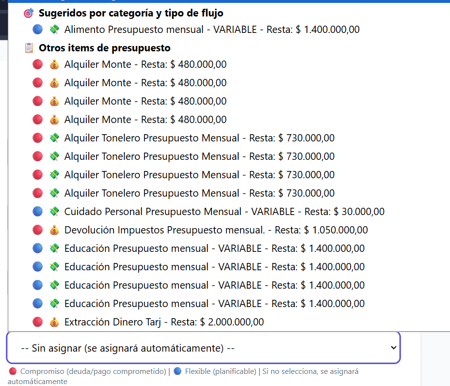

# Módulo de Gastos

## Mejoras Implementadas

| ID | Estado | Resumen | Objetivo |
|---|---|---|---|
| EXP-FEAT-001 | ✅ Implementado | Páginas con tamaño de 25 lineas cada una. Paginación con controles Anterior/Siguiente y números de página | Mejorar navegabilidad de transacciones |
| EXP-FEAT-002 | ✅ Implementado | Tanto en carga individual como masiva, categoria es campo obligatorio | Garantizar data quality |
| EXP-FEAT-003 | ✅ Implementado | Filtro por mes. Por defecto mostrar gastos del mes actual | Agrupar transactions por período |
| EXP-FEAT-004 | ✅ Implementado | En asignación de presupuesto, mostrar solo items del mes del gasto | Mantener consistencia temporal |
| EXP-FEAT-005 | ✅ Implementado | Selector de mes/año con navegación ◀ ▶ y botón "Hoy" en Reportes | UX consistente entre vistas |
| EXP-FEAT-006 | ✅ Implementado | Normalización de categorías: tabla categories con FK en transactions | Estructura relacional limpia |
| EXP-FEAT-007 | ✅ Implementado | Campos de transactions renombrados a inglés (date, type, amount, etc.) | Estandarizar nomenclatura |
| EXP-FEAT-008 | ✅ Implementado | Filtro por Detalle en pantalla de Reportes (búsqueda partial) | Facilitar búsqueda de transacciones |
| EXP-FEAT-009 | ✅ Implementado | Opción de Importar CSV integrada en pantalla de Reportes | Consolidar acciones en un lugar |
| EXP-FEAT-010 | ✅ Implementado | Se eliminó opción "Importar CSV" del sidebar | Evitar confusión y duplicación |
| EXP-FEAT-011 | ✅ Implementado | Layout de acciones en Reportes: Nuevo Item \| Importar CSV \| Exportar CSV \| Mostrar solo seleccionadas \| Eliminar | Interfaz limpia y consistente |
| EXP-FEAT-012 | ✅ Implementado | **Cierre de mes contable:** congelar mes para evitar cambios accidentales | Mantener integridad de períodos cerrados |
| EXP-FEAT-013 | ✅ Implementado | **Apertura de nuevo mes:** clonado de ítems de presupuesto del mes anterior (carryover de saldo removido — ver EXP-FEAT-017) | Facilitar transición entre períodos |
| EXP-FEAT-014 | 📋 Backlog | **Panel comparativo de cierres:** gráficos multi-mes con alertas de desvío | Visualizar tendencias y tomar decisiones |
| EXP-FEAT-015 | ✅ Implementado | **Habilitar cierre/apertura mes para WRITER** |
| EXP-FEAT-016 | ✅ Implementado | **Agregar atributo Variable/Fijo a items de gastos/ingresos** tanto para carga manual como masiva desde CSV. Pendiente validar popup de carga en flujo de reportes. 
Revisión: Sigue sin aparece opción para seleccionar VARIABLE o FIJA al cargar un gasto|
| EXP-FEAT-017 | ✅ Implementado   | **Mejorar Apertura nuevo mes** Clonar item a item de gastos fijos y marcarlos como Pendientes. Trigger manual movido a Reportes (no en Presupuesto). Depende de EXP-FEAT-016. |
| EXP-FEAT-018 | ✅ Implementado   | **Clonar gastos fijos** Misma lógica de EXP-FEAT-017, ejecutable de forma manual sin depender de apertura de mes (reutiliza endpoint de clonado fijo). |
| EXP-FEAT-019 | ✅ Testing OK | **Arraste Balance Neto ** Propagar balance neto de un mes al otro| 
| EXP-FEAT-020 | ✅ Implementado   | **Mostrar recurrencia en item Presupuesto** | Agregar sufijo REC o NoREC en titulo item de presupuesto | 

## Bugs (Resumen)

| ID | Prioridad | Estado | Resumen |
|---|---|---|---|
| EXP-BUG-001 | Alta | ✅ Resuelto | Error al editar asignación de item de presupuesto por uso de id temporal (`Date.now()`) en vez de id real de DB |
| EXP-BUG-002 | Alta | ✅ Resuelto | Error 422 por desalineación de campos entre frontend (inglés) y modelo Pydantic (español) |
| EXP-BUG-003 | Media | ✅ Resuelto | No aparecía selector para asignar gasto a item de presupuesto por filtro de mes incorrecto |
| EXP-BUG-004 | Media | ✅ Resuelto | Al editar gasto no se veían items nuevos por falta de recarga de datos en modal |
| EXP-BUG-005 | Alta | ✅ Resuelto | Cálculo de total a pagar incluía ingresos por falta de filtro `tipo_flujo = GASTO` |
| EXP-BUG-006 | Alta | ✅ Resuelto | Error 500 al editar transacción por longitud de `detail` (`VARCHAR(50)`), migrado a `TEXT` |
| EXP-BUG-007 | Alta | ✅ Resuelto | Error al borrar gasto (500 intermitente en `DELETE /api/transactions/{id}`) |
| EXP-BUG-008 | Alta | ✅ Resuelto | Error al importar desde CSV |
| EXP-BUG-009 | Alta | ✅ Resuelto | Error en alta masiva desde CSV (incluye respuestas 401 intermitentes) |
| EXP-BUG-010 | Alta | ✅ Resuelto | Al editar un gasto no persistía la vinculación a item de presupuesto tras recargar/cambiar de vista |
| EXP-BUG-011 | Alta | ✅ Resuelto | Inconsistencia en abril 2026: total de ingresos en panel no coincidía con suma de ingresos en tabla/CSV |
| EXP-BUG-012 | 📋 Backlog | **Datos sucios en combo categorias** | Limpiar categorias mal cargadas, en altas masivas considerar solo las categorias cargadas en modulo admin, sino usar categoria (sin clasificar), crearla sino existe.|
| EXP-BUG-013 | ✅ Resuelto| **No coincide el reporte post cierre con el reporte de mes** |parece que esta sumando gastos y presupuesto de cuotas a vencern el futuro, o hay un calculo mas de fechas, o ambos. |
| EXP-BUG-014 | ✅ Resuelto | **No se puede reabrir mes cerrado** | Usuario WRITER ahora puede reabrir el período que cerró él mismo. |
| EXP-BUG-015 | ✅ Resuelto | **No se pudo cargar el preview de apertura** | Corregido: el preview ya no depende del mes anterior estando cerrado. |
| EXP-BUG-016 |✅ Resuelto | **n-plicación de items de presupeusto en combo alta de transacciones** |  |

 

## OpenSpec Changes

| Change | Descripción | Mejoras | Estado |
|--------|-------------|---------|--------|
| `exp-month-close` | Cierre de mes contable con lifecycle y snapshot | EXP-FEAT-012, EXP-FEAT-015 | ✅ Done |
| `exp-month-open-rollover` | Apertura de mes con clonado de items de presupuesto (carryover transaction removida) | EXP-FEAT-013 | ✅ Done |
| `exp-month-comparative-dashboard` | Panel comparativo multi-mes con alertas de desvío | EXP-FEAT-014 | 📋 Backlog |
| `exp-feat-016-variable-fixed` | Atributo Variable/Fijo en items de presupuesto | EXP-FEAT-016 | 🟡 In Progress |
| `exp-feat-017-clone-fixed-as-pending` | Mejorar apertura de mes: clonar solo items fijos como Pendientes | EXP-FEAT-017 | ✅ Done |
| `exp-feat-019-net-balance-carryover` | Arrastre de balance neto como dato informativo entre meses | EXP-FEAT-019 | ✅ Done |

