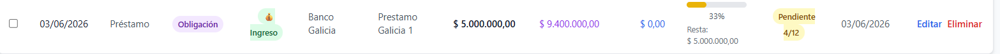
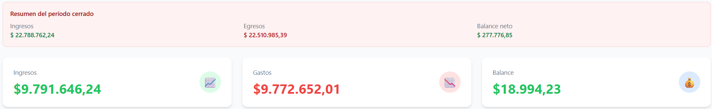
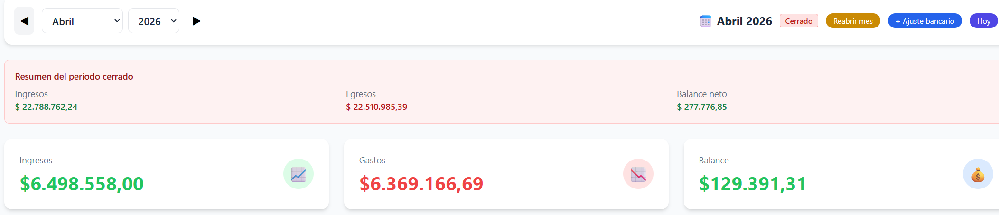
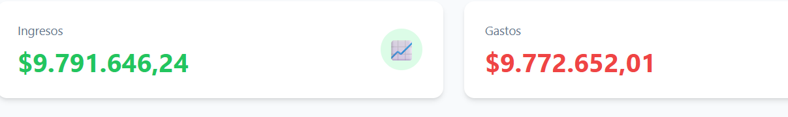
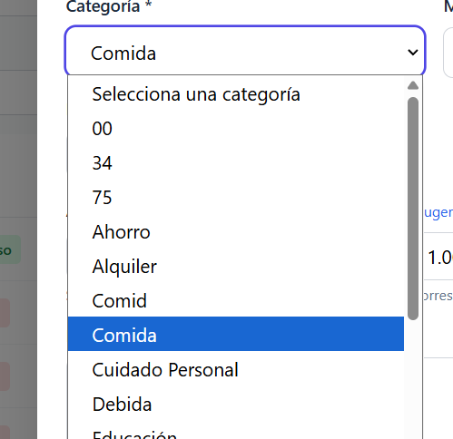

# Módulo de Gastos

## Mejoras Implementadas

| ID | Estado | Resumen | Objetivo |
|---|---|---|---|
| EXP-FEAT-001 | ✅ Implementado | Páginas con tamaño de 25 lineas cada una. Paginación con controles Anterior/Siguiente y números de página | Mejorar navegabilidad de transacciones |
| EXP-FEAT-002 | ✅ Implementado | Tanto en carga individual como masiva, categoria es campo obligatorio | Garantizar data quality |
| EXP-FEAT-003 | ✅ Implementado | Filtro por mes. Por defecto mostrar gastos del mes actual | Agrupar transactions por período |
| EXP-FEAT-004 | ✅ Implementado | En asignación de presupuesto, mostrar solo items del mes del gasto | Mantener consistencia temporal |
| EXP-FEAT-005 | ✅ Implementado | Selector de mes/año con navegación ◀ ▶ y botón "Hoy" en Reportes | UX consistente entre vistas |
| EXP-FEAT-006 | ✅ Implementado | Normalización de categorías: tabla categories con FK en transactions | Estructura relacional limpia |
| EXP-FEAT-007 | ✅ Implementado | Campos de transactions renombrados a inglés (date, type, amount, etc.) | Estandarizar nomenclatura |
| EXP-FEAT-008 | ✅ Implementado | Filtro por Detalle en pantalla de Reportes (búsqueda partial) | Facilitar búsqueda de transacciones |
| EXP-FEAT-009 | ✅ Implementado | Opción de Importar CSV integrada en pantalla de Reportes | Consolidar acciones en un lugar |
| EXP-FEAT-010 | ✅ Implementado | Se eliminó opción "Importar CSV" del sidebar | Evitar confusión y duplicación |
| EXP-FEAT-011 | ✅ Implementado | Layout de acciones en Reportes: Nuevo Item \| Importar CSV \| Exportar CSV \| Mostrar solo seleccionadas \| Eliminar | Interfaz limpia y consistente |
| EXP-FEAT-012 | 🔄 In Progress | **Cierre de mes contable:** congelar mes para evitar cambios accidentales | Mantener integridad de períodos cerrados |
| EXP-FEAT-013 | 📋 Backlog | **Apertura de nuevo mes:** carryover de saldo e ítems de presupuesto clonables | Facilitar transición entre períodos |
| EXP-FEAT-014 | 📋 Backlog | **Panel comparativo de cierres:** gráficos multi-mes con alertas de desvío | Visualizar tendencias y tomar decisiones |

## Bugs (Resumen)

| ID | Prioridad | Estado | Resumen |
|---|---|---|---|
| EXP-BUG-001 | Alta | ✅ Resuelto | Error al editar asignación de item de presupuesto por uso de id temporal (`Date.now()`) en vez de id real de DB |
| EXP-BUG-002 | Alta | ✅ Resuelto | Error 422 por desalineación de campos entre frontend (inglés) y modelo Pydantic (español) |
| EXP-BUG-003 | Media | ✅ Resuelto | No aparecía selector para asignar gasto a item de presupuesto por filtro de mes incorrecto |
| EXP-BUG-004 | Media | ✅ Resuelto | Al editar gasto no se veían items nuevos por falta de recarga de datos en modal |
| EXP-BUG-005 | Alta | ✅ Resuelto | Cálculo de total a pagar incluía ingresos por falta de filtro `tipo_flujo = GASTO` |
| EXP-BUG-006 | Alta | ✅ Resuelto | Error 500 al editar transacción por longitud de `detail` (`VARCHAR(50)`), migrado a `TEXT` |
| EXP-BUG-007 | Alta | ✅ Resuelto | Error al borrar gasto (500 intermitente en `DELETE /api/transactions/{id}`) |
| EXP-BUG-008 | Alta | ✅ Resuelto | Error al importar desde CSV |
| EXP-BUG-009 | Alta | ✅ Resuelto | Error en alta masiva desde CSV (incluye respuestas 401 intermitentes) |
| EXP-BUG-010 | Alta | ✅ Resuelto | Al editar un gasto no persistía la vinculación a item de presupuesto tras recargar/cambiar de vista |
| EXP-BUG-011 | Alta | ✅ Resuelto | Inconsistencia en abril 2026: total de ingresos en panel no coincidía con suma de ingresos en tabla/CSV |
| EXP-BUG-012 | Baja |📋 Backlog | **Datos sucios en combo categorias** | Limpiar categorias mal cargadas, en altas masivas considerar solo las categorias cargadas en modulo admin, sino usar categoria (sin clasificar), crearla sino existe.|
| EXP-BUG-013 | Alta |✅ Resuelto| **No coincide el reporte post cierre con el reporte de mes** |parece que esta sumando gastos y presupuesto de cuotas a vencern el futuro, o hay un calculo mas de fechas, o ambos. |
| EXP-BUG-014 | Alta | ✅ Resuelto | Opción de carga masiva eliminada |En la pantalla de carga de gastos/ingresos se eliminó opción de carga masiva por csv |
| EXP-BUG-015 | Alta |✅ Resuelto |En Deudas, `monto_total` tomaba el valor de la cuota proyectada. Fix revisión: `monto_total` usa siempre `principal_amount` del debt-record y `monto_a_pagar` (`estimated_payment`) se calcula como total con interés anual (`principal_amount * (1 + annual_interest_rate / 100)`). 
Revisión 1:✅ Resuelto   - Monto total incorrecto, Monto total a pagar incorecto (tanto que es menos que el monto solicitado) 
Revisión 2:✅ Resuelto  En ejecutado aparace $0 en vez del monto ya pagado de la deuda. 
Ahora se calcula desde la deuda real (`principal_amount - outstanding_amount`) y no desde la proyección mensual. 
|
| EXP-BUG-016 | Baja |📋 Todo | cuando cargo Cuota actual (X, proxima a pagar) se cambia a numero decimal. Por ejemplo cargo 4 y se autoasigna 3.98|

**Resumen:** 14 mejoras totales, 11 implementadas (79%), 1 en progreso (7%), 2 en backlog (14%)

## OpenSpec Changes

| Change | Descripción | Mejoras | Estado |
|--------|-------------|---------|--------|
| `exp-month-close` | Cierre de mes contable con lifecycle y snapshot | EXP-FEAT-012 | 🔄 In Progress |
| `exp-month-open-rollover` | Apertura de mes con carryover de saldo y clonado de presupuesto | EXP-FEAT-013 | 📋 Backlog |
| `exp-month-comparative-dashboard` | Panel comparativo multi-mes con alertas de desvío | EXP-FEAT-014 | 📋 Backlog |

EXP-FEAT-012. 🆕 PROPUESTA — Cierre de mes contable en Gastos.
    Objetivo: congelar un mes para evitar cambios accidentales, manteniendo control de excepciones y trazabilidad.

    Alcance:
    12a- Cerrar mes actual deshabilitando altas/ediciones/eliminaciones para usuarios estándar.
    12b- Permitir reapertura solo a admin, solicitando motivo obligatorio y guardando auditoría (usuario, fecha, motivo).
    12c- Al cerrar, generar snapshot de cierre del mes: total gastos, total ingresos, balance neto, cantidad de movimientos.
    12d- En mes cerrado, permitir solo ajustes bancarios (`origin = bank_adjustment`) con permisos restringidos.
    12e- Mostrar estado del período en UI: `Abierto` / `Cerrado` / `Reabierto`.

    Extención EXP-FEAT-012
    El cierre de mes debe ser por usuario, entro como admin y me aparece el reporte del cierre del usuario sergio, pero mezclando con carga de gastos cargado con usuario admin. Cada usuario debe poder gestionar por separado el cierre de periodos, Cambio provisorio: Que el write tambien pueda reabrir el periodo que cerró (solo el que cerró ese usuario). Registrar en un los eventos de apertura, cierra y reapertura.
    Vista de usuario sergio
    
    Vista de usuario admin
    
    

    Criterios de aceptación:
    - CA12.1: usuario no-admin recibe 403 al intentar crear/editar/borrar en mes cerrado.
    - CA12.2: reapertura requiere motivo; la operación queda auditada.
    - CA12.3: reportes muestran diferencia entre snapshot de cierre y estado actual tras reapertura.
    - CA12.4: no se generan 500 por operaciones bloqueadas; se retornan errores de negocio controlados.
    - CA12.5: el sistema NO cierra meses automáticamente al cambiar el mes calendario; el cierre es exclusivamente manual por admin (Req-7 spec). Al pasar de abril a mayo sin acción del admin, abril permanece en su estado anterior.

EXP-FEAT-013. 🆕 PROPUESTA — Apertura de nuevo mes con arrastres controlados.
    Objetivo: iniciar el nuevo mes sin recarga manual completa, preservando consistencia contable.

    Alcance:
    13a- Arrastrar saldo final del mes anterior como saldo inicial del nuevo mes (débito o crédito).
    13b- Clonar estructura de presupuesto del mes anterior (categoría, descripción, monto base) en estado editable.
    13c- Mantener versiones: `presupuesto_base_clonado` y `presupuesto_ajustado` para trazabilidad.
    13d- Permitir ABM completo sobre ítems clonados sin afectar histórico del mes anterior.

    Criterios de aceptación:
    - CA13.1: apertura de mes crea saldo inicial consistente con cierre del mes previo.
    - CA13.2: ítems de presupuesto quedan disponibles para edición inmediata.
    - CA13.3: cambios en mes nuevo no alteran registros del mes anterior.

EXP-FEAT-014. 🆕 PROPUESTA — Panel comparativo de cierres mensuales.
    Objetivo: visualizar tendencia y desvíos entre meses para tomar decisiones rápidas.

    Alcance:
    14a- Panel dedicado con gráficos de barras para comparar `gastos`, `ingresos`, `balance` y `% ahorro` por mes.
    14b- Selector de rango temporal (últimos 3, 6, 12 meses y rango personalizado).
    14c- Tooltip por barra con detalle: total, variación vs mes previo y top 3 categorías.
    14d- Indicadores de alerta (color) para meses con desvío superior a umbral configurable.

    Criterios de aceptación:
    - CA14.1: panel responde en menos de 2 segundos para 12 meses de datos.
    - CA14.2: cada barra muestra datos consistentes con reportes de transacciones.
    - CA14.3: variaciones mensuales se calculan correctamente y son visibles en tooltip.

EXP-FEAT-014. 🆕 PROPUESTA — Graficos de barras para categorias.
    Objetivo: Mostrar gráficos de categrorias en formato barras. Opciond elegir mostrar graficos de torta o de barra en el mismo widget.

Bugs:
EXP-BUG-001. ~~Prioridad: Alta~~ ✅ RESUELTO — El frontend usaba `id: Date.now()` como id de transacción en lugar del id real de la DB. Al editar, enviaba PUT con un timestamp (ej: 1775000505766) que no existía en PostgreSQL → 500. Fix: se eliminó `Date.now()` de TransactionForm.jsx y CSVImport.jsx, y `addTransaction` en App.jsx ahora usa el `id` real devuelto por la API.

 

    
Error al editar asignación de item de presupuesto
    api.js:58  PUT http://localhost:8000/api/transactions/1775000505766 500 (Internal Server Error)
    dispatchXhrRequest @ axios.js?v=00a09b6a:1784
    xhr @ axios.js?v=00a09b6a:1649
    dispatchRequest @ axios.js?v=00a09b6a:2210
    Promise.then
    _request @ axios.js?v=00a09b6a:2428
    request @ axios.js?v=00a09b6a:2324
    httpMethod @ axios.js?v=00a09b6a:2476
    wrap @ axios.js?v=00a09b6a:8
    updateTransaction @ api.js:58
    updateTransaction @ App.jsx:156
    handleSaveEdit @ Dashboard.jsx:46
    handleSubmit @ EditTransactionModal.jsx:40
    callCallback2 @ chunk-NUMECXU6.js?v=00a09b6a:3674
    invokeGuardedCallbackDev @ chunk-NUMECXU6.js?v=00a09b6a:3699
    invokeGuardedCallback @ chunk-NUMECXU6.js?v=00a09b6a:3733
    invokeGuardedCallbackAndCatchFirstError @ chunk-NUMECXU6.js?v=00a09b6a:3736
    executeDispatch @ chunk-NUMECXU6.js?v=00a09b6a:7014
    processDispatchQueueItemsInOrder @ chunk-NUMECXU6.js?v=00a09b6a:7034
    processDispatchQueue @ chunk-NUMECXU6.js?v=00a09b6a:7043
    dispatchEventsForPlugins @ chunk-NUMECXU6.js?v=00a09b6a:7051
    (anonymous) @ chunk-NUMECXU6.js?v=00a09b6a:7174
    batchedUpdates$1 @ chunk-NUMECXU6.js?v=00a09b6a:18913
    batchedUpdates @ chunk-NUMECXU6.js?v=00a09b6a:3579
    dispatchEventForPluginEventSystem @ chunk-NUMECXU6.js?v=00a09b6a:7173
    dispatchEventWithEnableCapturePhaseSelectiveHydrationWithoutDiscreteEventReplay @ chunk-NUMECXU6.js?v=00a09b6a:5478
    dispatchEvent @ chunk-NUMECXU6.js?v=00a09b6a:5472
    dispatchDiscreteEvent @ chunk-NUMECXU6.js?v=00a09b6a:5449
    installHook.js:1 ❌ Error updating transaction: AxiosError: Request failed with status code 500
        at settle (axios.js?v=00a09b6a:1319:7)
        at XMLHttpRequest.onloadend (axios.js?v=00a09b6a:1682:7)
        at Axios.request (axios.js?v=00a09b6a:2328:41)
        at async updateTransaction (App.jsx:156:7)
        at async handleSaveEdit (Dashboard.jsx:46:7)
    overrideMethod @ installHook.js:1
    updateTransaction @ App.jsx:166
    await in updateTransaction
    handleSaveEdit @ Dashboard.jsx:46
    handleSubmit @ EditTransactionModal.jsx:40
    callCallback2 @ chunk-NUMECXU6.js?v=00a09b6a:3674
    invokeGuardedCallbackDev @ chunk-NUMECXU6.js?v=00a09b6a:3699
    invokeGuardedCallback @ chunk-NUMECXU6.js?v=00a09b6a:3733
    invokeGuardedCallbackAndCatchFirstError @ chunk-NUMECXU6.js?v=00a09b6a:3736
    executeDispatch @ chunk-NUMECXU6.js?v=00a09b6a:7014
    processDispatchQueueItemsInOrder @ chunk-NUMECXU6.js?v=00a09b6a:7034
    processDispatchQueue @ chunk-NUMECXU6.js?v=00a09b6a:7043
    dispatchEventsForPlugins @ chunk-NUMECXU6.js?v=00a09b6a:7051
    (anonymous) @ chunk-NUMECXU6.js?v=00a09b6a:7174
    batchedUpdates$1 @ chunk-NUMECXU6.js?v=00a09b6a:18913
    batchedUpdates @ chunk-NUMECXU6.js?v=00a09b6a:3579
    dispatchEventForPluginEventSystem @ chunk-NUMECXU6.js?v=00a09b6a:7173
    dispatchEventWithEnableCapturePhaseSelectiveHydrationWithoutDiscreteEventReplay @ chunk-NUMECXU6.js?v=00a09b6a:5478
    dispatchEvent @ chunk-NUMECXU6.js?v=00a09b6a:5472
    dispatchDiscreteEvent @ chunk-NUMECXU6.js?v=00a09b6a:5449
    installHook.js:1 AxiosError: Request failed with status code 500
        at settle (axios.js?v=00a09b6a:1319:7)
        at XMLHttpRequest.onloadend (axios.js?v=00a09b6a:1682:7)
        at Axios.request (axios.js?v=00a09b6a:2328:41)
        at async updateTransaction (App.jsx:156:7)
        at async handleSaveEdit (Dashboard.jsx:46:7)
    overrideMethod @ installHook.js:1
    handleSaveEdit @ Dashboard.jsx:53
    await in handleSaveEdit
    handleSubmit @ EditTransactionModal.jsx:40
    callCallback2 @ chunk-NUMECXU6.js?v=00a09b6a:3674
    invokeGuardedCallbackDev @ chunk-NUMECXU6.js?v=00a09b6a:3699
    invokeGuardedCallback @ chunk-NUMECXU6.js?v=00a09b6a:3733
    invokeGuardedCallbackAndCatchFirstError @ chunk-NUMECXU6.js?v=00a09b6a:3736
    executeDispatch @ chunk-NUMECXU6.js?v=00a09b6a:7014
    processDispatchQueueItemsInOrder @ chunk-NUMECXU6.js?v=00a09b6a:7034
    processDispatchQueue @ chunk-NUMECXU6.js?v=00a09b6a:7043
    dispatchEventsForPlugins @ chunk-NUMECXU6.js?v=00a09b6a:7051
    (anonymous) @ chunk-NUMECXU6.js?v=00a09b6a:7174
    batchedUpdates$1 @ chunk-NUMECXU6.js?v=00a09b6a:18913
    batchedUpdates @ chunk-NUMECXU6.js?v=00a09b6a:3579
    dispatchEventForPluginEventSystem @ chunk-NUMECXU6.js?v=00a09b6a:7173
    dispatchEventWithEnableCapturePhaseSelectiveHydrationWithoutDiscreteEventReplay @ chunk-NUMECXU6.js?v=00a09b6a:5478
    dispatchEvent @ chunk-NUMECXU6.js?v=00a09b6a:5472
    dispatchDiscreteEvent @ chunk-NUMECXU6.js?v=00a09b6a:5449
   

2. ~~Error al import gastos desde csv~~ ✅ RESUELTO — El modelo Pydantic `Transaction` en main.py seguía usando nombres en español (`fecha`, `tipo`, `categoria`, `monto`, etc.) pero el frontend (CSVImport.jsx, TransactionForm.jsx, EditTransactionModal.jsx) enviaba campos en inglés (`date`, `type`, `category`, `amount`, etc.) tras Mejora 7 → 422 Unprocessable Entity. Fix: se actualizó el modelo Pydantic a campos inglés (`date`, `type`, `category`, `amount`, `necessity`, `payment_method`, `detail`, `assignment_status`).

App.jsx:47 ⚡ Loaded from cache
App.jsx:57 ✅ Loaded 89 transactions from PostgreSQL
usage-monitoring.js:71 Uncaught (in promise) InvalidStateError: Failed to execute 'transaction' on 'IDBDatabase': The database connection is closing.
    at Proxy.<anonymous> (chrome-extension://elfaihghhjjoknimpccccmkioofjjfkf/background.js:66:26082)
    at Proxy.s (chrome-extension://elfaihghhjjoknimpccccmkioofjjfkf/background.js:66:27201)
    at ps.getActiveSessions (chrome-extension://elfaihghhjjoknimpccccmkioofjjfkf/background.js:68:10277)
    at async Ec.getComputeDependencies (chrome-extension://elfaihghhjjoknimpccccmkioofjjfkf/background.js:68:40408)
    at async chrome-extension://elfaihghhjjoknimpccccmkioofjjfkf/background.js:68:16371
:8000/api/transactions/820:1  Failed to load resource: the server responded with a status of 422 (Unprocessable Entity)
installHook.js:1 ❌ Error updating transaction: AxiosError: Request failed with status code 422
    at settle (axios.js?v=00a09b6a:1319:7)
    at XMLHttpRequest.onloadend (axios.js?v=00a09b6a:1682:7)
    at Axios.request (axios.js?v=00a09b6a:2328:41)
    at async updateTransaction (App.jsx:158:7)
    at async handleSaveEdit (Dashboard.jsx:46:7)
overrideMethod @ installHook.js:1
installHook.js:1 AxiosError: Request failed with status code 422
    at settle (axios.js?v=00a09b6a:1319:7)
    at XMLHttpRequest.onloadend (axios.js?v=00a09b6a:1682:7)
    at Axios.request (axios.js?v=00a09b6a:2328:41)
    at async updateTransaction (App.jsx:158:7)
    at async handleSaveEdit (Dashboard.jsx:46:7)
overrideMethod @ installHook.js:1
(index):1 Uncaught (in promise) Error: A listener indicated an asynchronous response by returning true, but the message channel closed before a response was received
(index):1 Uncaught (in promise) Error: A listener indicated an asynchronous response by returning true, but the message channel closed before a response was received
(index):1 Uncaught (in promise) Error: A listener indicated an asynchronous response by returning true, but the message channel closed before a response was received
(index):1 Uncaught (in promise) Error: A listener indicated an asynchronous response by returning true, but the message channel closed before a response was received
usage-monitoring.js:71 Uncaught (in promise) InvalidStateError: Failed to execute 'transaction' on 'IDBDatabase': The database connection is closing.
    at Proxy.<anonymous> (chrome-extension://elfaihghhjjoknimpccccmkioofjjfkf/background.js:66:26082)
    at Proxy.s (chrome-extension://elfaihghhjjoknimpccccmkioofjjfkf/background.js:66:27201)
    at ps.getActiveSessions (chrome-extension://elfaihghhjjoknimpccccmkioofjjfkf/background.js:68:10277)
    at async Ec.getComputeDependencies (chrome-extension://elfaihghhjjoknimpccccmkioofjjfkf/background.js:68:40408)
    at async chrome-extension://elfaihghhjjoknimpccccmkioofjjfkf/background.js:68:16371
usage-monitoring.js:71 Uncaught (in promise) InvalidStateError: Failed to execute 'transaction' on 'IDBDatabase': The database connection is closing.
    at Proxy.<anonymous> (chrome-extension://elfaihghhjjoknimpccccmkioofjjfkf/background.js:66:26082)
    at Proxy.s (chrome-extension://elfaihghhjjoknimpccccmkioofjjfkf/background.js:66:27201)
    at ps.getActiveSessions (chrome-extension://elfaihghhjjoknimpccccmkioofjjfkf/background.js:68:10277)
    at async Ec.getComputeDependencies (chrome-extension://elfaihghhjjoknimpccccmkioofjjfkf/background.js:68:40408)
    at async chrome-extension://elfaihghhjjoknimpccccmkioofjjfkf/background.js:68:16371
:8000/api/transactions/import:1  Failed to load resource: the server responded with a status of 422 (Unprocessable Entity)
installHook.js:1 ❌ Error importing transactions: AxiosError: Request failed with status code 422
    at settle (axios.js?v=00a09b6a:1319:7)
    at XMLHttpRequest.onloadend (axios.js?v=00a09b6a:1682:7)
    at Axios.request (axios.js?v=00a09b6a:2328:41)
    at async addMultipleTransactions (App.jsx:144:24)
    at async confirmImport (CSVImport.jsx:155:9)
overrideMethod @ installHook.js:1

3. ~~Desapareció la funcionalidad de asignar un nuevo gasto a un item de presupuesto~~ ✅ RESUELTO — El filtro de items de presupuesto por mes usaba `d.fecha` (fecha de creación del item) en lugar de `d.fecha_vencimiento` (mes al que pertenece). Al no haber items creados en el mes actual, el selector no aparecía. Fix: se cambió el filtro a `d.fecha_vencimiento` en TransactionForm.jsx y EditTransactionModal.jsx.
   
   Revisión bug 3: Sigue si aparecer combo → Verificado: el filtro por `fecha_vencimiento` es correcto, el backend estaba caído cuando se testeó.
4. ~~No puedo asignar item de presupuesto al editar un gasto del mes actual~~ ✅ RESUELTO — Dashboard.jsx cargaba los items de presupuesto solo una vez al montar el componente. Si se agregaban items nuevos (ej: al clonar mes), el modal de edición no los veía. Fix: se agregó `useEffect` en Dashboard.jsx que recarga los items de presupuesto cada vez que se abre el modal de edición.
5. ~~Prioridad Alta - Error en el calculo de  Total a Pagar en presupuesto Marzo , y se propaga a abril , el csv qeu geerar muestra Total por Pagar = 8628000 (sum de todas la categorias menos Ingresos) e Ingresos  =  8824024, parece que el codigo suma todo como montos a pagar, sin filtrar ingresos~~ ✅ RESUELTO — `get_debt_summary()` en debt_service.py no filtraba por `tipo_flujo`, sumando items de tipo INGRESO como si fueran gastos a pagar. Fix: se agregó filtro `Debt.tipo_flujo == FlowType.GASTO` a todas las queries de montos (`total_amount`, `pending_amount`, `partial_amount`, `overdue_amount`) y conteos por estado. Se agregó campo `total_ingresos` separado.

6. ~~Error al editar transaccion de gastos~~ ✅ RESUELTO — La columna `detail` en la tabla `transactions` era `VARCHAR(50)`, demasiado corta para detalles reales. Al editar una transacción con más de 50 caracteres, el backend fallaba silenciosamente con error 500. Fix: migración Alembic `feb52f2c5e5c` cambia columna `detail` de `VARCHAR(50)` a `TEXT`. Además se mejoró el manejo de errores en `update_transaction` para capturar `ValueError` (categoría vacía → 400) y propagar errores con mensajes claros en lugar de 404 genérico.

App.jsx:47 ⚡ Loaded from cache
App.jsx:47 ⚡ Loaded from cache
App.jsx:57 ✅ Loaded 121 transactions from PostgreSQL
App.jsx:57 ✅ Loaded 121 transactions from PostgreSQL
(index):1 Uncaught (in promise) Error: A listener indicated an asynchronous response by returning true, but the message channel closed before a response was received
(index):1 Uncaught (in promise) Error: A listener indicated an asynchronous response by returning true, but the message channel closed before a response was received
(index):1 Uncaught (in promise) Error: A listener indicated an asynchronous response by returning true, but the message channel closed before a response was received
(index):1 Uncaught (in promise) Error: A listener indicated an asynchronous response by returning true, but the message channel closed before a response was received
usage-monitoring.js:71 Uncaught (in promise) InvalidStateError: Failed to execute 'transaction' on 'IDBDatabase': The database connection is closing.
    at Proxy.<anonymous> (chrome-extension://elfaihghhjjoknimpccccmkioofjjfkf/background.js:66:26082)
    at Proxy.s (chrome-extension://elfaihghhjjoknimpccccmkioofjjfkf/background.js:66:27201)
    at ps.getActiveSessions (chrome-extension://elfaihghhjjoknimpccccmkioofjjfkf/background.js:68:10277)
    at async Ec.getComputeDependencies (chrome-extension://elfaihghhjjoknimpccccmkioofjjfkf/background.js:68:40408)
    at async chrome-extension://elfaihghhjjoknimpccccmkioofjjfkf/background.js:68:16371

7. ✅ RESUELTO — Prioridad Alta - Error al borrar gasto.
    → Validado por testing funcional: la eliminación de gastos ya no reproduce el error intermitente reportado.
 
 

    App.jsx:47 ⚡ Loaded from cache
    App.jsx:57 ✅ Loaded 122 transactions from PostgreSQL
    App.jsx:177 ✅ Transaction 853 deleted from PostgreSQL
    App.jsx:47 ⚡ Loaded from cache
    :8000/api/transactions/853:1  Failed to load resource: the server responded with a status of 500 (Internal Server Error)
    installHook.js:1 ❌ Error deleting transaction: AxiosError: Request failed with status code 500
        at settle (axios.js?v=00a09b6a:1319:7)
        at XMLHttpRequest.onloadend (axios.js?v=00a09b6a:1682:7)
        at Axios.request (axios.js?v=00a09b6a:2328:41)
        at async deleteTransaction (App.jsx:176:7)
        at async handleDelete (Dashboard.jsx:68:7)
    overrideMethod @ installHook.js:1
    installHook.js:1 AxiosError: Request failed with status code 500
        at settle (axios.js?v=00a09b6a:1319:7)
        at XMLHttpRequest.onloadend (axios.js?v=00a09b6a:1682:7)
        at Axios.request (axios.js?v=00a09b6a:2328:41)
        at async deleteTransaction (App.jsx:176:7)
        at async handleDelete (Dashboard.jsx:68:7)
    overrideMethod @ installHook.js:1
    App.jsx:57 ✅ Loaded 121 transactions from PostgreSQL

8. ✅ RESUELTO — Prioridad Alta - Error al importar desde csv.
    → Validado por testing funcional: la importación vuelve a completarse correctamente.

App.jsx:47 ⚡ Loaded from cache
App.jsx:57 ✅ Loaded 94 transactions from PostgreSQL
(index):1 Uncaught (in promise) Error: A listener indicated an asynchronous response by returning true, but the message channel closed before a response was received
(index):1 Uncaught (in promise) Error: A listener indicated an asynchronous response by returning true, but the message channel closed before a response was received
(index):1 Uncaught (in promise) Error: A listener indicated an asynchronous response by returning true, but the message channel closed before a response was received

9. ✅ RESUELTO — Prioridad Alta - Error en alta masiva desde un csv.
    → Validado por testing funcional: el flujo de alta masiva ya no presenta la falla reportada.

    App.jsx:47 ⚡ Loaded from cache
    App.jsx:47 ⚡ Loaded from cache
    App.jsx:57 ✅ Loaded 156 transactions from PostgreSQL
    App.jsx:57 ✅ Loaded 156 transactions from PostgreSQL
    (index):1 Uncaught (in promise) Error: A listener indicated an asynchronous response by returning true, but the message channel closed before a response was received
    (index):1 Uncaught (in promise) Error: A listener indicated an asynchronous response by returning true, but the message channel closed before a response was received
    (index):1 Uncaught (in promise) Error: A listener indicated an asynchronous response by returning true, but the message channel closed before a response was received
    (index):1 Uncaught (in promise) Error: A listener indicated an asynchronous response by returning true, but the message channel closed before a response was received
    :8000/api/transactions/import:1  Failed to load resource: the server responded with a status of 401 (Unauthorized)
    App.jsx:154 ✅ CSV import result: Object
    App.jsx:47 ⚡ Loaded from cache
    :8000/api/transactions/import:1  Failed to load resource: the server responded with a status of 401 (Unauthorized)
    App.jsx:57 ✅ Loaded 167 transactions from PostgreSQL
    App.jsx:154 ✅ CSV import result: {message: '11 transacciones importadas exitosamente', added: 11, total: 11, errors: null}
    App.jsx:47 ⚡ Loaded from cache
    App.jsx:57 ✅ Loaded 178 transactions from PostgreSQL

10. ✅ RESUELTO — Prioridad Alta - Al editar un item de gasto parecía vincularse, pero al recargar/cambiar de vista la vinculación desaparecía.
    → Causa detectada: en edición se enviaba `debt_id` nuevo junto a `budget_item_id` viejo/null; el backend priorizaba `budget_item_id` y no persistía el nuevo vínculo.
    → Fix aplicado: payload de edición ahora envía `debt_id` y `budget_item_id` sincronizados; además, tras actualizar se recargan transacciones desde backend para evitar estado solo-frontend.

11. ✅ RESUELTO — Prioridad Alta - Inconsistencia en abril 2026 entre ingresos del panel y suma de ingresos en tabla/CSV.
    → Fix: En Presupuesto se unificó la base mensual entre panel y tabla (mismo criterio de mes/año sin desfase por parsing de fechas) y la exportación CSV ahora usa los ítems visibles/filtrados en tabla. Con esto, panel, tabla y CSV quedan alineados para el período seleccionado.
     
    $9.791.646,24 en panel vs $8478079,00 en suam de ingresos en tabla.

12. Prioridad Baja -  Datos sucios en combo categorias (00,34,75,Comid). Verificar si 
    alta masiva de items de gastos/ingresos valida categorias configuradsa en modulo admin, sino crear un nuevo feat: Validar categorias en carga masiva via csv, si no existe asignar a categoria "Sin Clasificar" (Agregarla si no existe usando usuario admin).

13. ✅ RESUELTO —Prioridad ALta -  No coincide el reporte post cierre con el reporte de mes, parece que esta sumando gastos y presupuesto de cuotas a vencern el futuro, o hay un calculo mas de fechas, o ambos.

