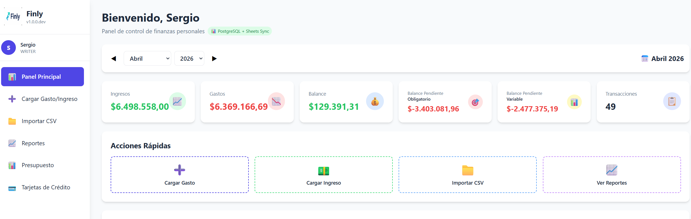

## Security module features ang bugs

## Features (IDs)

| ID | Tipo | Estado | Resumen |
|---|---|---|---|
| SEC-FEAT-001 | Feature | ✅ Completada | Visualizador de password (ojito) |
| SEC-FEAT-002 | Feature | ✅ Completada | Clonado de datos entre usuarios por admin |
| SEC-FEAT-004 | Feature | 📋 Backlog  | ADMIN pueda resetar passwords de todos los usuarios |
| SEC-FEAT-005 | Feature | 📋 Backlog  | Sugerir diseño de módulo de reseteo de password |

## Bug

| SEC-BUG-001 | Bug | ✅ Corregido | Aislamiento de datos por usuario en módulos principales |

Mejoras

SEC-FEAT-001. ~~habilitar vizualizador de password (ojito)~~ ✅ Completada
SEC-FEAT-002. ~~Clonado de datos de un usuario a otros (solo desde role admin)~~ ✅ Completada
   ~~SEC-FEAT-002A Clonado de datos módulos Gastos, Presupuestos y Tarjeta de Crédito y sus relaciones (vinculaciones entre gasto y presupuesto por ej)~~ ✅
   ~~SEC-FEAT-002B Crear selección para clonar todo, o solo un rango de meses. En el caso de tarjeta de Crédito el periodo a clonar sería cuya fecha de cierre anterior coincida con el mes indicado.~~ ✅
   Implementación: Endpoint `POST /api/admin/clone-data` + tab "Clonar Datos" en AdminPanel. Clona transactions, budget_items, credit_cards con sus relaciones (purchases, installment plans, statements). Soporta clonado total o por rango de meses.
   

Bugs

SEC-BUG-001. ~~Nuevo usuario visualiza datos del usuario admin.~~ ✅ Corregido — Se agregó columna `user_id` a `transactions`, `budget_items` y `month_closings`. Todos los endpoints filtran por usuario autenticado.
   Reproducción:
   a. Usuario ingresa con user: sergio pass: Sergio4401.
   b. Usuario entra Panel Principal y visualiza datos de otro usuario (ver imagen)
      
